# Solving arithmetic problems: methods classified by first step

Most arithmetic questions can be solved in several ways. This report catalogs the methods for a family of
ratio, fraction, and percent questions and classifies each method by **the first step a student takes**,
using the second step only when methods share a first step. The goal is an app that recognizes a student's
method from what they write first and responds with help for *that* method.

## How the data is organized

- **Skills** are small questions that other methods call as steps: simplify a fraction, write it as a decimal,
  find a common multiple, cross products. Each has its own methods (a common multiple can be recalled, found by
  listing multiples, by multiplying, or from the GCF).
- **Core questions** (compare fractions, missing value, add fractions) have methods built from primitive steps
  and skill calls.
- **Applied questions** are core questions in context: a proportion check *is* comparing fractions for equality,
  a better buy *is* comparing price ÷ quantity, and a percent of a number *is* a missing value with denominator 100.

The first-step trees are not written by hand: `v2/build.py` expands every skill call into every combination of
skill methods, runs each variant on the examples to check the answer, and groups variants by their first step,
then by their second where needed. The hand-written version this replaced is in `v1/` for comparison.

## What expanding the skills revealed

Shared first steps that the hand-written v1 tree missed, because they only appear once skills are expanded:

- In *compare fractions*, `3 × 7` starts both **cross-multiply** and **rewrite one fraction over the other's
  denominator** (through missing value's cross-multiply). The next step decides: `5 × 4` vs `21 ÷ 4`.
- In *proportion check*, `6 ÷ 8` starts both **decimal** and **rewrite over the other's denominator**,
  and `GCF(6, 8)` starts both **simplify** and the same rewrite.
- `3 × 5 = 15` can come from **listing multiples** or from **multiplying**; the graphs show it as one node
  linked from both classes.

Known limit: the generated trees store a student-chosen multiplier as a wildcard, so a typed classifier sees
`4 × 25` as matching three methods. The per-example graphs tell those apart by value.

## Reading the graphs

Each example graph reads left to right: question → **hexagons** grouping first steps by operation · scope →
**blue** first step → **purple** second step (only where methods share a first step) → **yellow** method →
the method's steps, where a **green dashed** box is a call to another question (it has its own section) →
answer. Edge labels name the skill method that produced the step.

## How the questions reuse each other

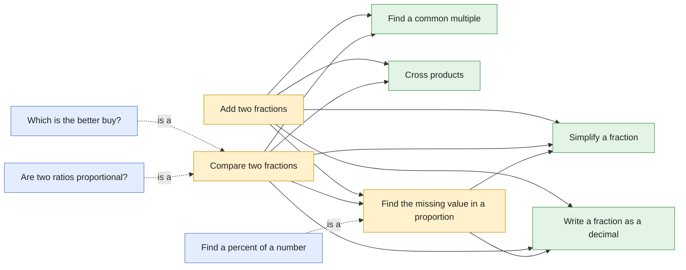

| Question | Kind | Methods | Uses |
|---|---|---|---|
| [Add two fractions](#add-fractions) | core | 3 | [common-multiple](#common-multiple), [cross-products](#cross-products), [missing-value](#missing-value), [simplify-fraction](#simplify-fraction), [to-decimal](#to-decimal) |
| [Compare two fractions](#compare-fractions) | core | 11 | [common-multiple](#common-multiple), [compare-fractions](#compare-fractions), [cross-products](#cross-products), [missing-value](#missing-value), [simplify-fraction](#simplify-fraction), [to-decimal](#to-decimal) |
| [Find the missing value in a proportion](#missing-value) | core | 6 | [simplify-fraction](#simplify-fraction), [to-decimal](#to-decimal) |
| [Which is the better buy?](#better-buy) | applied | 6 | [compare-fractions](#compare-fractions) |
| [Find a percent of a number](#percent-of) | applied | 6 | [missing-value](#missing-value) |
| [Are two ratios proportional?](#proportion-check) | applied | 11 | [compare-fractions](#compare-fractions) |
| [Find a common multiple](#common-multiple) | skill | 4 | — |
| [Cross products](#cross-products) | skill | 1 | — |
| [Simplify a fraction](#simplify-fraction) | skill | 2 | — |
| [Write a fraction as a decimal](#to-decimal) | skill | 2 | — |

## Contents

- [Add two fractions](#add-fractions) (core)
- [Compare two fractions](#compare-fractions) (core)
- [Find the missing value in a proportion](#missing-value) (core)
- [Which is the better buy?](#better-buy) (applied)
- [Find a percent of a number](#percent-of) (applied)
- [Are two ratios proportional?](#proportion-check) (applied)
- [Find a common multiple](#common-multiple) (skill)
- [Cross products](#cross-products) (skill)
- [Simplify a fraction](#simplify-fraction) (skill)
- [Write a fraction as a decimal](#to-decimal) (skill)
- [Word problems](#word-problems): extraction concepts and 12 stories

<a name="add-fractions"></a>

## Add two fractions

`add-fractions` · core · prompt: *Find {a}/{b} + {c}/{d}.*

Uses: [common-multiple](#common-multiple), [cross-products](#cross-products), [missing-value](#missing-value), [simplify-fraction](#simplify-fraction), [to-decimal](#to-decimal)

| Method | Idea | Steps use |
|---|---|---|
| **Common denominator** `common_denominator` | Rewrite both fractions over a common denominator, add the numerators, simplify. | common-multiple, missing-value, simplify-fraction |
| **Bow-tie (cross-multiply)** `bow_tie` | ({a}×{d} + {c}×{b}) / ({b}×{d}), then simplify. | cross-products, simplify-fraction |
| **Convert to decimals** `decimal` | Write each fraction as a decimal and add. | to-decimal |

Reading the graphs: **hexagons** group first steps by operation · scope; **blue** = first step, **purple** = second step (only where methods share a first step); **yellow** = method; **green dashed** = a call to another question (see its own page); edge labels show which skill method produced the step.

### Find 5/6 + 3/4.

```mermaid
flowchart LR
  n0(["Find 5/6 + 3/4."])
  n1(["Answer: 19/12"])
  n2["Common denominator"]
  n3["Find a common multiple of 6 and 4 → 12"]
  n2 --> n3
  n4["Solve 5/6 = x/12 → 10"]
  n3 --> n4
  n5["Solve 3/4 = x/12 → 9"]
  n4 --> n5
  n6["10 + 9 = 19"]
  n5 --> n6
  n7["Simplify 19/12 → 19/12"]
  n6 --> n7
  n7 --> n1
  n8["Bow-tie (cross-multiply)"]
  n9["Find the cross products of 5/6 and 3/4 → 20/18"]
  n8 --> n9
  n10["6 × 4 = 24"]
  n9 --> n10
  n11["20 + 18 = 38"]
  n10 --> n11
  n12["Simplify 38/24 → 19/12"]
  n11 --> n12
  n12 --> n1
  n13["Convert to decimals"]
  n14["Write 5/6 as a decimal → ≈ 0.833"]
  n13 --> n14
  n15["Write 3/4 as a decimal → 0.75"]
  n14 --> n15
  n16["5/6 + 0.75 = 19/12"]
  n15 --> n16
  n16 --> n1
  n17["5 ÷ 6 ≈ 0.833"]
  n18{{"divide · within"}}
  n0 --> n18
  n18 --> n17
  n17 -->|"to-decimal/divide"| n13
  n19["GCF(6, 4) = 2"]
  n20{{"factor · across"}}
  n0 --> n20
  n20 --> n19
  n19 -->|"common-multiple/gcf_formula"| n2
  n21["5 × 4 = 20"]
  n22{{"multiply · across"}}
  n0 --> n22
  n22 --> n21
  n21 -->|"cross-products/diagonals"| n8
  n23["6 × 4 = 24"]
  n22 --> n23
  n23 -->|"common-multiple/product"| n2
  n24["LCM(6, 4) = 12"]
  n22 --> n24
  n24 -->|"common-multiple/recall"| n2
  n25["6 × 2 = 12"]
  n26{{"multiply · within"}}
  n0 --> n26
  n26 --> n25
  n25 -->|"common-multiple/list_multiples"| n2
  classDef cls fill:#eef0f6,stroke:#8a90a6,color:#222
  classDef first fill:#e3edfd,stroke:#5b7fd1,color:#222
  classDef second fill:#efe6fb,stroke:#8b63c9,color:#222
  classDef method fill:#fff1cc,stroke:#c99a1a,color:#222,font-weight:bold
  classDef skill fill:#e3f4e6,stroke:#3f9a55,stroke-dasharray:5 3,color:#222
  classDef step fill:#ffffff,stroke:#999,color:#222
  classDef ans fill:#fde4e1,stroke:#c4554a,color:#222
  class n18,n20,n22,n26 cls
  class n17,n19,n21,n23,n24,n25 first
  class n2,n8,n13 method
  class n3,n4,n5,n7,n9,n12,n14,n15 skill
  class n6,n10,n11,n16 step
  class n0,n1 ans
```

### Find 2/3 + 1/5.

```mermaid
flowchart LR
  n0(["Find 2/3 + 1/5."])
  n1(["Answer: 13/15"])
  n2["Common denominator"]
  n3["Find a common multiple of 3 and 5 → 15"]
  n2 --> n3
  n4["Solve 2/3 = x/15 → 10"]
  n3 --> n4
  n5["Solve 1/5 = x/15 → 3"]
  n4 --> n5
  n6["10 + 3 = 13"]
  n5 --> n6
  n7["Simplify 13/15 → 13/15"]
  n6 --> n7
  n7 --> n1
  n8["Bow-tie (cross-multiply)"]
  n9["Find the cross products of 2/3 and 1/5 → 10/3"]
  n8 --> n9
  n10["3 × 5 = 15"]
  n9 --> n10
  n11["10 + 3 = 13"]
  n10 --> n11
  n12["Simplify 13/15 → 13/15"]
  n11 --> n12
  n12 --> n1
  n13["Convert to decimals"]
  n14["Write 2/3 as a decimal → ≈ 0.667"]
  n13 --> n14
  n15["Write 1/5 as a decimal → 0.2"]
  n14 --> n15
  n16["2/3 + 0.2 = 13/15"]
  n15 --> n16
  n16 --> n1
  n17["2 ÷ 3 ≈ 0.667"]
  n18{{"divide · within"}}
  n0 --> n18
  n18 --> n17
  n17 -->|"to-decimal/divide"| n13
  n19["GCF(3, 5) = 1"]
  n20{{"factor · across"}}
  n0 --> n20
  n20 --> n19
  n19 -->|"common-multiple/gcf_formula"| n2
  n21["2 × 5 = 10"]
  n22{{"multiply · across"}}
  n0 --> n22
  n22 --> n21
  n21 -->|"cross-products/diagonals"| n8
  n23["LCM(3, 5) = 15"]
  n22 --> n23
  n23 -->|"common-multiple/recall"| n2
  n24["3 × 5 = 15"]
  n22 --> n24
  n25{{"multiply · within"}}
  n0 --> n25
  n25 --> n24
  n24 -->|"common-multiple/list_multiples / common-multiple/product"| n2
  classDef cls fill:#eef0f6,stroke:#8a90a6,color:#222
  classDef first fill:#e3edfd,stroke:#5b7fd1,color:#222
  classDef second fill:#efe6fb,stroke:#8b63c9,color:#222
  classDef method fill:#fff1cc,stroke:#c99a1a,color:#222,font-weight:bold
  classDef skill fill:#e3f4e6,stroke:#3f9a55,stroke-dasharray:5 3,color:#222
  classDef step fill:#ffffff,stroke:#999,color:#222
  classDef ans fill:#fde4e1,stroke:#c4554a,color:#222
  class n18,n20,n22,n25 cls
  class n17,n19,n21,n23,n24 first
  class n2,n8,n13 method
  class n3,n4,n5,n7,n9,n12,n14,n15 skill
  class n6,n10,n11,n16 step
  class n0,n1 ans
```


<a name="compare-fractions"></a>

## Compare two fractions

`compare-fractions` · core · prompt: *Which is larger: {a}/{b} or {c}/{d}? (Or are they equal?)*

Uses: [common-multiple](#common-multiple), [compare-fractions](#compare-fractions), [cross-products](#cross-products), [missing-value](#missing-value), [simplify-fraction](#simplify-fraction), [to-decimal](#to-decimal)

| Method | Idea | Steps use |
|---|---|---|
| **Cross-multiply** `cross_multiply` | {a}/{b} > {c}/{d} exactly when {a}×{d} > {c}×{b}. | cross-products |
| **Common denominator** `common_denominator` | Rewrite both fractions over the same denominator, then compare numerators. | common-multiple, missing-value |
| **Rewrite one fraction over the other's denominator** `match_denominator` | Turn {a}/{b} into something over {d}, then compare numerators with {c}. | missing-value |
| **Common numerator** `common_numerator` | With equal numerators, the smaller denominator gives the bigger fraction. | common-multiple, missing-value |
| **Convert to decimals** `decimal` | Write each fraction as a decimal and compare. | to-decimal |
| **Compare unit rates (flipped fractions)** `unit_rate` | How much bottom per 1 of top? The bigger rate belongs to the smaller fraction. | to-decimal |
| **Compare scale factors** `scale_factor` | How much do the tops grow ({c} ÷ {a}) compared with the bottoms ({d} ÷ {b})? | — |
| **Ratio table** `ratio_table` | Scale {a}:{b} by 2, 3, 4, … until the top reaches {c}, then compare bottoms. | — |
| **Graph the points** `graph` | Plot ({a}, {b}) and ({c}, {d}); the steeper line from the origin belongs to the smaller fraction. | — |
| **Simplify both** `simplify` | Reduce both fractions to lowest terms; equal fractions reduce to the same thing. | simplify-fraction |
| **Distance from 1** `distance_from_one` | Find how far each fraction is from 1; the one closer to 1 is bigger. | compare-fractions |

Reading the graphs: **hexagons** group first steps by operation · scope; **blue** = first step, **purple** = second step (only where methods share a first step); **yellow** = method; **green dashed** = a call to another question (see its own page); edge labels show which skill method produced the step.

### Which is larger: 3/4 or 5/7? (Or are they equal?)

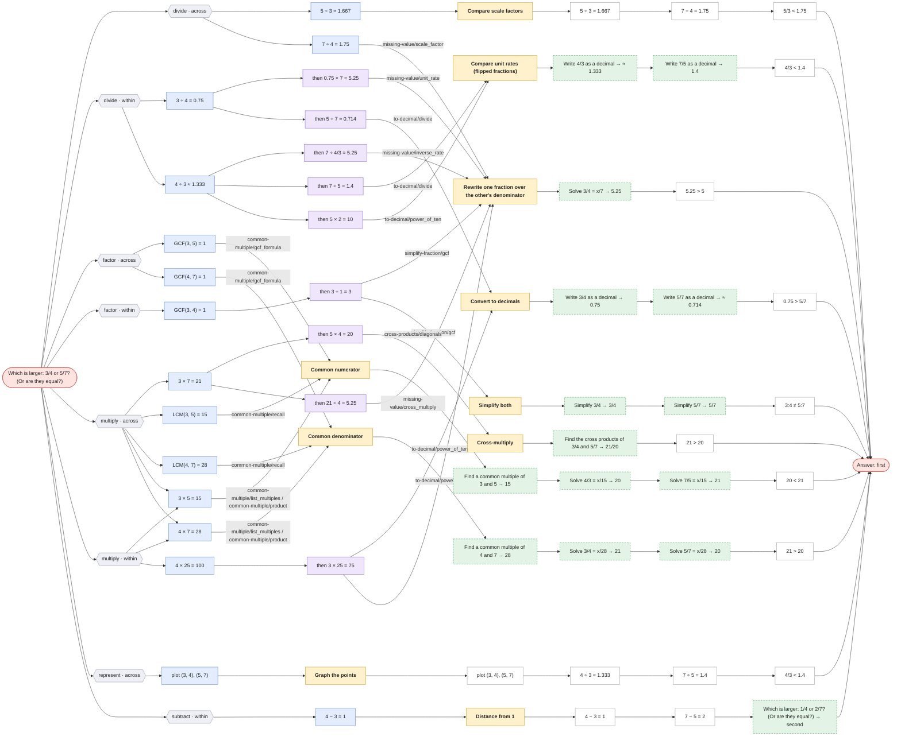

Not applicable here: Ratio table (`ratio_table`)

### Which is larger: 3/8 or 2/5? (Or are they equal?)

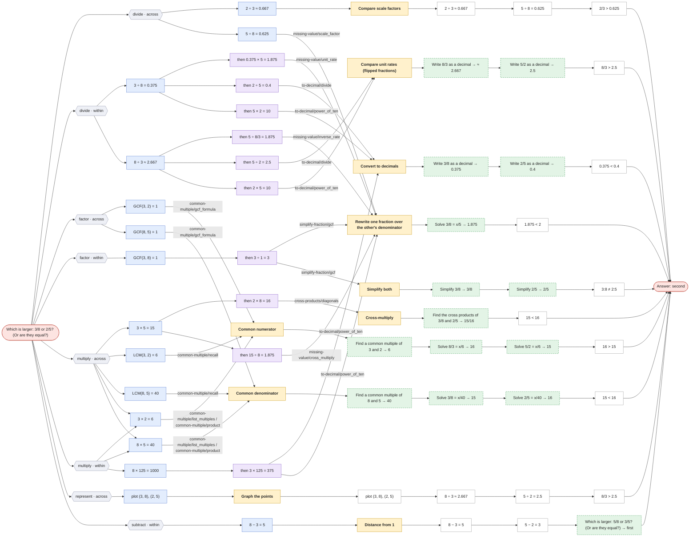

Not applicable here: Ratio table (`ratio_table`)


<a name="missing-value"></a>

## Find the missing value in a proportion

`missing-value` · core · prompt: *Solve {a}/{b} = x/{d}.*

Uses: [simplify-fraction](#simplify-fraction), [to-decimal](#to-decimal)

| Method | Idea | Steps use |
|---|---|---|
| **Cross-multiply and divide** `cross_multiply` | {a} × {d} = {b} × x, so x = {a} × {d} ÷ {b}. | — |
| **Scale factor** `scale_factor` | Find what turns {b} into {d}, then do the same to {a}. | — |
| **Unit rate** `unit_rate` | Find the value per 1, then scale up to {d}. | to-decimal |
| **Inverse rate** `inverse_rate` | Find how many of the second quantity per 1 of the first, then divide. | to-decimal |
| **Ratio table** `ratio_table` | Build {a}:{b} up by ×2, ×3, … until the second term reaches {d}. | — |
| **Simplify, then scale** `simplify_then_scale` | Reduce {a}/{b} first so a whole-number scale factor appears. | simplify-fraction |

Reading the graphs: **hexagons** group first steps by operation · scope; **blue** = first step, **purple** = second step (only where methods share a first step); **yellow** = method; **green dashed** = a call to another question (see its own page); edge labels show which skill method produced the step.

### Solve 3/5 = x/40.

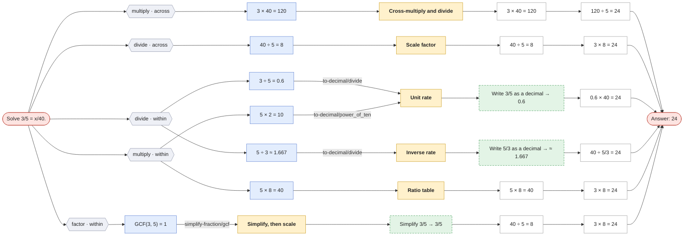

### Solve 4/6 = x/15.

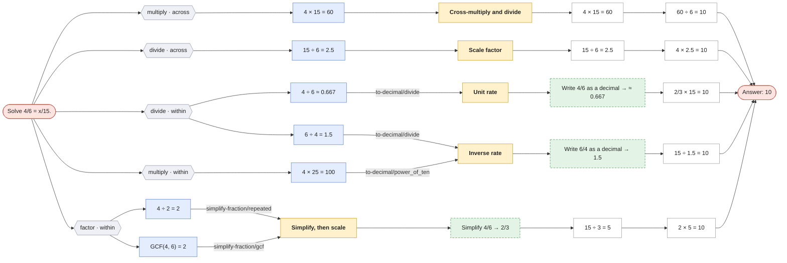

Not applicable here: Ratio table (`ratio_table`)


<a name="better-buy"></a>

## Which is the better buy?

`better-buy` · applied · prompt: *Offer 1: {q1} units for ${p1}. Offer 2: {q2} units for ${p2}. Which is the better buy?*

Reduces to [compare-fractions](#compare-fractions) with `{"a": "p1", "b": "q1", "c": "p2", "d": "q2"}`. Compare the prices per unit p1/q1 and p2/q2; the smaller one is the better buy, so 'first' (bigger) maps to 'second'.

| Method | Idea | Steps use |
|---|---|---|
| **Price per unit** `price_per_unit` (= compare-fractions · decimal) | Find the cost of 1 unit in each offer; lower is better. | — |
| **Units per dollar** `units_per_dollar` (= compare-fractions · unit_rate) | Find how much $1 buys; more is better. | — |
| **Common quantity** `common_quantity` (= compare-fractions · common_denominator) | Price both offers at the same quantity. | — |
| **Scale one offer to the other's size** `scale_up` (= compare-fractions · match_denominator) | What would offer 1 cost for {q2} units? | — |
| **Cross-multiply** `cross_multiply` (= compare-fractions · cross_multiply) | {a}/{b} > {c}/{d} exactly when {a}×{d} > {c}×{b}. | — |
| **Compare growth** `compare_growth` (= compare-fractions · scale_factor) | Price grows by {p2} ÷ {p1}, quantity by {q2} ÷ {q1}; quantity growing faster means offer 2 is better. | — |

Reading the graphs: **hexagons** group first steps by operation · scope; **blue** = first step, **purple** = second step (only where methods share a first step); **yellow** = method; **green dashed** = a call to another question (see its own page); edge labels show which skill method produced the step.

### Offer 1: 12 units for $3. Offer 2: 20 units for $4.5. Which is the better buy?

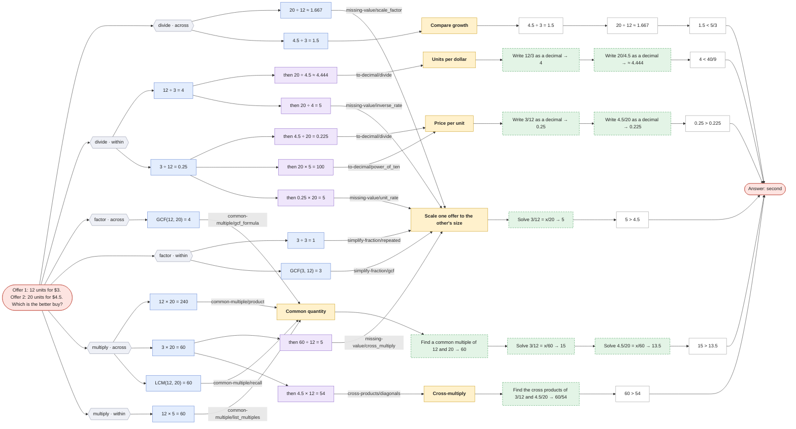

### Offer 1: 6 units for $4.2. Offer 2: 10 units for $7.5. Which is the better buy?

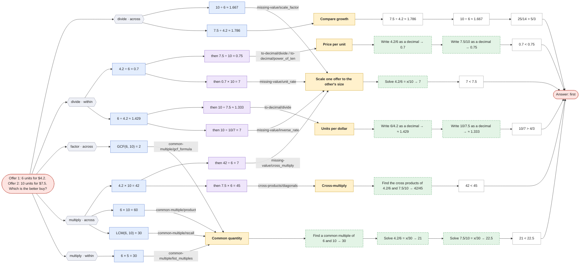


<a name="percent-of"></a>

## Find a percent of a number

`percent-of` · applied · prompt: *What is {p}% of {n}?*

Reduces to [missing-value](#missing-value) with `{"a": "p", "b": 100, "d": "n"}`. p% of n means p/100 = x/n.

| Method | Idea | Steps use |
|---|---|---|
| **Convert to a decimal and multiply** `decimal` (= missing-value · unit_rate) | {p}% = {p} ÷ 100; multiply that by {n}. | — |
| **Find 1% first** `one_percent` (= missing-value · scale_factor) | 1% of {n} is {n} ÷ 100; multiply by {p}. | — |
| **Multiply, then divide by 100** `multiply_first` (= missing-value · cross_multiply) | {p} × {n} ÷ 100. | — |
| **Use a simplified fraction** `fraction` (= missing-value · simplify_then_scale) | {p}/100 simplifies (15/100 = 3/20); take that fraction of {n}. | — |
| **Ratio table** `ratio_table` (= missing-value · ratio_table) | Scale {p}:100 until the 100 becomes {n}. | — |
| **Build from 10% and 5%** `benchmark_10_5` | 10% is easy (÷ 10) and 5% is half of that; add up the pieces. | — |

Reading the graphs: **hexagons** group first steps by operation · scope; **blue** = first step, **purple** = second step (only where methods share a first step); **yellow** = method; **green dashed** = a call to another question (see its own page); edge labels show which skill method produced the step.

### What is 15% of 80?


Not applicable here: Ratio table (`ratio_table`)

### What is 35% of 60?

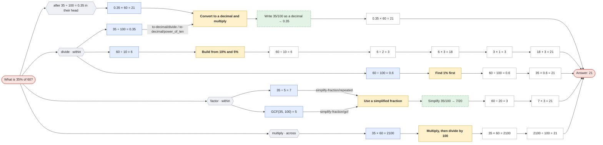

Not applicable here: Ratio table (`ratio_table`)


<a name="proportion-check"></a>

## Are two ratios proportional?

`proportion-check` · applied · prompt: *Are {a}:{b} and {c}:{d} proportional?*

Reduces to [compare-fractions](#compare-fractions) with `{"a": "a", "b": "b", "c": "c", "d": "d"}`. 

| Method | Idea | Steps use |
|---|---|---|
| **Cross-multiply** `cross_multiply` (= compare-fractions · cross_multiply) | {a}/{b} > {c}/{d} exactly when {a}×{d} > {c}×{b}. | — |
| **Common denominator** `common_denominator` (= compare-fractions · common_denominator) | Rewrite both fractions over the same denominator, then compare numerators. | — |
| **Rewrite one fraction over the other's denominator** `match_denominator` (= compare-fractions · match_denominator) | Turn {a}/{b} into something over {d}, then compare numerators with {c}. | — |
| **Common numerator** `common_numerator` (= compare-fractions · common_numerator) | With equal numerators, the smaller denominator gives the bigger fraction. | — |
| **Convert to decimals** `decimal` (= compare-fractions · decimal) | Write each fraction as a decimal and compare. | — |
| **Compare unit rates (flipped fractions)** `unit_rate` (= compare-fractions · unit_rate) | How much bottom per 1 of top? The bigger rate belongs to the smaller fraction. | — |
| **Compare scale factors** `scale_factor` (= compare-fractions · scale_factor) | How much do the tops grow ({c} ÷ {a}) compared with the bottoms ({d} ÷ {b})? | — |
| **Ratio table** `ratio_table` (= compare-fractions · ratio_table) | Scale {a}:{b} by 2, 3, 4, … until the top reaches {c}, then compare bottoms. | — |
| **Graph the points** `graph` (= compare-fractions · graph) | Plot ({a}, {b}) and ({c}, {d}); the steeper line from the origin belongs to the smaller fraction. | — |
| **Simplify both** `simplify` (= compare-fractions · simplify) | Reduce both fractions to lowest terms; equal fractions reduce to the same thing. | — |
| **Distance from 1** `distance_from_one` (= compare-fractions · distance_from_one) | Find how far each fraction is from 1; the one closer to 1 is bigger. | — |

Reading the graphs: **hexagons** group first steps by operation · scope; **blue** = first step, **purple** = second step (only where methods share a first step); **yellow** = method; **green dashed** = a call to another question (see its own page); edge labels show which skill method produced the step.

### Are 6:8 and 72:96 proportional?

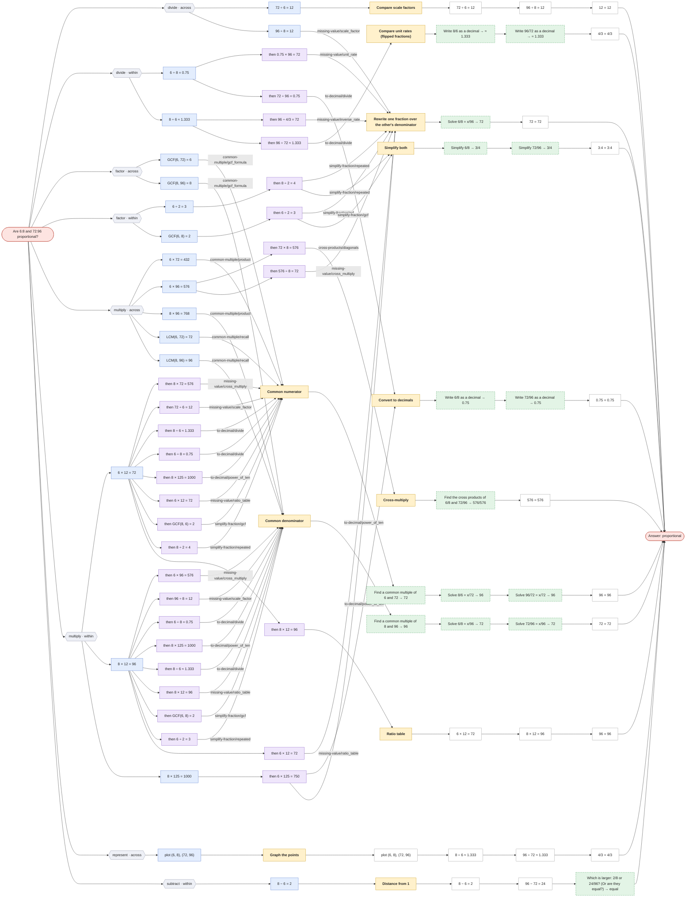

### Are 4:6 and 10:14 proportional?

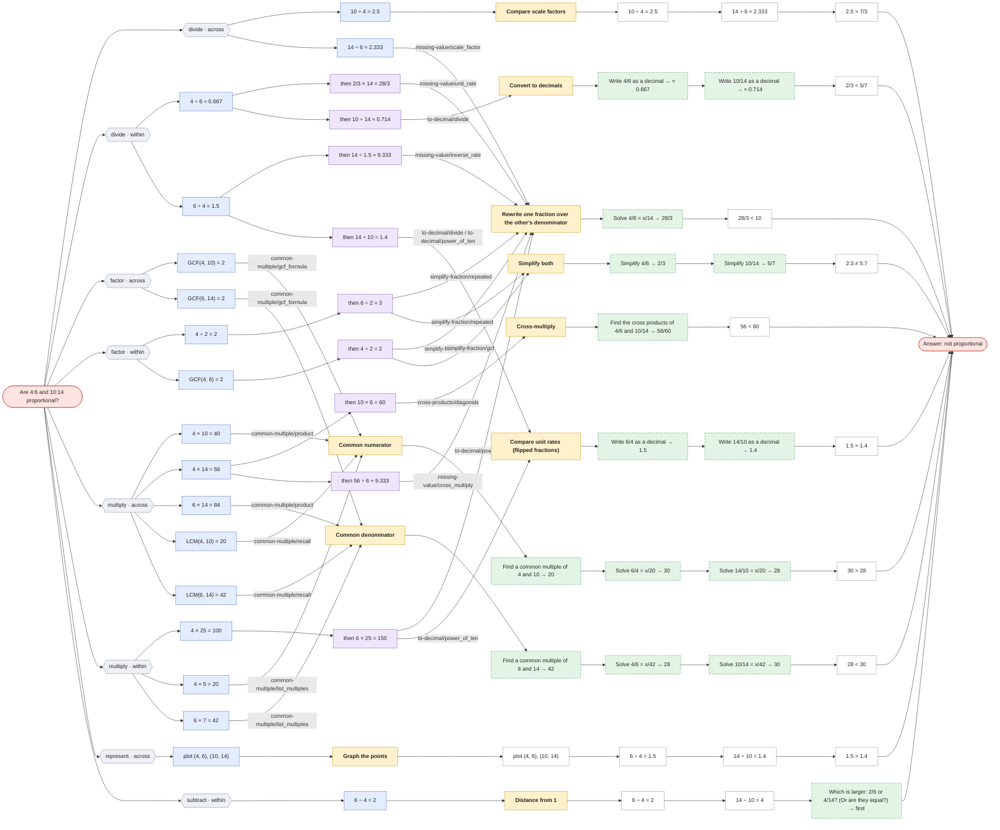

Not applicable here: Ratio table (`ratio_table`)


<a name="common-multiple"></a>

## Find a common multiple

`common-multiple` · skill · prompt: *Find a common multiple of {x} and {y}.*

| Method | Idea | Steps use |
|---|---|---|
| **Know the LCM** `recall` | Recognize the least common multiple directly. | — |
| **List multiples** `list_multiples` | Count up by {x} until you reach a number {y} divides. | — |
| **Multiply them** `product` | {x} × {y} is always a common multiple. | — |
| **Use the GCF** `gcf_formula` | LCM = {x} ÷ GCF × {y}. | — |

Reading the graphs: **hexagons** group first steps by operation · scope; **blue** = first step, **purple** = second step (only where methods share a first step); **yellow** = method; **green dashed** = a call to another question (see its own page); edge labels show which skill method produced the step.

### Find a common multiple of 4 and 6.

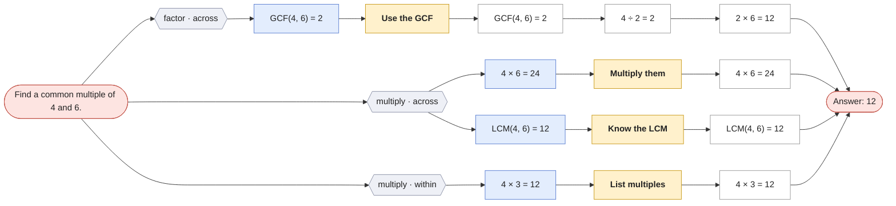

### Find a common multiple of 4 and 7.

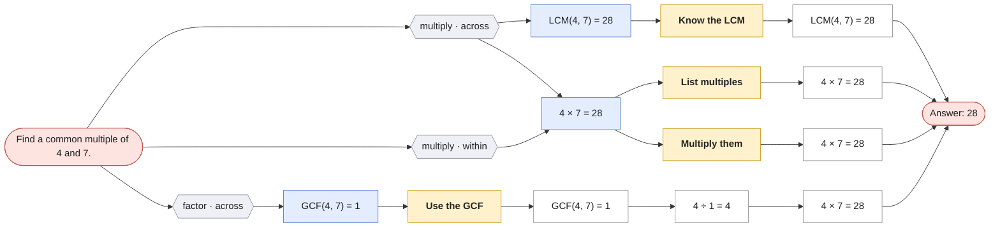


<a name="cross-products"></a>

## Cross products

`cross-products` · skill · prompt: *Find the cross products of {a}/{b} and {c}/{d}.*

| Method | Idea | Steps use |
|---|---|---|
| **Multiply the diagonals** `diagonals` | Multiply each numerator by the other fraction's denominator. | — |

Reading the graphs: **hexagons** group first steps by operation · scope; **blue** = first step, **purple** = second step (only where methods share a first step); **yellow** = method; **green dashed** = a call to another question (see its own page); edge labels show which skill method produced the step.

### Find the cross products of 3/4 and 5/7.

```mermaid
flowchart LR
  n0(["Find the cross products of 3/4 and 5/7."])
  n1(["Answer: 21/20"])
  n2["Multiply the diagonals"]
  n3["3 × 7 = 21"]
  n2 --> n3
  n4["5 × 4 = 20"]
  n3 --> n4
  n4 --> n1
  n5["3 × 7 = 21"]
  n6{{"multiply · across"}}
  n0 --> n6
  n6 --> n5
  n5 --> n2
  classDef cls fill:#eef0f6,stroke:#8a90a6,color:#222
  classDef first fill:#e3edfd,stroke:#5b7fd1,color:#222
  classDef second fill:#efe6fb,stroke:#8b63c9,color:#222
  classDef method fill:#fff1cc,stroke:#c99a1a,color:#222,font-weight:bold
  classDef skill fill:#e3f4e6,stroke:#3f9a55,stroke-dasharray:5 3,color:#222
  classDef step fill:#ffffff,stroke:#999,color:#222
  classDef ans fill:#fde4e1,stroke:#c4554a,color:#222
  class n6 cls
  class n5 first
  class n2 method
  class n3,n4 step
  class n0,n1 ans
```

### Find the cross products of 6/8 and 72/96.

```mermaid
flowchart LR
  n0(["Find the cross products of 6/8 and 72/96."])
  n1(["Answer: 576/576"])
  n2["Multiply the diagonals"]
  n3["6 × 96 = 576"]
  n2 --> n3
  n4["72 × 8 = 576"]
  n3 --> n4
  n4 --> n1
  n5["6 × 96 = 576"]
  n6{{"multiply · across"}}
  n0 --> n6
  n6 --> n5
  n5 --> n2
  classDef cls fill:#eef0f6,stroke:#8a90a6,color:#222
  classDef first fill:#e3edfd,stroke:#5b7fd1,color:#222
  classDef second fill:#efe6fb,stroke:#8b63c9,color:#222
  classDef method fill:#fff1cc,stroke:#c99a1a,color:#222,font-weight:bold
  classDef skill fill:#e3f4e6,stroke:#3f9a55,stroke-dasharray:5 3,color:#222
  classDef step fill:#ffffff,stroke:#999,color:#222
  classDef ans fill:#fde4e1,stroke:#c4554a,color:#222
  class n6 cls
  class n5 first
  class n2 method
  class n3,n4 step
  class n0,n1 ans
```


<a name="simplify-fraction"></a>

## Simplify a fraction

`simplify-fraction` · skill · prompt: *Simplify {x}/{y}.*

| Method | Idea | Steps use |
|---|---|---|
| **Divide by the GCF** `gcf` | Find the greatest common factor once and divide both terms by it. | — |
| **Divide out common factors repeatedly** `repeated` | Keep dividing both terms by any shared factor (2, 3, 5, …) until none is left. | — |

Reading the graphs: **hexagons** group first steps by operation · scope; **blue** = first step, **purple** = second step (only where methods share a first step); **yellow** = method; **green dashed** = a call to another question (see its own page); edge labels show which skill method produced the step.

### Simplify 6/8.

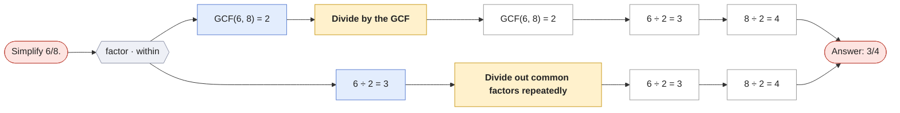

### Simplify 72/96.

```mermaid
flowchart LR
  n0(["Simplify 72/96."])
  n1(["Answer: 3/4"])
  n2["Divide by the GCF"]
  n3["GCF(72, 96) = 24"]
  n2 --> n3
  n4["72 ÷ 24 = 3"]
  n3 --> n4
  n5["96 ÷ 24 = 4"]
  n4 --> n5
  n5 --> n1
  n6["Divide out common factors repeatedly"]
  n7["72 ÷ 2 = 36"]
  n6 --> n7
  n8["96 ÷ 2 = 48"]
  n7 --> n8
  n9["36 ÷ 2 = 18"]
  n8 --> n9
  n10["48 ÷ 2 = 24"]
  n9 --> n10
  n11["18 ÷ 2 = 9"]
  n10 --> n11
  n12["24 ÷ 2 = 12"]
  n11 --> n12
  n13["9 ÷ 3 = 3"]
  n12 --> n13
  n14["12 ÷ 3 = 4"]
  n13 --> n14
  n14 --> n1
  n15["72 ÷ 2 = 36"]
  n16{{"factor · within"}}
  n0 --> n16
  n16 --> n15
  n15 --> n6
  n17["GCF(72, 96) = 24"]
  n16 --> n17
  n17 --> n2
  classDef cls fill:#eef0f6,stroke:#8a90a6,color:#222
  classDef first fill:#e3edfd,stroke:#5b7fd1,color:#222
  classDef second fill:#efe6fb,stroke:#8b63c9,color:#222
  classDef method fill:#fff1cc,stroke:#c99a1a,color:#222,font-weight:bold
  classDef skill fill:#e3f4e6,stroke:#3f9a55,stroke-dasharray:5 3,color:#222
  classDef step fill:#ffffff,stroke:#999,color:#222
  classDef ans fill:#fde4e1,stroke:#c4554a,color:#222
  class n16 cls
  class n15,n17 first
  class n2,n6 method
  class n3,n4,n5,n7,n8,n9,n10,n11,n12,n13,n14 step
  class n0,n1 ans
```


<a name="to-decimal"></a>

## Write a fraction as a decimal

`to-decimal` · skill · prompt: *Write {x}/{y} as a decimal.*

| Method | Idea | Steps use |
|---|---|---|
| **Divide** `divide` | Divide the numerator by the denominator (long division or a calculator). | — |
| **Scale to 10, 100, 1000** `power_of_ten` | Multiply top and bottom so the denominator becomes 10, 100, or 1000, then read off the decimal. | — |

Reading the graphs: **hexagons** group first steps by operation · scope; **blue** = first step, **purple** = second step (only where methods share a first step); **yellow** = method; **green dashed** = a call to another question (see its own page); edge labels show which skill method produced the step.

### Write 3/4 as a decimal.

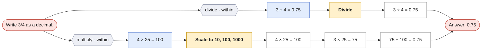

### Write 5/8 as a decimal.

```mermaid
flowchart LR
  n0(["Write 5/8 as a decimal."])
  n1(["Answer: 0.625"])
  n2["Divide"]
  n3["5 ÷ 8 = 0.625"]
  n2 --> n3
  n3 --> n1
  n4["Scale to 10, 100, 1000"]
  n5["8 × 125 = 1000"]
  n4 --> n5
  n6["5 × 125 = 625"]
  n5 --> n6
  n7["625 ÷ 1000 = 0.625"]
  n6 --> n7
  n7 --> n1
  n8["5 ÷ 8 = 0.625"]
  n9{{"divide · within"}}
  n0 --> n9
  n9 --> n8
  n8 --> n2
  n10["8 × 125 = 1000"]
  n11{{"multiply · within"}}
  n0 --> n11
  n11 --> n10
  n10 --> n4
  classDef cls fill:#eef0f6,stroke:#8a90a6,color:#222
  classDef first fill:#e3edfd,stroke:#5b7fd1,color:#222
  classDef second fill:#efe6fb,stroke:#8b63c9,color:#222
  classDef method fill:#fff1cc,stroke:#c99a1a,color:#222,font-weight:bold
  classDef skill fill:#e3f4e6,stroke:#3f9a55,stroke-dasharray:5 3,color:#222
  classDef step fill:#ffffff,stroke:#999,color:#222
  classDef ans fill:#fde4e1,stroke:#c4554a,color:#222
  class n9,n11 cls
  class n8,n10 first
  class n2,n4 method
  class n3,n5,n6,n7 step
  class n0,n1 ans
```


## Word problems

A word problem needs **extraction** before any method applies: pull out the quantities, drop the distractors, pair the right numbers in the right order, and recognize which question the story is. Each problem below maps to one of the questions above; its **traps** are common wrong extractions, written as alternative mappings so the wrong answer each one produces is computed, not guessed. That lets an app diagnose an extraction mistake from a student's answer, and often from their first step.

Each graph drills from the story down to the arithmetic: **story** → its **quantities** (grey dashed = not needed; white boxes are arithmetic steps, such as converting 2 dozen to 24) → the mapped question with **every method's first steps and operations**, exactly as in the question graphs → the **follow-up step**, if any → the **answer in the story's terms** (green). **Red dashed** branches are traps, each with the first steps that give it away (steps no correct reading starts with).

### Extraction concepts

| Concept | What the student does | Cues | Typical mistake |
|---|---|---|---|
| **Recognize the question type** `question_type` | Decide which question the story is: missing value, compare, better buy, proportion check, percent of, add fractions. | at the same rate / speed; how many … for …; which is the better buy / deal; who is better / sweeter / faster; same taste / shade; % of, % off, tip, tax; in all, altogether (with fractions) | Solving a different question than the one asked (sale price instead of savings). |
| **Pull out each quantity** `quantity` | Write each number with its unit and what it counts: 4 spoons (of sugar), 6 glasses (of lemonade). | — | Keeping the number but losing what it counts, so it gets used in the wrong place. |
| **Spot numbers written as words** `implicit_number` | Turn words into numbers. | a dozen = 12; a pair = 2; half = 1/2; twice = 2 ×; a quarter = 1/4; a / an / each = 1 | Reading '2 dozen' as 2. |
| **Make units match** `unit_conversion` | Convert so both sides of a ratio use the same units. | minutes ↔ hours; cents ↔ dollars; inches ↔ feet | Mixing hours on one side with minutes on the other. |
| **Find the pair that forms the ratio** `rate_pair` | Identify which two quantities belong together. | per; for every; each; to make; out of; for; stands for; in (150 miles in 3 hours) | Pairing the wrong two numbers. |
| **Keep the same order on both sides** `correspondence` | If the known ratio is sugar : lemonade, the unknown ratio must be sugar : lemonade too. | — | Flipping one side: 4/6 = 18/x instead of 4/6 = x/18. |
| **Ignore numbers that don't matter** `distractor` | Recognize numbers the question doesn't need. | — | Using a distractor in place of a real quantity. |
| **Name the unknown** `unknown` | Say what's asked for and in what unit, before computing. | — | Computing a related number that isn't the one asked for. |
| **'More' vs 'in all'** `delta_vs_total` | Decide whether a number is an increase or a new total, and whether the answer should be. | more; additional; another; in all; altogether; total; already; left | Answering the total when the extra amount was asked for, or the reverse. |
| **Scale, don't add** `multiplicative` | Proportional quantities grow by the same factor, not by the same amount. | — | '18 more glasses, so 18 more spoons.' |
| **Which way wins** `direction` | In a comparison, decide whether the bigger or smaller ratio is better, and which ratio (sugar per glass, or glasses per spoon) the story is about. | cheaper; sweeter; better rate; faster; stronger | Picking the bigger number when the smaller one wins, or comparing the flipped ratio. |
| **Finish the story** `follow_up` | A step after the core computation: subtract what's already used, find the price after a discount. | — | Stopping after the core computation. |
| **Answer in the story's terms** `answer_in_context` | Name the person or offer, give units, write 19/12 as 1 7/12. | — | Answering 'first' or a bare number. |

| Word problem | Maps to | Concepts |
|---|---|---|
| [Cereal boxes](#cereal-boxes) | [better-buy](#better-buy) | Recognize the question type, Find the pair that forms the ratio, Which way wins, Ignore numbers that don't matter, Answer in the story's terms |
| [Free throws](#free-throws) | [compare-fractions](#compare-fractions) | Find the pair that forms the ratio, Which way wins, Answer in the story's terms |
| [Jacket on sale](#jacket-sale) | [percent-of](#percent-of) | Recognize the question type, Name the unknown, Finish the story |
| [Lemonade: how many in all](#lemonade-in-all) | [missing-value](#missing-value) | 'More' vs 'in all', Finish the story, Find the pair that forms the ratio, Scale, don't add |
| [Lemonade: more sugar](#lemonade-more-sugar) | [missing-value](#missing-value) | Recognize the question type, Pull out each quantity, Find the pair that forms the ratio, Keep the same order on both sides, Ignore numbers that don't matter, 'More' vs 'in all', Scale, don't add, Name the unknown |
| [Map scale](#map-scale) | [missing-value](#missing-value) | Find the pair that forms the ratio, Keep the same order on both sides, Spot numbers written as words |
| [Same shade of paint?](#paint-shade) | [proportion-check](#proportion-check) | Recognize the question type, Find the pair that forms the ratio, Scale, don't add, Answer in the story's terms |
| [Pancakes by the dozen](#pancakes-dozen) | [missing-value](#missing-value) | Spot numbers written as words, Ignore numbers that don't matter, Find the pair that forms the ratio, Keep the same order on both sides |
| [Sharing pizza](#pizza-shared) | [add-fractions](#add-fractions) | Recognize the question type, Pull out each quantity, Answer in the story's terms |
| [Whose lemonade is sweeter?](#sweeter-lemonade) | [compare-fractions](#compare-fractions) | Recognize the question type, Find the pair that forms the ratio, Which way wins, Scale, don't add, Answer in the story's terms |
| [Train in minutes](#train-minutes) | [missing-value](#missing-value) | Make units match, Find the pair that forms the ratio, Recognize the question type |
| [Walking to school](#walk-to-school) | [percent-of](#percent-of) | Recognize the question type, Ignore numbers that don't matter |

<a name="cereal-boxes"></a>

### Cereal boxes

> A 12-ounce box of cereal costs $3.00 and a 20-ounce box costs $4.50. The store is 2 miles from home. Which box is the better buy?

| Phrase | Value | Counts | Role |
|---|---|---|---|
| “a 12-ounce box” | 12 | cereal in the small box | used |
| “costs $3.00” | 3.00 | price of the small box | used |
| “a 20-ounce box” | 20 | cereal in the big box | used |
| “costs $4.50” | 4.50 | price of the big box | used |
| “2 miles from home” | 2 | distance to the store | distractor |

**Asked:** which box is the better buy (box). **Link:** “box … costs”: Each box pairs ounces with dollars; compare dollars per ounce, and the smaller wins.

**Maps to** [better-buy](#better-buy): q1 = 12, p1 = 3, q2 = 20, p2 = 4.5. **Answer:** the 20-ounce box ($0.225 per ounce vs $0.25).

```mermaid
flowchart LR
  w0(["Cereal boxes"])
  w1["a 12-ounce box"]
  w0 --> w1
  w2["costs $3.00"]
  w0 --> w2
  w3["a 20-ounce box"]
  w0 --> w3
  w4["costs $4.50"]
  w0 --> w4
  w5["2 miles from home (not needed)"]
  w0 --> w5
  c0(["Offer 1: 12 units for $3. Offer 2: 20 units for $4.5. Which is the better buy?"])
  c1(["Answer: the 20-ounce box"])
  c2["Price per unit"]
  c3["Write 3/12 as a decimal → 0.25"]
  c2 --> c3
  c4["Write 4.5/20 as a decimal → 0.225"]
  c3 --> c4
  c5["0.25 #gt; 0.225"]
  c4 --> c5
  c5 --> c1
  c6["Units per dollar"]
  c7["Write 12/3 as a decimal → 4"]
  c6 --> c7
  c8["Write 20/4.5 as a decimal → ≈ 4.444"]
  c7 --> c8
  c9["4 #lt; 40/9"]
  c8 --> c9
  c9 --> c1
  c10["Common quantity"]
  c11["Find a common multiple of 12 and 20 → 60"]
  c10 --> c11
  c12["Solve 3/12 = x/60 → 15"]
  c11 --> c12
  c13["Solve 4.5/20 = x/60 → 13.5"]
  c12 --> c13
  c14["15 #gt; 13.5"]
  c13 --> c14
  c14 --> c1
  c15["Scale one offer to the other's size"]
  c16["Solve 3/12 = x/20 → 5"]
  c15 --> c16
  c17["5 #gt; 4.5"]
  c16 --> c17
  c17 --> c1
  c18["Cross-multiply"]
  c19["Find the cross products of 3/12 and 4.5/20 → 60/54"]
  c18 --> c19
  c20["60 #gt; 54"]
  c19 --> c20
  c20 --> c1
  c21["Compare growth"]
  c22["4.5 ÷ 3 = 1.5"]
  c21 --> c22
  c23["20 ÷ 12 ≈ 1.667"]
  c22 --> c23
  c24["1.5 #lt; 5/3"]
  c23 --> c24
  c24 --> c1
  c25["20 ÷ 12 ≈ 1.667"]
  c26{{"divide · across"}}
  c0 --> c26
  c26 --> c25
  c25 -->|"missing-value/scale_factor"| c15
  c27["4.5 ÷ 3 = 1.5"]
  c26 --> c27
  c27 --> c21
  c28["12 ÷ 3 = 4"]
  c29{{"divide · within"}}
  c0 --> c29
  c29 --> c28
  c30["then 20 ÷ 4.5 ≈ 4.444"]
  c28 --> c30
  c30 -->|"to-decimal/divide"| c6
  c31["then 20 ÷ 4 = 5"]
  c28 --> c31
  c31 -->|"missing-value/inverse_rate"| c15
  c32["3 ÷ 12 = 0.25"]
  c29 --> c32
  c33["then 4.5 ÷ 20 = 0.225"]
  c32 --> c33
  c33 -->|"to-decimal/divide"| c2
  c34["then 20 × 5 = 100"]
  c32 --> c34
  c34 -->|"to-decimal/power_of_ten"| c2
  c35["then 0.25 × 20 = 5"]
  c32 --> c35
  c35 -->|"missing-value/unit_rate"| c15
  c36["GCF(12, 20) = 4"]
  c37{{"factor · across"}}
  c0 --> c37
  c37 --> c36
  c36 -->|"common-multiple/gcf_formula"| c10
  c38["3 ÷ 3 = 1"]
  c39{{"factor · within"}}
  c0 --> c39
  c39 --> c38
  c38 -->|"simplify-fraction/repeated"| c15
  c40["GCF(3, 12) = 3"]
  c39 --> c40
  c40 -->|"simplify-fraction/gcf"| c15
  c41["12 × 20 = 240"]
  c42{{"multiply · across"}}
  c0 --> c42
  c42 --> c41
  c41 -->|"common-multiple/product"| c10
  c43["3 × 20 = 60"]
  c42 --> c43
  c44["then 60 ÷ 12 = 5"]
  c43 --> c44
  c44 -->|"missing-value/cross_multiply"| c15
  c45["then 4.5 × 12 = 54"]
  c43 --> c45
  c45 -->|"cross-products/diagonals"| c18
  c46["LCM(12, 20) = 60"]
  c42 --> c46
  c46 -->|"common-multiple/recall"| c10
  c47["12 × 5 = 60"]
  c48{{"multiply · within"}}
  c0 --> c48
  c48 --> c47
  c47 -->|"common-multiple/list_multiples"| c10
  classDef cls fill:#eef0f6,stroke:#8a90a6,color:#222
  classDef first fill:#e3edfd,stroke:#5b7fd1,color:#222
  classDef second fill:#efe6fb,stroke:#8b63c9,color:#222
  classDef method fill:#fff1cc,stroke:#c99a1a,color:#222,font-weight:bold
  classDef skill fill:#e3f4e6,stroke:#3f9a55,stroke-dasharray:5 3,color:#222
  classDef step fill:#ffffff,stroke:#999,color:#222
  classDef ans fill:#fde4e1,stroke:#c4554a,color:#222
  class c26,c29,c37,c39,c42,c48 cls
  class c25,c27,c28,c32,c36,c38,c40,c41,c43,c46,c47 first
  class c30,c31,c33,c34,c35,c44,c45 second
  class c2,c6,c10,c15,c18,c21 method
  class c3,c4,c7,c8,c11,c12,c13,c16,c19 skill
  class c5,c9,c14,c17,c20,c22,c23,c24 step
  class c0,c1 ans
  w1 -->|"q1"| c0
  w2 -->|"p1"| c0
  w3 -->|"q2"| c0
  w4 -->|"p2"| c0
  w6(["the 20-ounce box ($0.225 per ounce vs $0.25)"])
  c1 --> w6
  w7["Compares prices only and picks the cheaper box. → the 12-ounce box"]
  w0 -.->|"Find the pair that forms the ratio"| w7
  w8["Finds ounces per dollar but picks the smaller one. → the 12-ounce box"]
  w0 -.->|"Which way wins"| w8
  classDef cls fill:#eef0f6,stroke:#8a90a6,color:#222
  classDef first fill:#e3edfd,stroke:#5b7fd1,color:#222
  classDef second fill:#efe6fb,stroke:#8b63c9,color:#222
  classDef method fill:#fff1cc,stroke:#c99a1a,color:#222,font-weight:bold
  classDef skill fill:#e3f4e6,stroke:#3f9a55,stroke-dasharray:5 3,color:#222
  classDef step fill:#ffffff,stroke:#999,color:#222
  classDef ans fill:#fde4e1,stroke:#c4554a,color:#222
  classDef wstory fill:#fde4e1,stroke:#c4554a,color:#222
  classDef wused fill:#dbe9ff,stroke:#3d6fd1,color:#222
  classDef wdist fill:#f2f2f2,stroke:#999,stroke-dasharray:4 3,color:#777
  classDef wop fill:#ffffff,stroke:#3d6fd1,color:#222
  classDef wfinal fill:#d4f0da,stroke:#2f8a45,color:#222,font-weight:bold
  classDef wtrap fill:#fff,stroke:#c4554a,stroke-dasharray:5 3,color:#a33
  classDef wtfirst fill:#fff5f4,stroke:#c4554a,stroke-dasharray:2 2,color:#a33
  class w0 wstory
  class w1,w2,w3,w4 wused
  class w5 wdist
  class w6 wfinal
  class w7,w8 wtrap
```

| Trap | Mistake | Gives | Caught by the answer? |
|---|---|---|---|
| Find the pair that forms the ratio | Compares prices only and picks the cheaper box. | the 12-ounce box | yes |
| Which way wins | Finds ounces per dollar but picks the smaller one. | the 12-ounce box | yes |

<a name="free-throws"></a>

### Free throws

> Maya made 3 of her 4 free throws. Leo made 5 of his 7. Who has the better shooting rate?

| Phrase | Value | Counts | Role |
|---|---|---|---|
| “made 3” | 3 | Maya's made shots | used |
| “of her 4” | 4 | Maya's attempts | used |
| “made 5” | 5 | Leo's made shots | used |
| “of his 7” | 7 | Leo's attempts | used |

**Asked:** who has the better shooting rate (name). **Link:** “made … of”: Made out of attempted; the bigger fraction wins.

**Maps to** [compare-fractions](#compare-fractions): a = 3, b = 4, c = 5, d = 7. **Answer:** Maya (3/4 = 0.75 vs 5/7 ≈ 0.714).

```mermaid
flowchart LR
  w0(["Free throws"])
  w1["made 3"]
  w0 --> w1
  w2["of her 4"]
  w0 --> w2
  w3["made 5"]
  w0 --> w3
  w4["of his 7"]
  w0 --> w4
  c0(["Which is larger: 3/4 or 5/7? (Or are they equal?)"])
  c1(["Answer: Maya"])
  c2["Cross-multiply"]
  c3["Find the cross products of 3/4 and 5/7 → 21/20"]
  c2 --> c3
  c4["21 #gt; 20"]
  c3 --> c4
  c4 --> c1
  c5["Common denominator"]
  c6["Find a common multiple of 4 and 7 → 28"]
  c5 --> c6
  c7["Solve 3/4 = x/28 → 21"]
  c6 --> c7
  c8["Solve 5/7 = x/28 → 20"]
  c7 --> c8
  c9["21 #gt; 20"]
  c8 --> c9
  c9 --> c1
  c10["Rewrite one fraction over the other's denominator"]
  c11["Solve 3/4 = x/7 → 5.25"]
  c10 --> c11
  c12["5.25 #gt; 5"]
  c11 --> c12
  c12 --> c1
  c13["Common numerator"]
  c14["Find a common multiple of 3 and 5 → 15"]
  c13 --> c14
  c15["Solve 4/3 = x/15 → 20"]
  c14 --> c15
  c16["Solve 7/5 = x/15 → 21"]
  c15 --> c16
  c17["20 #lt; 21"]
  c16 --> c17
  c17 --> c1
  c18["Convert to decimals"]
  c19["Write 3/4 as a decimal → 0.75"]
  c18 --> c19
  c20["Write 5/7 as a decimal → ≈ 0.714"]
  c19 --> c20
  c21["0.75 #gt; 5/7"]
  c20 --> c21
  c21 --> c1
  c22["Compare unit rates (flipped fractions)"]
  c23["Write 4/3 as a decimal → ≈ 1.333"]
  c22 --> c23
  c24["Write 7/5 as a decimal → 1.4"]
  c23 --> c24
  c25["4/3 #lt; 1.4"]
  c24 --> c25
  c25 --> c1
  c26["Compare scale factors"]
  c27["5 ÷ 3 ≈ 1.667"]
  c26 --> c27
  c28["7 ÷ 4 = 1.75"]
  c27 --> c28
  c29["5/3 #lt; 1.75"]
  c28 --> c29
  c29 --> c1
  c30["Graph the points"]
  c31["plot (3, 4), (5, 7)"]
  c30 --> c31
  c32["4 ÷ 3 ≈ 1.333"]
  c31 --> c32
  c33["7 ÷ 5 = 1.4"]
  c32 --> c33
  c34["4/3 #lt; 1.4"]
  c33 --> c34
  c34 --> c1
  c35["Simplify both"]
  c36["Simplify 3/4 → 3/4"]
  c35 --> c36
  c37["Simplify 5/7 → 5/7"]
  c36 --> c37
  c38["3:4 ≠ 5:7"]
  c37 --> c38
  c38 --> c1
  c39["Distance from 1"]
  c40["4 − 3 = 1"]
  c39 --> c40
  c41["7 − 5 = 2"]
  c40 --> c41
  c42["Which is larger: 1/4 or 2/7? (Or are they equal?) → second"]
  c41 --> c42
  c42 --> c1
  c43["5 ÷ 3 ≈ 1.667"]
  c44{{"divide · across"}}
  c0 --> c44
  c44 --> c43
  c43 --> c26
  c45["7 ÷ 4 = 1.75"]
  c44 --> c45
  c45 -->|"missing-value/scale_factor"| c10
  c46["3 ÷ 4 = 0.75"]
  c47{{"divide · within"}}
  c0 --> c47
  c47 --> c46
  c48["then 0.75 × 7 = 5.25"]
  c46 --> c48
  c48 -->|"missing-value/unit_rate"| c10
  c49["then 5 ÷ 7 ≈ 0.714"]
  c46 --> c49
  c49 -->|"to-decimal/divide"| c18
  c50["4 ÷ 3 ≈ 1.333"]
  c47 --> c50
  c51["then 7 ÷ 4/3 = 5.25"]
  c50 --> c51
  c51 -->|"missing-value/inverse_rate"| c10
  c52["then 7 ÷ 5 = 1.4"]
  c50 --> c52
  c52 -->|"to-decimal/divide"| c22
  c53["then 5 × 2 = 10"]
  c50 --> c53
  c53 -->|"to-decimal/power_of_ten"| c22
  c54["GCF(3, 5) = 1"]
  c55{{"factor · across"}}
  c0 --> c55
  c55 --> c54
  c54 -->|"common-multiple/gcf_formula"| c13
  c56["GCF(4, 7) = 1"]
  c55 --> c56
  c56 -->|"common-multiple/gcf_formula"| c5
  c57["GCF(3, 4) = 1"]
  c58{{"factor · within"}}
  c0 --> c58
  c58 --> c57
  c59["then 3 ÷ 1 = 3"]
  c57 --> c59
  c59 -->|"simplify-fraction/gcf"| c10
  c59 -->|"simplify-fraction/gcf"| c35
  c60["3 × 7 = 21"]
  c61{{"multiply · across"}}
  c0 --> c61
  c61 --> c60
  c62["then 5 × 4 = 20"]
  c60 --> c62
  c62 -->|"cross-products/diagonals"| c2
  c63["then 21 ÷ 4 = 5.25"]
  c60 --> c63
  c63 -->|"missing-value/cross_multiply"| c10
  c64["LCM(3, 5) = 15"]
  c61 --> c64
  c64 -->|"common-multiple/recall"| c13
  c65["LCM(4, 7) = 28"]
  c61 --> c65
  c65 -->|"common-multiple/recall"| c5
  c66["3 × 5 = 15"]
  c61 --> c66
  c67{{"multiply · within"}}
  c0 --> c67
  c67 --> c66
  c66 -->|"common-multiple/list_multiples / common-multiple/product"| c13
  c68["4 × 7 = 28"]
  c61 --> c68
  c67 --> c68
  c68 -->|"common-multiple/list_multiples / common-multiple/product"| c5
  c69["4 × 25 = 100"]
  c67 --> c69
  c70["then 3 × 25 = 75"]
  c69 --> c70
  c70 -->|"to-decimal/power_of_ten"| c18
  c70 -->|"to-decimal/power_of_ten"| c10
  c71["plot (3, 4), (5, 7)"]
  c72{{"represent · across"}}
  c0 --> c72
  c72 --> c71
  c71 --> c30
  c73["4 − 3 = 1"]
  c74{{"subtract · within"}}
  c0 --> c74
  c74 --> c73
  c73 --> c39
  classDef cls fill:#eef0f6,stroke:#8a90a6,color:#222
  classDef first fill:#e3edfd,stroke:#5b7fd1,color:#222
  classDef second fill:#efe6fb,stroke:#8b63c9,color:#222
  classDef method fill:#fff1cc,stroke:#c99a1a,color:#222,font-weight:bold
  classDef skill fill:#e3f4e6,stroke:#3f9a55,stroke-dasharray:5 3,color:#222
  classDef step fill:#ffffff,stroke:#999,color:#222
  classDef ans fill:#fde4e1,stroke:#c4554a,color:#222
  class c44,c47,c55,c58,c61,c67,c72,c74 cls
  class c43,c45,c46,c50,c54,c56,c57,c60,c64,c65,c66,c68,c69,c71,c73 first
  class c48,c49,c51,c52,c53,c59,c62,c63,c70 second
  class c2,c5,c10,c13,c18,c22,c26,c30,c35,c39 method
  class c3,c6,c7,c8,c11,c14,c15,c16,c19,c20,c23,c24,c36,c37,c42 skill
  class c4,c9,c12,c17,c21,c25,c27,c28,c29,c31,c32,c33,c34,c38,c40,c41 step
  class c0,c1 ans
  w1 -->|"a"| c0
  w2 -->|"b"| c0
  w3 -->|"c"| c0
  w4 -->|"d"| c0
  w5(["Maya (3/4 = 0.75 vs 5/7 ≈ 0.714)"])
  c1 --> w5
  w6["Compares shots made only (5 #gt; 3). → Leo"]
  w0 -.->|"Find the pair that forms the ratio"| w6
  w7["Compares misses per shot and picks the bigger. → Leo"]
  w0 -.->|"Which way wins"| w7
  w8["1 × 7 = 7"]
  w7 -.-> w8
  w9["LCM(1, 2) = 2"]
  w7 -.-> w9
  w10["1 ÷ 4 = 0.25"]
  w7 -.-> w10
  w11["4 ÷ 1 = 4"]
  w7 -.-> w11
  classDef cls fill:#eef0f6,stroke:#8a90a6,color:#222
  classDef first fill:#e3edfd,stroke:#5b7fd1,color:#222
  classDef second fill:#efe6fb,stroke:#8b63c9,color:#222
  classDef method fill:#fff1cc,stroke:#c99a1a,color:#222,font-weight:bold
  classDef skill fill:#e3f4e6,stroke:#3f9a55,stroke-dasharray:5 3,color:#222
  classDef step fill:#ffffff,stroke:#999,color:#222
  classDef ans fill:#fde4e1,stroke:#c4554a,color:#222
  classDef wstory fill:#fde4e1,stroke:#c4554a,color:#222
  classDef wused fill:#dbe9ff,stroke:#3d6fd1,color:#222
  classDef wdist fill:#f2f2f2,stroke:#999,stroke-dasharray:4 3,color:#777
  classDef wop fill:#ffffff,stroke:#3d6fd1,color:#222
  classDef wfinal fill:#d4f0da,stroke:#2f8a45,color:#222,font-weight:bold
  classDef wtrap fill:#fff,stroke:#c4554a,stroke-dasharray:5 3,color:#a33
  classDef wtfirst fill:#fff5f4,stroke:#c4554a,stroke-dasharray:2 2,color:#a33
  class w0 wstory
  class w1,w2,w3,w4 wused
  class w5 wfinal
  class w6,w7 wtrap
  class w8,w9,w10,w11 wtfirst
```

| Trap | Mistake | Gives | Caught by the answer? |
|---|---|---|---|
| Find the pair that forms the ratio | Compares shots made only (5 > 3). | Leo | yes |
| Which way wins | Compares misses per shot and picks the bigger. | Leo | yes |

First steps that give a trap away (each method's main route under the wrong reading; no correct route starts this way). Traps that just compare raw counts are caught by the answer instead.

| Student's first step | Suggests |
|---|---|
| `1 × 2 = 2` | Compares misses per shot and picks the bigger. |
| `1 × 7 = 7` | Compares misses per shot and picks the bigger. |
| `1 ÷ 4 = 0.25` | Compares misses per shot and picks the bigger. |
| `2 ÷ 1 = 2` | Compares misses per shot and picks the bigger. |
| `4 ÷ 1 = 4` | Compares misses per shot and picks the bigger. |
| `4 − 1 = 3` | Compares misses per shot and picks the bigger. |
| `GCF(1, 4) = 1` | Compares misses per shot and picks the bigger. |
| `LCM(1, 2) = 2` | Compares misses per shot and picks the bigger. |
| `plot (1, 4), (2, 7)` | Compares misses per shot and picks the bigger. |

<a name="jacket-sale"></a>

### Jacket on sale

> A jacket normally costs $80. This week it is 15% off. How much does the jacket cost this week?

| Phrase | Value | Counts | Role |
|---|---|---|---|
| “costs $80” | 80 | original price | used |
| “15% off” | 15 | discount | used |

**Asked:** how much does it cost this week (dollars). **Link:** “% off”: 15% of the original price is taken off.

**Maps to** [percent-of](#percent-of): p = 15, n = 80, then subtract the savings from the original price. **Answer:** $68.

```mermaid
flowchart LR
  w0(["Jacket on sale"])
  w1["costs $80"]
  w0 --> w1
  w2["15% off"]
  w0 --> w2
  c0(["What is 15% of 80?"])
  c1(["Answer: 12"])
  c2["Convert to a decimal and multiply"]
  c3["Write 15/100 as a decimal → 0.15"]
  c2 --> c3
  c4["0.15 × 80 = 12"]
  c3 --> c4
  c4 --> c1
  c5["Find 1% first"]
  c6["80 ÷ 100 = 0.8"]
  c5 --> c6
  c7["15 × 0.8 = 12"]
  c6 --> c7
  c7 --> c1
  c8["Multiply, then divide by 100"]
  c9["15 × 80 = 1200"]
  c8 --> c9
  c10["1200 ÷ 100 = 12"]
  c9 --> c10
  c10 --> c1
  c11["Use a simplified fraction"]
  c12["Simplify 15/100 → 3/20"]
  c11 --> c12
  c13["80 ÷ 20 = 4"]
  c12 --> c13
  c14["3 × 4 = 12"]
  c13 --> c14
  c14 --> c1
  c15["Build from 10% and 5%"]
  c16["80 ÷ 10 = 8"]
  c15 --> c16
  c17["8 ÷ 2 = 4"]
  c16 --> c17
  c18["8 × 1 = 8"]
  c17 --> c18
  c19["4 × 1 = 4"]
  c18 --> c19
  c20["8 + 4 = 12"]
  c19 --> c20
  c20 --> c1
  c21["0.15 × 80 = 12"]
  c22{{"after 15 ÷ 100 = 0.15 in their head"}}
  c0 --> c22
  c22 --> c21
  c21 --> c2
  c23["15 ÷ 100 = 0.15"]
  c24{{"divide · within"}}
  c0 --> c24
  c24 --> c23
  c23 -->|"to-decimal/divide / to-decimal/power_of_ten"| c2
  c25["80 ÷ 10 = 8"]
  c24 --> c25
  c25 --> c15
  c26["80 ÷ 100 = 0.8"]
  c24 --> c26
  c26 --> c5
  c27["15 ÷ 5 = 3"]
  c28{{"factor · within"}}
  c0 --> c28
  c28 --> c27
  c27 -->|"simplify-fraction/repeated"| c11
  c29["GCF(15, 100) = 5"]
  c28 --> c29
  c29 -->|"simplify-fraction/gcf"| c11
  c30["15 × 80 = 1200"]
  c31{{"multiply · across"}}
  c0 --> c31
  c31 --> c30
  c30 --> c8
  classDef cls fill:#eef0f6,stroke:#8a90a6,color:#222
  classDef first fill:#e3edfd,stroke:#5b7fd1,color:#222
  classDef second fill:#efe6fb,stroke:#8b63c9,color:#222
  classDef method fill:#fff1cc,stroke:#c99a1a,color:#222,font-weight:bold
  classDef skill fill:#e3f4e6,stroke:#3f9a55,stroke-dasharray:5 3,color:#222
  classDef step fill:#ffffff,stroke:#999,color:#222
  classDef ans fill:#fde4e1,stroke:#c4554a,color:#222
  class c22,c24,c28,c31 cls
  class c21,c23,c25,c26,c27,c29,c30 first
  class c2,c5,c8,c11,c15 method
  class c3,c12 skill
  class c4,c6,c7,c9,c10,c13,c14,c16,c17,c18,c19,c20 step
  class c0,c1 ans
  w2 -->|"p"| c0
  w1 -->|"n"| c0
  w3["80 − 12 = 68 (subtract the savings from the original price)"]
  w1 --> w3
  c1 --> w3
  w4(["$68"])
  w3 --> w4
  w5["Answers the savings instead of the new price. → 12"]
  w0 -.->|"Name the unknown"| w5
  w6["Takes off $15 instead of 15%. → 65"]
  w0 -.->|"Recognize the question type"| w6
  classDef cls fill:#eef0f6,stroke:#8a90a6,color:#222
  classDef first fill:#e3edfd,stroke:#5b7fd1,color:#222
  classDef second fill:#efe6fb,stroke:#8b63c9,color:#222
  classDef method fill:#fff1cc,stroke:#c99a1a,color:#222,font-weight:bold
  classDef skill fill:#e3f4e6,stroke:#3f9a55,stroke-dasharray:5 3,color:#222
  classDef step fill:#ffffff,stroke:#999,color:#222
  classDef ans fill:#fde4e1,stroke:#c4554a,color:#222
  classDef wstory fill:#fde4e1,stroke:#c4554a,color:#222
  classDef wused fill:#dbe9ff,stroke:#3d6fd1,color:#222
  classDef wdist fill:#f2f2f2,stroke:#999,stroke-dasharray:4 3,color:#777
  classDef wop fill:#ffffff,stroke:#3d6fd1,color:#222
  classDef wfinal fill:#d4f0da,stroke:#2f8a45,color:#222,font-weight:bold
  classDef wtrap fill:#fff,stroke:#c4554a,stroke-dasharray:5 3,color:#a33
  classDef wtfirst fill:#fff5f4,stroke:#c4554a,stroke-dasharray:2 2,color:#a33
  class w0 wstory
  class w1,w2 wused
  class w3 wop
  class w4 wfinal
  class w5,w6 wtrap
```

| Trap | Mistake | Gives | Caught by the answer? |
|---|---|---|---|
| Name the unknown | Answers the savings instead of the new price. | 12 | yes |
| Recognize the question type | Takes off $15 instead of 15%. | 65 | yes |

<a name="lemonade-in-all"></a>

### Lemonade: how many in all

> Joe used 4 spoons of sugar to make the first 6 glasses of lemonade. He wants 18 glasses in all. How many more spoons of sugar does he need?

| Phrase | Value | Counts | Role |
|---|---|---|---|
| “4 spoons of sugar” | 4 | sugar already used | used |
| “the first 6 glasses” | 6 | lemonade made | used |
| “18 glasses in all” | 18 | lemonade wanted in total | used |

**Asked:** how many more spoons (spoons). **Link:** “to make”: 4 spoons per 6 glasses; 18 is a total, so the answer is total sugar minus sugar already used.

**Maps to** [missing-value](#missing-value): a = 4, b = 6, d = 18, then subtract the sugar already used. **Answer:** 8 more spoons of sugar.

```mermaid
flowchart LR
  w0(["Lemonade: how many in all"])
  w1["4 spoons of sugar"]
  w0 --> w1
  w2["the first 6 glasses"]
  w0 --> w2
  w3["18 glasses in all"]
  w0 --> w3
  c0(["Solve 4/6 = x/18."])
  c1(["Answer: 12"])
  c2["Cross-multiply and divide"]
  c3["4 × 18 = 72"]
  c2 --> c3
  c4["72 ÷ 6 = 12"]
  c3 --> c4
  c4 --> c1
  c5["Scale factor"]
  c6["18 ÷ 6 = 3"]
  c5 --> c6
  c7["4 × 3 = 12"]
  c6 --> c7
  c7 --> c1
  c8["Unit rate"]
  c9["Write 4/6 as a decimal → ≈ 0.667"]
  c8 --> c9
  c10["2/3 × 18 = 12"]
  c9 --> c10
  c10 --> c1
  c11["Inverse rate"]
  c12["Write 6/4 as a decimal → 1.5"]
  c11 --> c12
  c13["18 ÷ 1.5 = 12"]
  c12 --> c13
  c13 --> c1
  c14["Ratio table"]
  c15["6 × 3 = 18"]
  c14 --> c15
  c16["4 × 3 = 12"]
  c15 --> c16
  c16 --> c1
  c17["Simplify, then scale"]
  c18["Simplify 4/6 → 2/3"]
  c17 --> c18
  c19["18 ÷ 3 = 6"]
  c18 --> c19
  c20["2 × 6 = 12"]
  c19 --> c20
  c20 --> c1
  c21["18 ÷ 6 = 3"]
  c22{{"divide · across"}}
  c0 --> c22
  c22 --> c21
  c21 --> c5
  c23["4 ÷ 6 ≈ 0.667"]
  c24{{"divide · within"}}
  c0 --> c24
  c24 --> c23
  c23 -->|"to-decimal/divide"| c8
  c25["6 ÷ 4 = 1.5"]
  c24 --> c25
  c25 -->|"to-decimal/divide"| c11
  c26["4 ÷ 2 = 2"]
  c27{{"factor · within"}}
  c0 --> c27
  c27 --> c26
  c26 -->|"simplify-fraction/repeated"| c17
  c28["GCF(4, 6) = 2"]
  c27 --> c28
  c28 -->|"simplify-fraction/gcf"| c17
  c29["4 × 18 = 72"]
  c30{{"multiply · across"}}
  c0 --> c30
  c30 --> c29
  c29 --> c2
  c31["4 × 25 = 100"]
  c32{{"multiply · within"}}
  c0 --> c32
  c32 --> c31
  c31 -->|"to-decimal/power_of_ten"| c11
  c33["6 × 3 = 18"]
  c32 --> c33
  c33 --> c14
  classDef cls fill:#eef0f6,stroke:#8a90a6,color:#222
  classDef first fill:#e3edfd,stroke:#5b7fd1,color:#222
  classDef second fill:#efe6fb,stroke:#8b63c9,color:#222
  classDef method fill:#fff1cc,stroke:#c99a1a,color:#222,font-weight:bold
  classDef skill fill:#e3f4e6,stroke:#3f9a55,stroke-dasharray:5 3,color:#222
  classDef step fill:#ffffff,stroke:#999,color:#222
  classDef ans fill:#fde4e1,stroke:#c4554a,color:#222
  class c22,c24,c27,c30,c32 cls
  class c21,c23,c25,c26,c28,c29,c31,c33 first
  class c2,c5,c8,c11,c14,c17 method
  class c9,c12,c18 skill
  class c3,c4,c6,c7,c10,c13,c15,c16,c19,c20 step
  class c0,c1 ans
  w1 -->|"a"| c0
  w2 -->|"b"| c0
  w3 -->|"d"| c0
  w4["12 − 4 = 8 (subtract the sugar already used)"]
  c1 --> w4
  w1 --> w4
  w5(["8 more spoons of sugar"])
  w4 --> w5
  w6["Stops at the sugar for all 18 glasses. → 12"]
  w0 -.->|"Finish the story"| w6
  w7["Reads 18 as 18 more glasses. → 12"]
  w0 -.->|"'More' vs 'in all'"| w7
  w8["Adds instead of scaling: 12 more glasses, so 12 more spoons. → 12"]
  w0 -.->|"Scale, don't add"| w8
  classDef cls fill:#eef0f6,stroke:#8a90a6,color:#222
  classDef first fill:#e3edfd,stroke:#5b7fd1,color:#222
  classDef second fill:#efe6fb,stroke:#8b63c9,color:#222
  classDef method fill:#fff1cc,stroke:#c99a1a,color:#222,font-weight:bold
  classDef skill fill:#e3f4e6,stroke:#3f9a55,stroke-dasharray:5 3,color:#222
  classDef step fill:#ffffff,stroke:#999,color:#222
  classDef ans fill:#fde4e1,stroke:#c4554a,color:#222
  classDef wstory fill:#fde4e1,stroke:#c4554a,color:#222
  classDef wused fill:#dbe9ff,stroke:#3d6fd1,color:#222
  classDef wdist fill:#f2f2f2,stroke:#999,stroke-dasharray:4 3,color:#777
  classDef wop fill:#ffffff,stroke:#3d6fd1,color:#222
  classDef wfinal fill:#d4f0da,stroke:#2f8a45,color:#222,font-weight:bold
  classDef wtrap fill:#fff,stroke:#c4554a,stroke-dasharray:5 3,color:#a33
  classDef wtfirst fill:#fff5f4,stroke:#c4554a,stroke-dasharray:2 2,color:#a33
  class w0 wstory
  class w1,w2,w3 wused
  class w4 wop
  class w5 wfinal
  class w6,w7,w8 wtrap
```

| Trap | Mistake | Gives | Caught by the answer? |
|---|---|---|---|
| Finish the story | Stops at the sugar for all 18 glasses. | 12 | yes |
| 'More' vs 'in all' | Reads 18 as 18 more glasses. | 12 | yes |
| Scale, don't add | Adds instead of scaling: 12 more glasses, so 12 more spoons. | 12 | yes |

<a name="lemonade-more-sugar"></a>

### Lemonade: more sugar

> Joe is having a party. He has 6 cups of water and 4 spoons of sugar, which make 6 glasses of lemonade. He needs 18 more glasses of lemonade. How many more spoons of sugar does he need?

| Phrase | Value | Counts | Role |
|---|---|---|---|
| “6 cups of water” | 6 | water | distractor |
| “4 spoons of sugar” | 4 | sugar | used |
| “6 glasses of lemonade” | 6 | lemonade | used |
| “18 more glasses” | 18 | extra lemonade | used |

**Asked:** how many more spoons of sugar (spoons). **Link:** “which make”: 4 spoons of sugar go with 6 glasses; the water is a distractor for a question about sugar.

**Maps to** [missing-value](#missing-value): a = 4, b = 6, d = 18. **Answer:** 12 more spoons of sugar.

```mermaid
flowchart LR
  w0(["Lemonade: more sugar"])
  w1["6 cups of water (not needed)"]
  w0 --> w1
  w2["4 spoons of sugar"]
  w0 --> w2
  w3["6 glasses of lemonade"]
  w0 --> w3
  w4["18 more glasses"]
  w0 --> w4
  c0(["Solve 4/6 = x/18."])
  c1(["Answer: 12"])
  c2["Cross-multiply and divide"]
  c3["4 × 18 = 72"]
  c2 --> c3
  c4["72 ÷ 6 = 12"]
  c3 --> c4
  c4 --> c1
  c5["Scale factor"]
  c6["18 ÷ 6 = 3"]
  c5 --> c6
  c7["4 × 3 = 12"]
  c6 --> c7
  c7 --> c1
  c8["Unit rate"]
  c9["Write 4/6 as a decimal → ≈ 0.667"]
  c8 --> c9
  c10["2/3 × 18 = 12"]
  c9 --> c10
  c10 --> c1
  c11["Inverse rate"]
  c12["Write 6/4 as a decimal → 1.5"]
  c11 --> c12
  c13["18 ÷ 1.5 = 12"]
  c12 --> c13
  c13 --> c1
  c14["Ratio table"]
  c15["6 × 3 = 18"]
  c14 --> c15
  c16["4 × 3 = 12"]
  c15 --> c16
  c16 --> c1
  c17["Simplify, then scale"]
  c18["Simplify 4/6 → 2/3"]
  c17 --> c18
  c19["18 ÷ 3 = 6"]
  c18 --> c19
  c20["2 × 6 = 12"]
  c19 --> c20
  c20 --> c1
  c21["18 ÷ 6 = 3"]
  c22{{"divide · across"}}
  c0 --> c22
  c22 --> c21
  c21 --> c5
  c23["4 ÷ 6 ≈ 0.667"]
  c24{{"divide · within"}}
  c0 --> c24
  c24 --> c23
  c23 -->|"to-decimal/divide"| c8
  c25["6 ÷ 4 = 1.5"]
  c24 --> c25
  c25 -->|"to-decimal/divide"| c11
  c26["4 ÷ 2 = 2"]
  c27{{"factor · within"}}
  c0 --> c27
  c27 --> c26
  c26 -->|"simplify-fraction/repeated"| c17
  c28["GCF(4, 6) = 2"]
  c27 --> c28
  c28 -->|"simplify-fraction/gcf"| c17
  c29["4 × 18 = 72"]
  c30{{"multiply · across"}}
  c0 --> c30
  c30 --> c29
  c29 --> c2
  c31["4 × 25 = 100"]
  c32{{"multiply · within"}}
  c0 --> c32
  c32 --> c31
  c31 -->|"to-decimal/power_of_ten"| c11
  c33["6 × 3 = 18"]
  c32 --> c33
  c33 --> c14
  classDef cls fill:#eef0f6,stroke:#8a90a6,color:#222
  classDef first fill:#e3edfd,stroke:#5b7fd1,color:#222
  classDef second fill:#efe6fb,stroke:#8b63c9,color:#222
  classDef method fill:#fff1cc,stroke:#c99a1a,color:#222,font-weight:bold
  classDef skill fill:#e3f4e6,stroke:#3f9a55,stroke-dasharray:5 3,color:#222
  classDef step fill:#ffffff,stroke:#999,color:#222
  classDef ans fill:#fde4e1,stroke:#c4554a,color:#222
  class c22,c24,c27,c30,c32 cls
  class c21,c23,c25,c26,c28,c29,c31,c33 first
  class c2,c5,c8,c11,c14,c17 method
  class c9,c12,c18 skill
  class c3,c4,c6,c7,c10,c13,c15,c16,c19,c20 step
  class c0,c1 ans
  w2 -->|"a"| c0
  w3 -->|"b"| c0
  w4 -->|"d"| c0
  w5(["12 more spoons of sugar"])
  c1 --> w5
  w6["Finds the sugar for all 24 glasses instead of the 18 extra. → 16"]
  w0 -.->|"'More' vs 'in all'"| w6
  w7["4 × 24 = 96"]
  w6 -.-> w7
  w8["24 ÷ 6 = 4"]
  w6 -.-> w8
  w9["6 × 4 = 24"]
  w6 -.-> w9
  w10["Reads 18 as the new total and subtracts the 4 spoons already used. → 8"]
  w0 -.->|"'More' vs 'in all'"| w10
  w11["Flips one side: glasses over sugar = x over glasses. → 27"]
  w0 -.->|"Keep the same order on both sides"| w11
  w12["6 × 18 = 108"]
  w11 -.-> w12
  w13["18 ÷ 4 = 4.5"]
  w11 -.-> w13
  w14["Pairs sugar with the 6 cups of water instead of the 6 glasses. → 12 (same answer!)"]
  w0 -.->|"Ignore numbers that don't matter"| w14
  w15["Adds instead of scaling: 18 more glasses, so 18 more spoons. → 18"]
  w0 -.->|"Scale, don't add"| w15
  classDef cls fill:#eef0f6,stroke:#8a90a6,color:#222
  classDef first fill:#e3edfd,stroke:#5b7fd1,color:#222
  classDef second fill:#efe6fb,stroke:#8b63c9,color:#222
  classDef method fill:#fff1cc,stroke:#c99a1a,color:#222,font-weight:bold
  classDef skill fill:#e3f4e6,stroke:#3f9a55,stroke-dasharray:5 3,color:#222
  classDef step fill:#ffffff,stroke:#999,color:#222
  classDef ans fill:#fde4e1,stroke:#c4554a,color:#222
  classDef wstory fill:#fde4e1,stroke:#c4554a,color:#222
  classDef wused fill:#dbe9ff,stroke:#3d6fd1,color:#222
  classDef wdist fill:#f2f2f2,stroke:#999,stroke-dasharray:4 3,color:#777
  classDef wop fill:#ffffff,stroke:#3d6fd1,color:#222
  classDef wfinal fill:#d4f0da,stroke:#2f8a45,color:#222,font-weight:bold
  classDef wtrap fill:#fff,stroke:#c4554a,stroke-dasharray:5 3,color:#a33
  classDef wtfirst fill:#fff5f4,stroke:#c4554a,stroke-dasharray:2 2,color:#a33
  class w0 wstory
  class w2,w3,w4 wused
  class w1 wdist
  class w5 wfinal
  class w6,w10,w11,w14,w15 wtrap
  class w7,w8,w9,w12,w13 wtfirst
```

| Trap | Mistake | Gives | Caught by the answer? |
|---|---|---|---|
| 'More' vs 'in all' | Finds the sugar for all 24 glasses instead of the 18 extra. | 16 | yes |
| 'More' vs 'in all' | Reads 18 as the new total and subtracts the 4 spoons already used. | 8 | yes |
| Keep the same order on both sides | Flips one side: glasses over sugar = x over glasses. | 27 | yes |
| Ignore numbers that don't matter | Pairs sugar with the 6 cups of water instead of the 6 glasses. | 12 | **no**: same answer, so ask how they got it |
| Scale, don't add | Adds instead of scaling: 18 more glasses, so 18 more spoons. | 18 | yes |

First steps that give a trap away (each method's main route under the wrong reading; no correct route starts this way). Traps that just compare raw counts are caught by the answer instead.

| Student's first step | Suggests |
|---|---|
| `18 ÷ 4 = 4.5` | Flips one side: glasses over sugar = x over glasses. |
| `24 ÷ 6 = 4` | Finds the sugar for all 24 glasses instead of the 18 extra. |
| `4 × 24 = 96` | Finds the sugar for all 24 glasses instead of the 18 extra. |
| `6 × 18 = 108` | Flips one side: glasses over sugar = x over glasses. |
| `6 × 4 = 24` | Finds the sugar for all 24 glasses instead of the 18 extra. |

<a name="map-scale"></a>

### Map scale

> On a map, 1 inch stands for 25 miles. Two towns are 3.5 inches apart on the map. How far apart are they really?

| Phrase | Value | Counts | Role |
|---|---|---|---|
| “1 inch” | 1 | map distance | used |
| “25 miles” | 25 | real distance | used |
| “3.5 inches apart” | 3.5 | map distance between the towns | used |

**Asked:** how far apart really (miles). **Link:** “stands for”: 25 real miles per 1 map inch.

**Maps to** [missing-value](#missing-value): a = 25, b = 1, d = 3.5. **Answer:** 87.5 miles.

```mermaid
flowchart LR
  w0(["Map scale"])
  w1["1 inch"]
  w0 --> w1
  w2["25 miles"]
  w0 --> w2
  w3["3.5 inches apart"]
  w0 --> w3
  c0(["Solve 25/1 = x/3.5."])
  c1(["Answer: 87.5"])
  c2["Cross-multiply and divide"]
  c3["25 × 3.5 = 87.5"]
  c2 --> c3
  c4["87.5 ÷ 1 = 87.5"]
  c3 --> c4
  c4 --> c1
  c5["Scale factor"]
  c6["3.5 ÷ 1 = 3.5"]
  c5 --> c6
  c7["25 × 3.5 = 87.5"]
  c6 --> c7
  c7 --> c1
  c8["Unit rate"]
  c9["Write 25/1 as a decimal → 25"]
  c8 --> c9
  c10["25 × 3.5 = 87.5"]
  c9 --> c10
  c10 --> c1
  c11["Inverse rate"]
  c12["Write 1/25 as a decimal → 0.04"]
  c11 --> c12
  c13["3.5 ÷ 0.04 = 87.5"]
  c12 --> c13
  c13 --> c1
  c14["Simplify, then scale"]
  c15["Simplify 25/1 → 25/1"]
  c14 --> c15
  c16["3.5 ÷ 1 = 3.5"]
  c15 --> c16
  c17["25 × 3.5 = 87.5"]
  c16 --> c17
  c17 --> c1
  c18["3.5 ÷ 1 = 3.5"]
  c19{{"divide · across"}}
  c0 --> c19
  c19 --> c18
  c18 --> c5
  c20["1 ÷ 25 = 0.04"]
  c21{{"divide · within"}}
  c0 --> c21
  c21 --> c20
  c20 -->|"to-decimal/divide"| c11
  c22["25 ÷ 1 = 25"]
  c21 --> c22
  c22 -->|"to-decimal/divide"| c8
  c23["GCF(25, 1) = 1"]
  c24{{"factor · within"}}
  c0 --> c24
  c24 --> c23
  c23 -->|"simplify-fraction/gcf"| c14
  c25["25 × 3.5 = 87.5"]
  c26{{"multiply · across"}}
  c0 --> c26
  c26 --> c25
  c25 --> c2
  c27["1 × 10 = 10"]
  c28{{"multiply · within"}}
  c0 --> c28
  c28 --> c27
  c27 -->|"to-decimal/power_of_ten"| c8
  c29["25 × 4 = 100"]
  c28 --> c29
  c29 -->|"to-decimal/power_of_ten"| c11
  classDef cls fill:#eef0f6,stroke:#8a90a6,color:#222
  classDef first fill:#e3edfd,stroke:#5b7fd1,color:#222
  classDef second fill:#efe6fb,stroke:#8b63c9,color:#222
  classDef method fill:#fff1cc,stroke:#c99a1a,color:#222,font-weight:bold
  classDef skill fill:#e3f4e6,stroke:#3f9a55,stroke-dasharray:5 3,color:#222
  classDef step fill:#ffffff,stroke:#999,color:#222
  classDef ans fill:#fde4e1,stroke:#c4554a,color:#222
  class c19,c21,c24,c26,c28 cls
  class c18,c20,c22,c23,c25,c27,c29 first
  class c2,c5,c8,c11,c14 method
  class c9,c12,c15 skill
  class c3,c4,c6,c7,c10,c13,c16,c17 step
  class c0,c1 ans
  w2 -->|"a"| c0
  w1 -->|"b"| c0
  w3 -->|"d"| c0
  w4(["87.5 miles"])
  c1 --> w4
  w5["Flips one side: inches over miles. → 0.14"]
  w0 -.->|"Keep the same order on both sides"| w5
  w6["1 × 3.5 = 3.5"]
  w5 -.-> w6
  w7["3.5 ÷ 25 = 0.14"]
  w5 -.-> w7
  w8["Divides the scale by the map distance. → 50/7"]
  w0 -.->|"Find the pair that forms the ratio"| w8
  classDef cls fill:#eef0f6,stroke:#8a90a6,color:#222
  classDef first fill:#e3edfd,stroke:#5b7fd1,color:#222
  classDef second fill:#efe6fb,stroke:#8b63c9,color:#222
  classDef method fill:#fff1cc,stroke:#c99a1a,color:#222,font-weight:bold
  classDef skill fill:#e3f4e6,stroke:#3f9a55,stroke-dasharray:5 3,color:#222
  classDef step fill:#ffffff,stroke:#999,color:#222
  classDef ans fill:#fde4e1,stroke:#c4554a,color:#222
  classDef wstory fill:#fde4e1,stroke:#c4554a,color:#222
  classDef wused fill:#dbe9ff,stroke:#3d6fd1,color:#222
  classDef wdist fill:#f2f2f2,stroke:#999,stroke-dasharray:4 3,color:#777
  classDef wop fill:#ffffff,stroke:#3d6fd1,color:#222
  classDef wfinal fill:#d4f0da,stroke:#2f8a45,color:#222,font-weight:bold
  classDef wtrap fill:#fff,stroke:#c4554a,stroke-dasharray:5 3,color:#a33
  classDef wtfirst fill:#fff5f4,stroke:#c4554a,stroke-dasharray:2 2,color:#a33
  class w0 wstory
  class w1,w2,w3 wused
  class w4 wfinal
  class w5,w8 wtrap
  class w6,w7 wtfirst
```

| Trap | Mistake | Gives | Caught by the answer? |
|---|---|---|---|
| Keep the same order on both sides | Flips one side: inches over miles. | 0.14 | yes |
| Find the pair that forms the ratio | Divides the scale by the map distance. | 50/7 | yes |

First steps that give a trap away (each method's main route under the wrong reading; no correct route starts this way). Traps that just compare raw counts are caught by the answer instead.

| Student's first step | Suggests |
|---|---|
| `1 × 3.5 = 3.5` | Flips one side: inches over miles. |
| `3.5 ÷ 25 = 0.14` | Flips one side: inches over miles. |

<a name="paint-shade"></a>

### Same shade of paint?

> Paint A mixes 6 cans of blue with 8 cans of white. Paint B mixes 72 cans of blue with 96 cans of white. Will the two paints be the same shade?

| Phrase | Value | Counts | Role |
|---|---|---|---|
| “6 cans of blue” | 6 | blue in A | used |
| “8 cans of white” | 8 | white in A | used |
| “72 cans of blue” | 72 | blue in B | used |
| “96 cans of white” | 96 | white in B | used |

**Asked:** same shade? (yes/no). **Link:** “mixes … with”: Same shade means the same blue : white ratio.

**Maps to** [proportion-check](#proportion-check): a = 6, b = 8, c = 72, d = 96. **Answer:** Yes: both are 3 blue to 4 white.

```mermaid
flowchart LR
  w0(["Same shade of paint?"])
  w1["6 cans of blue"]
  w0 --> w1
  w2["8 cans of white"]
  w0 --> w2
  w3["72 cans of blue"]
  w0 --> w3
  w4["96 cans of white"]
  w0 --> w4
  c0(["Are 6:8 and 72:96 proportional?"])
  c1(["Answer: yes"])
  c2["Cross-multiply"]
  c3["Find the cross products of 6/8 and 72/96 → 576/576"]
  c2 --> c3
  c4["576 = 576"]
  c3 --> c4
  c4 --> c1
  c5["Common denominator"]
  c6["Find a common multiple of 8 and 96 → 96"]
  c5 --> c6
  c7["Solve 6/8 = x/96 → 72"]
  c6 --> c7
  c8["Solve 72/96 = x/96 → 72"]
  c7 --> c8
  c9["72 = 72"]
  c8 --> c9
  c9 --> c1
  c10["Rewrite one fraction over the other's denominator"]
  c11["Solve 6/8 = x/96 → 72"]
  c10 --> c11
  c12["72 = 72"]
  c11 --> c12
  c12 --> c1
  c13["Common numerator"]
  c14["Find a common multiple of 6 and 72 → 72"]
  c13 --> c14
  c15["Solve 8/6 = x/72 → 96"]
  c14 --> c15
  c16["Solve 96/72 = x/72 → 96"]
  c15 --> c16
  c17["96 = 96"]
  c16 --> c17
  c17 --> c1
  c18["Convert to decimals"]
  c19["Write 6/8 as a decimal → 0.75"]
  c18 --> c19
  c20["Write 72/96 as a decimal → 0.75"]
  c19 --> c20
  c21["0.75 = 0.75"]
  c20 --> c21
  c21 --> c1
  c22["Compare unit rates (flipped fractions)"]
  c23["Write 8/6 as a decimal → ≈ 1.333"]
  c22 --> c23
  c24["Write 96/72 as a decimal → ≈ 1.333"]
  c23 --> c24
  c25["4/3 = 4/3"]
  c24 --> c25
  c25 --> c1
  c26["Compare scale factors"]
  c27["72 ÷ 6 = 12"]
  c26 --> c27
  c28["96 ÷ 8 = 12"]
  c27 --> c28
  c29["12 = 12"]
  c28 --> c29
  c29 --> c1
  c30["Ratio table"]
  c31["6 × 12 = 72"]
  c30 --> c31
  c32["8 × 12 = 96"]
  c31 --> c32
  c33["96 = 96"]
  c32 --> c33
  c33 --> c1
  c34["Graph the points"]
  c35["plot (6, 8), (72, 96)"]
  c34 --> c35
  c36["8 ÷ 6 ≈ 1.333"]
  c35 --> c36
  c37["96 ÷ 72 ≈ 1.333"]
  c36 --> c37
  c38["4/3 = 4/3"]
  c37 --> c38
  c38 --> c1
  c39["Simplify both"]
  c40["Simplify 6/8 → 3/4"]
  c39 --> c40
  c41["Simplify 72/96 → 3/4"]
  c40 --> c41
  c42["3:4 = 3:4"]
  c41 --> c42
  c42 --> c1
  c43["Distance from 1"]
  c44["8 − 6 = 2"]
  c43 --> c44
  c45["96 − 72 = 24"]
  c44 --> c45
  c46["Which is larger: 2/8 or 24/96? (Or are they equal?) → equal"]
  c45 --> c46
  c46 --> c1
  c47["72 ÷ 6 = 12"]
  c48{{"divide · across"}}
  c0 --> c48
  c48 --> c47
  c47 --> c26
  c49["96 ÷ 8 = 12"]
  c48 --> c49
  c49 -->|"missing-value/scale_factor"| c10
  c50["6 ÷ 8 = 0.75"]
  c51{{"divide · within"}}
  c0 --> c51
  c51 --> c50
  c52["then 0.75 × 96 = 72"]
  c50 --> c52
  c52 -->|"missing-value/unit_rate"| c10
  c53["then 72 ÷ 96 = 0.75"]
  c50 --> c53
  c53 -->|"to-decimal/divide"| c18
  c54["8 ÷ 6 ≈ 1.333"]
  c51 --> c54
  c55["then 96 ÷ 4/3 = 72"]
  c54 --> c55
  c55 -->|"missing-value/inverse_rate"| c10
  c56["then 96 ÷ 72 ≈ 1.333"]
  c54 --> c56
  c56 -->|"to-decimal/divide"| c22
  c57["GCF(6, 72) = 6"]
  c58{{"factor · across"}}
  c0 --> c58
  c58 --> c57
  c57 -->|"common-multiple/gcf_formula"| c13
  c59["GCF(8, 96) = 8"]
  c58 --> c59
  c59 -->|"common-multiple/gcf_formula"| c5
  c60["6 ÷ 2 = 3"]
  c61{{"factor · within"}}
  c0 --> c61
  c61 --> c60
  c62["then 8 ÷ 2 = 4"]
  c60 --> c62
  c62 -->|"simplify-fraction/repeated"| c10
  c62 -->|"simplify-fraction/repeated"| c39
  c63["GCF(6, 8) = 2"]
  c61 --> c63
  c64["then 6 ÷ 2 = 3"]
  c63 --> c64
  c64 -->|"simplify-fraction/gcf"| c10
  c64 -->|"simplify-fraction/gcf"| c39
  c65["6 × 72 = 432"]
  c66{{"multiply · across"}}
  c0 --> c66
  c66 --> c65
  c65 -->|"common-multiple/product"| c13
  c67["6 × 96 = 576"]
  c66 --> c67
  c68["then 72 × 8 = 576"]
  c67 --> c68
  c68 -->|"cross-products/diagonals"| c2
  c69["then 576 ÷ 8 = 72"]
  c67 --> c69
  c69 -->|"missing-value/cross_multiply"| c10
  c70["8 × 96 = 768"]
  c66 --> c70
  c70 -->|"common-multiple/product"| c5
  c71["LCM(6, 72) = 72"]
  c66 --> c71
  c71 -->|"common-multiple/recall"| c13
  c72["LCM(8, 96) = 96"]
  c66 --> c72
  c72 -->|"common-multiple/recall"| c5
  c73["6 × 12 = 72"]
  c74{{"multiply · within"}}
  c0 --> c74
  c74 --> c73
  c75["then 8 × 72 = 576"]
  c73 --> c75
  c75 -->|"missing-value/cross_multiply"| c13
  c76["then 72 ÷ 6 = 12"]
  c73 --> c76
  c76 -->|"missing-value/scale_factor"| c13
  c77["then 8 ÷ 6 ≈ 1.333"]
  c73 --> c77
  c77 -->|"to-decimal/divide"| c13
  c78["then 6 ÷ 8 = 0.75"]
  c73 --> c78
  c78 -->|"to-decimal/divide"| c13
  c79["then 8 × 125 = 1000"]
  c73 --> c79
  c79 -->|"to-decimal/power_of_ten"| c13
  c80["then 6 × 12 = 72"]
  c73 --> c80
  c80 -->|"missing-value/ratio_table"| c13
  c81["then GCF(8, 6) = 2"]
  c73 --> c81
  c81 -->|"simplify-fraction/gcf"| c13
  c82["then 8 ÷ 2 = 4"]
  c73 --> c82
  c82 -->|"simplify-fraction/repeated"| c13
  c83["then 8 × 12 = 96"]
  c73 --> c83
  c83 --> c30
  c84["8 × 12 = 96"]
  c74 --> c84
  c85["then 6 × 96 = 576"]
  c84 --> c85
  c85 -->|"missing-value/cross_multiply"| c5
  c86["then 96 ÷ 8 = 12"]
  c84 --> c86
  c86 -->|"missing-value/scale_factor"| c5
  c87["then 6 ÷ 8 = 0.75"]
  c84 --> c87
  c87 -->|"to-decimal/divide"| c5
  c88["then 8 × 125 = 1000"]
  c84 --> c88
  c88 -->|"to-decimal/power_of_ten"| c5
  c89["then 8 ÷ 6 ≈ 1.333"]
  c84 --> c89
  c89 -->|"to-decimal/divide"| c5
  c90["then 8 × 12 = 96"]
  c84 --> c90
  c90 -->|"missing-value/ratio_table"| c5
  c91["then GCF(6, 8) = 2"]
  c84 --> c91
  c91 -->|"simplify-fraction/gcf"| c5
  c92["then 6 ÷ 2 = 3"]
  c84 --> c92
  c92 -->|"simplify-fraction/repeated"| c5
  c93["then 6 × 12 = 72"]
  c84 --> c93
  c93 -->|"missing-value/ratio_table"| c10
  c94["8 × 125 = 1000"]
  c74 --> c94
  c95["then 6 × 125 = 750"]
  c94 --> c95
  c95 -->|"to-decimal/power_of_ten"| c18
  c95 -->|"to-decimal/power_of_ten"| c10
  c96["plot (6, 8), (72, 96)"]
  c97{{"represent · across"}}
  c0 --> c97
  c97 --> c96
  c96 --> c34
  c98["8 − 6 = 2"]
  c99{{"subtract · within"}}
  c0 --> c99
  c99 --> c98
  c98 --> c43
  classDef cls fill:#eef0f6,stroke:#8a90a6,color:#222
  classDef first fill:#e3edfd,stroke:#5b7fd1,color:#222
  classDef second fill:#efe6fb,stroke:#8b63c9,color:#222
  classDef method fill:#fff1cc,stroke:#c99a1a,color:#222,font-weight:bold
  classDef skill fill:#e3f4e6,stroke:#3f9a55,stroke-dasharray:5 3,color:#222
  classDef step fill:#ffffff,stroke:#999,color:#222
  classDef ans fill:#fde4e1,stroke:#c4554a,color:#222
  class c48,c51,c58,c61,c66,c74,c97,c99 cls
  class c47,c49,c50,c54,c57,c59,c60,c63,c65,c67,c70,c71,c72,c73,c84,c94,c96,c98 first
  class c52,c53,c55,c56,c62,c64,c68,c69,c75,c76,c77,c78,c79,c80,c81,c82,c83,c85,c86,c87,c88,c89,c90,c91,c92,c93,c95 second
  class c2,c5,c10,c13,c18,c22,c26,c30,c34,c39,c43 method
  class c3,c6,c7,c8,c11,c14,c15,c16,c19,c20,c23,c24,c40,c41,c46 skill
  class c4,c9,c12,c17,c21,c25,c27,c28,c29,c31,c32,c33,c35,c36,c37,c38,c42,c44,c45 step
  class c0,c1 ans
  w1 -->|"a"| c0
  w2 -->|"b"| c0
  w3 -->|"c"| c0
  w4 -->|"d"| c0
  w5(["Yes: both are 3 blue to 4 white"])
  c1 --> w5
  w6["Compares the differences (2 more white vs 24 more white). → no"]
  w0 -.->|"Scale, don't add"| w6
  classDef cls fill:#eef0f6,stroke:#8a90a6,color:#222
  classDef first fill:#e3edfd,stroke:#5b7fd1,color:#222
  classDef second fill:#efe6fb,stroke:#8b63c9,color:#222
  classDef method fill:#fff1cc,stroke:#c99a1a,color:#222,font-weight:bold
  classDef skill fill:#e3f4e6,stroke:#3f9a55,stroke-dasharray:5 3,color:#222
  classDef step fill:#ffffff,stroke:#999,color:#222
  classDef ans fill:#fde4e1,stroke:#c4554a,color:#222
  classDef wstory fill:#fde4e1,stroke:#c4554a,color:#222
  classDef wused fill:#dbe9ff,stroke:#3d6fd1,color:#222
  classDef wdist fill:#f2f2f2,stroke:#999,stroke-dasharray:4 3,color:#777
  classDef wop fill:#ffffff,stroke:#3d6fd1,color:#222
  classDef wfinal fill:#d4f0da,stroke:#2f8a45,color:#222,font-weight:bold
  classDef wtrap fill:#fff,stroke:#c4554a,stroke-dasharray:5 3,color:#a33
  classDef wtfirst fill:#fff5f4,stroke:#c4554a,stroke-dasharray:2 2,color:#a33
  class w0 wstory
  class w1,w2,w3,w4 wused
  class w5 wfinal
  class w6 wtrap
```

| Trap | Mistake | Gives | Caught by the answer? |
|---|---|---|---|
| Scale, don't add | Compares the differences (2 more white vs 24 more white). | no | yes |

<a name="pancakes-dozen"></a>

### Pancakes by the dozen

> A pancake recipe uses 2 cups of flour and 3 eggs to make 12 pancakes. How many cups of flour are needed for 2 dozen pancakes?

| Phrase | Value | Counts | Role |
|---|---|---|---|
| “2 cups of flour” | 2 | flour | used |
| “3 eggs” | 3 | eggs | distractor |
| “12 pancakes” | 12 | pancakes | used |
| “2 dozen pancakes” | 2 dozen → **24** (1 dozen = 12) | pancakes wanted | used |

**Asked:** how many cups of flour (cups). **Link:** “to make”: 2 cups of flour per 12 pancakes.

**Maps to** [missing-value](#missing-value): a = 2, b = 12, d = 24. **Answer:** 4 cups of flour.

```mermaid
flowchart LR
  w0(["Pancakes by the dozen"])
  w1["2 cups of flour"]
  w0 --> w1
  w2["3 eggs (not needed)"]
  w0 --> w2
  w3["12 pancakes"]
  w0 --> w3
  w4["2 dozen pancakes"]
  w0 --> w4
  w5["2 × 12 = 24 (1 dozen = 12)"]
  w4 --> w5
  c0(["Solve 2/12 = x/24."])
  c1(["Answer: 4"])
  c2["Cross-multiply and divide"]
  c3["2 × 24 = 48"]
  c2 --> c3
  c4["48 ÷ 12 = 4"]
  c3 --> c4
  c4 --> c1
  c5["Scale factor"]
  c6["24 ÷ 12 = 2"]
  c5 --> c6
  c7["2 × 2 = 4"]
  c6 --> c7
  c7 --> c1
  c8["Unit rate"]
  c9["Write 2/12 as a decimal → ≈ 0.167"]
  c8 --> c9
  c10["1/6 × 24 = 4"]
  c9 --> c10
  c10 --> c1
  c11["Inverse rate"]
  c12["Write 12/2 as a decimal → 6"]
  c11 --> c12
  c13["24 ÷ 6 = 4"]
  c12 --> c13
  c13 --> c1
  c14["Ratio table"]
  c15["12 × 2 = 24"]
  c14 --> c15
  c16["2 × 2 = 4"]
  c15 --> c16
  c16 --> c1
  c17["Simplify, then scale"]
  c18["Simplify 2/12 → 1/6"]
  c17 --> c18
  c19["24 ÷ 6 = 4"]
  c18 --> c19
  c20["1 × 4 = 4"]
  c19 --> c20
  c20 --> c1
  c21["24 ÷ 12 = 2"]
  c22{{"divide · across"}}
  c0 --> c22
  c22 --> c21
  c21 --> c5
  c23["12 ÷ 2 = 6"]
  c24{{"divide · within"}}
  c0 --> c24
  c24 --> c23
  c23 -->|"to-decimal/divide"| c11
  c25["2 ÷ 12 ≈ 0.167"]
  c24 --> c25
  c25 -->|"to-decimal/divide"| c8
  c26["2 ÷ 2 = 1"]
  c27{{"factor · within"}}
  c0 --> c27
  c27 --> c26
  c26 -->|"simplify-fraction/repeated"| c17
  c28["GCF(2, 12) = 2"]
  c27 --> c28
  c28 -->|"simplify-fraction/gcf"| c17
  c29["2 × 24 = 48"]
  c30{{"multiply · across"}}
  c0 --> c30
  c30 --> c29
  c29 --> c2
  c31["12 × 2 = 24"]
  c32{{"multiply · within"}}
  c0 --> c32
  c32 --> c31
  c31 --> c14
  c33["2 × 5 = 10"]
  c32 --> c33
  c33 -->|"to-decimal/power_of_ten"| c11
  classDef cls fill:#eef0f6,stroke:#8a90a6,color:#222
  classDef first fill:#e3edfd,stroke:#5b7fd1,color:#222
  classDef second fill:#efe6fb,stroke:#8b63c9,color:#222
  classDef method fill:#fff1cc,stroke:#c99a1a,color:#222,font-weight:bold
  classDef skill fill:#e3f4e6,stroke:#3f9a55,stroke-dasharray:5 3,color:#222
  classDef step fill:#ffffff,stroke:#999,color:#222
  classDef ans fill:#fde4e1,stroke:#c4554a,color:#222
  class c22,c24,c27,c30,c32 cls
  class c21,c23,c25,c26,c28,c29,c31,c33 first
  class c2,c5,c8,c11,c14,c17 method
  class c9,c12,c18 skill
  class c3,c4,c6,c7,c10,c13,c15,c16,c19,c20 step
  class c0,c1 ans
  w1 -->|"a"| c0
  w3 -->|"b"| c0
  w5 -->|"d"| c0
  w6(["4 cups of flour"])
  c1 --> w6
  w7["Reads '2 dozen' as 2 pancakes. → 1/3"]
  w0 -.->|"Spot numbers written as words"| w7
  w8["2 × 2 = 4"]
  w7 -.-> w8
  w9["Scales the eggs instead of the flour. → 6"]
  w0 -.->|"Ignore numbers that don't matter"| w9
  w10["3 × 24 = 72"]
  w9 -.-> w10
  w11["3 ÷ 12 = 0.25"]
  w9 -.-> w11
  w12["12 ÷ 3 = 4"]
  w9 -.-> w12
  w13["GCF(3, 12) = 3"]
  w9 -.-> w13
  w14["Flips one side: pancakes over flour. → 144"]
  w0 -.->|"Keep the same order on both sides"| w14
  w15["12 × 24 = 288"]
  w14 -.-> w15
  w16["24 ÷ 2 = 12"]
  w14 -.-> w16
  classDef cls fill:#eef0f6,stroke:#8a90a6,color:#222
  classDef first fill:#e3edfd,stroke:#5b7fd1,color:#222
  classDef second fill:#efe6fb,stroke:#8b63c9,color:#222
  classDef method fill:#fff1cc,stroke:#c99a1a,color:#222,font-weight:bold
  classDef skill fill:#e3f4e6,stroke:#3f9a55,stroke-dasharray:5 3,color:#222
  classDef step fill:#ffffff,stroke:#999,color:#222
  classDef ans fill:#fde4e1,stroke:#c4554a,color:#222
  classDef wstory fill:#fde4e1,stroke:#c4554a,color:#222
  classDef wused fill:#dbe9ff,stroke:#3d6fd1,color:#222
  classDef wdist fill:#f2f2f2,stroke:#999,stroke-dasharray:4 3,color:#777
  classDef wop fill:#ffffff,stroke:#3d6fd1,color:#222
  classDef wfinal fill:#d4f0da,stroke:#2f8a45,color:#222,font-weight:bold
  classDef wtrap fill:#fff,stroke:#c4554a,stroke-dasharray:5 3,color:#a33
  classDef wtfirst fill:#fff5f4,stroke:#c4554a,stroke-dasharray:2 2,color:#a33
  class w0 wstory
  class w1,w3,w4 wused
  class w2 wdist
  class w5 wop
  class w6 wfinal
  class w7,w9,w14 wtrap
  class w8,w10,w11,w12,w13,w15,w16 wtfirst
```

| Trap | Mistake | Gives | Caught by the answer? |
|---|---|---|---|
| Spot numbers written as words | Reads '2 dozen' as 2 pancakes. | 1/3 | yes |
| Ignore numbers that don't matter | Scales the eggs instead of the flour. | 6 | yes |
| Keep the same order on both sides | Flips one side: pancakes over flour. | 144 | yes |

First steps that give a trap away (each method's main route under the wrong reading; no correct route starts this way). Traps that just compare raw counts are caught by the answer instead.

| Student's first step | Suggests |
|---|---|
| `12 × 24 = 288` | Flips one side: pancakes over flour. |
| `12 ÷ 3 = 4` | Scales the eggs instead of the flour. |
| `2 × 2 = 4` | Reads '2 dozen' as 2 pancakes. |
| `24 ÷ 2 = 12` | Flips one side: pancakes over flour. |
| `3 × 24 = 72` | Scales the eggs instead of the flour. |
| `3 ÷ 12 = 0.25` | Scales the eggs instead of the flour. |
| `GCF(3, 12) = 3` | Scales the eggs instead of the flour. |

<a name="pizza-shared"></a>

### Sharing pizza

> Sam ate 5/6 of a pizza and Kim ate 3/4 of a pizza. How much pizza did they eat in all?

| Phrase | Value | Counts | Role |
|---|---|---|---|
| “5/6 of a pizza” | 5/6 | Sam's share | used |
| “3/4 of a pizza” | 3/4 | Kim's share | used |

**Asked:** how much in all (pizzas). **Link:** “in all”: Add the two fractions.

**Maps to** [add-fractions](#add-fractions): a = 5, b = 6, c = 3, d = 4. **Answer:** 1 7/12 pizzas.

```mermaid
flowchart LR
  w0(["Sharing pizza"])
  w1["5/6 of a pizza"]
  w0 --> w1
  w2["3/4 of a pizza"]
  w0 --> w2
  c0(["Find 5/6 + 3/4."])
  c1(["Answer: 19/12"])
  c2["Common denominator"]
  c3["Find a common multiple of 6 and 4 → 12"]
  c2 --> c3
  c4["Solve 5/6 = x/12 → 10"]
  c3 --> c4
  c5["Solve 3/4 = x/12 → 9"]
  c4 --> c5
  c6["10 + 9 = 19"]
  c5 --> c6
  c7["Simplify 19/12 → 19/12"]
  c6 --> c7
  c7 --> c1
  c8["Bow-tie (cross-multiply)"]
  c9["Find the cross products of 5/6 and 3/4 → 20/18"]
  c8 --> c9
  c10["6 × 4 = 24"]
  c9 --> c10
  c11["20 + 18 = 38"]
  c10 --> c11
  c12["Simplify 38/24 → 19/12"]
  c11 --> c12
  c12 --> c1
  c13["Convert to decimals"]
  c14["Write 5/6 as a decimal → ≈ 0.833"]
  c13 --> c14
  c15["Write 3/4 as a decimal → 0.75"]
  c14 --> c15
  c16["5/6 + 0.75 = 19/12"]
  c15 --> c16
  c16 --> c1
  c17["5 ÷ 6 ≈ 0.833"]
  c18{{"divide · within"}}
  c0 --> c18
  c18 --> c17
  c17 -->|"to-decimal/divide"| c13
  c19["GCF(6, 4) = 2"]
  c20{{"factor · across"}}
  c0 --> c20
  c20 --> c19
  c19 -->|"common-multiple/gcf_formula"| c2
  c21["5 × 4 = 20"]
  c22{{"multiply · across"}}
  c0 --> c22
  c22 --> c21
  c21 -->|"cross-products/diagonals"| c8
  c23["6 × 4 = 24"]
  c22 --> c23
  c23 -->|"common-multiple/product"| c2
  c24["LCM(6, 4) = 12"]
  c22 --> c24
  c24 -->|"common-multiple/recall"| c2
  c25["6 × 2 = 12"]
  c26{{"multiply · within"}}
  c0 --> c26
  c26 --> c25
  c25 -->|"common-multiple/list_multiples"| c2
  classDef cls fill:#eef0f6,stroke:#8a90a6,color:#222
  classDef first fill:#e3edfd,stroke:#5b7fd1,color:#222
  classDef second fill:#efe6fb,stroke:#8b63c9,color:#222
  classDef method fill:#fff1cc,stroke:#c99a1a,color:#222,font-weight:bold
  classDef skill fill:#e3f4e6,stroke:#3f9a55,stroke-dasharray:5 3,color:#222
  classDef step fill:#ffffff,stroke:#999,color:#222
  classDef ans fill:#fde4e1,stroke:#c4554a,color:#222
  class c18,c20,c22,c26 cls
  class c17,c19,c21,c23,c24,c25 first
  class c2,c8,c13 method
  class c3,c4,c5,c7,c9,c12,c14,c15 skill
  class c6,c10,c11,c16 step
  class c0,c1 ans
  w1 -->|"a"| c0
  w1 -->|"b"| c0
  w2 -->|"c"| c0
  w2 -->|"d"| c0
  w3(["1 7/12 pizzas"])
  c1 --> w3
  w4["Adds tops and bottoms: (5 + 3)/(6 + 4). → 0.8"]
  w0 -.->|"Recognize the question type"| w4
  classDef cls fill:#eef0f6,stroke:#8a90a6,color:#222
  classDef first fill:#e3edfd,stroke:#5b7fd1,color:#222
  classDef second fill:#efe6fb,stroke:#8b63c9,color:#222
  classDef method fill:#fff1cc,stroke:#c99a1a,color:#222,font-weight:bold
  classDef skill fill:#e3f4e6,stroke:#3f9a55,stroke-dasharray:5 3,color:#222
  classDef step fill:#ffffff,stroke:#999,color:#222
  classDef ans fill:#fde4e1,stroke:#c4554a,color:#222
  classDef wstory fill:#fde4e1,stroke:#c4554a,color:#222
  classDef wused fill:#dbe9ff,stroke:#3d6fd1,color:#222
  classDef wdist fill:#f2f2f2,stroke:#999,stroke-dasharray:4 3,color:#777
  classDef wop fill:#ffffff,stroke:#3d6fd1,color:#222
  classDef wfinal fill:#d4f0da,stroke:#2f8a45,color:#222,font-weight:bold
  classDef wtrap fill:#fff,stroke:#c4554a,stroke-dasharray:5 3,color:#a33
  classDef wtfirst fill:#fff5f4,stroke:#c4554a,stroke-dasharray:2 2,color:#a33
  class w0 wstory
  class w1,w2 wused
  class w3 wfinal
  class w4 wtrap
```

| Trap | Mistake | Gives | Caught by the answer? |
|---|---|---|---|
| Recognize the question type | Adds tops and bottoms: (5 + 3)/(6 + 4). | 0.8 | yes |

<a name="sweeter-lemonade"></a>

### Whose lemonade is sweeter?

> Joe mixes 4 spoons of sugar into 6 glasses of lemonade. Ann mixes 10 spoons of sugar into 14 glasses. Whose lemonade is sweeter?

| Phrase | Value | Counts | Role |
|---|---|---|---|
| “4 spoons of sugar” | 4 | Joe's sugar | used |
| “6 glasses” | 6 | Joe's lemonade | used |
| “10 spoons of sugar” | 10 | Ann's sugar | used |
| “14 glasses” | 14 | Ann's lemonade | used |

**Asked:** whose is sweeter (name). **Link:** “mixes … into”: Sweetness is sugar per glass; the bigger fraction is sweeter.

**Maps to** [compare-fractions](#compare-fractions): a = 4, b = 6, c = 10, d = 14. **Answer:** Ann's (10/14 ≈ 0.714 spoons per glass vs 4/6 ≈ 0.667).

```mermaid
flowchart LR
  w0(["Whose lemonade is sweeter?"])
  w1["4 spoons of sugar"]
  w0 --> w1
  w2["6 glasses"]
  w0 --> w2
  w3["10 spoons of sugar"]
  w0 --> w3
  w4["14 glasses"]
  w0 --> w4
  c0(["Which is larger: 4/6 or 10/14? (Or are they equal?)"])
  c1(["Answer: Ann"])
  c2["Cross-multiply"]
  c3["Find the cross products of 4/6 and 10/14 → 56/60"]
  c2 --> c3
  c4["56 #lt; 60"]
  c3 --> c4
  c4 --> c1
  c5["Common denominator"]
  c6["Find a common multiple of 6 and 14 → 42"]
  c5 --> c6
  c7["Solve 4/6 = x/42 → 28"]
  c6 --> c7
  c8["Solve 10/14 = x/42 → 30"]
  c7 --> c8
  c9["28 #lt; 30"]
  c8 --> c9
  c9 --> c1
  c10["Rewrite one fraction over the other's denominator"]
  c11["Solve 4/6 = x/14 → 28/3"]
  c10 --> c11
  c12["28/3 #lt; 10"]
  c11 --> c12
  c12 --> c1
  c13["Common numerator"]
  c14["Find a common multiple of 4 and 10 → 20"]
  c13 --> c14
  c15["Solve 6/4 = x/20 → 30"]
  c14 --> c15
  c16["Solve 14/10 = x/20 → 28"]
  c15 --> c16
  c17["30 #gt; 28"]
  c16 --> c17
  c17 --> c1
  c18["Convert to decimals"]
  c19["Write 4/6 as a decimal → ≈ 0.667"]
  c18 --> c19
  c20["Write 10/14 as a decimal → ≈ 0.714"]
  c19 --> c20
  c21["2/3 #lt; 5/7"]
  c20 --> c21
  c21 --> c1
  c22["Compare unit rates (flipped fractions)"]
  c23["Write 6/4 as a decimal → 1.5"]
  c22 --> c23
  c24["Write 14/10 as a decimal → 1.4"]
  c23 --> c24
  c25["1.5 #gt; 1.4"]
  c24 --> c25
  c25 --> c1
  c26["Compare scale factors"]
  c27["10 ÷ 4 = 2.5"]
  c26 --> c27
  c28["14 ÷ 6 ≈ 2.333"]
  c27 --> c28
  c29["2.5 #gt; 7/3"]
  c28 --> c29
  c29 --> c1
  c30["Graph the points"]
  c31["plot (4, 6), (10, 14)"]
  c30 --> c31
  c32["6 ÷ 4 = 1.5"]
  c31 --> c32
  c33["14 ÷ 10 = 1.4"]
  c32 --> c33
  c34["1.5 #gt; 1.4"]
  c33 --> c34
  c34 --> c1
  c35["Simplify both"]
  c36["Simplify 4/6 → 2/3"]
  c35 --> c36
  c37["Simplify 10/14 → 5/7"]
  c36 --> c37
  c38["2:3 ≠ 5:7"]
  c37 --> c38
  c38 --> c1
  c39["Distance from 1"]
  c40["6 − 4 = 2"]
  c39 --> c40
  c41["14 − 10 = 4"]
  c40 --> c41
  c42["Which is larger: 2/6 or 4/14? (Or are they equal?) → first"]
  c41 --> c42
  c42 --> c1
  c43["10 ÷ 4 = 2.5"]
  c44{{"divide · across"}}
  c0 --> c44
  c44 --> c43
  c43 --> c26
  c45["14 ÷ 6 ≈ 2.333"]
  c44 --> c45
  c45 -->|"missing-value/scale_factor"| c10
  c46["4 ÷ 6 ≈ 0.667"]
  c47{{"divide · within"}}
  c0 --> c47
  c47 --> c46
  c48["then 2/3 × 14 = 28/3"]
  c46 --> c48
  c48 -->|"missing-value/unit_rate"| c10
  c49["then 10 ÷ 14 ≈ 0.714"]
  c46 --> c49
  c49 -->|"to-decimal/divide"| c18
  c50["6 ÷ 4 = 1.5"]
  c47 --> c50
  c51["then 14 ÷ 1.5 ≈ 9.333"]
  c50 --> c51
  c51 -->|"missing-value/inverse_rate"| c10
  c52["then 14 ÷ 10 = 1.4"]
  c50 --> c52
  c52 -->|"to-decimal/divide / to-decimal/power_of_ten"| c22
  c53["GCF(4, 10) = 2"]
  c54{{"factor · across"}}
  c0 --> c54
  c54 --> c53
  c53 -->|"common-multiple/gcf_formula"| c13
  c55["GCF(6, 14) = 2"]
  c54 --> c55
  c55 -->|"common-multiple/gcf_formula"| c5
  c56["4 ÷ 2 = 2"]
  c57{{"factor · within"}}
  c0 --> c57
  c57 --> c56
  c58["then 6 ÷ 2 = 3"]
  c56 --> c58
  c58 -->|"simplify-fraction/repeated"| c10
  c58 -->|"simplify-fraction/repeated"| c35
  c59["GCF(4, 6) = 2"]
  c57 --> c59
  c60["then 4 ÷ 2 = 2"]
  c59 --> c60
  c60 -->|"simplify-fraction/gcf"| c10
  c60 -->|"simplify-fraction/gcf"| c35
  c61["4 × 10 = 40"]
  c62{{"multiply · across"}}
  c0 --> c62
  c62 --> c61
  c61 -->|"common-multiple/product"| c13
  c63["4 × 14 = 56"]
  c62 --> c63
  c64["then 10 × 6 = 60"]
  c63 --> c64
  c64 -->|"cross-products/diagonals"| c2
  c65["then 56 ÷ 6 ≈ 9.333"]
  c63 --> c65
  c65 -->|"missing-value/cross_multiply"| c10
  c66["6 × 14 = 84"]
  c62 --> c66
  c66 -->|"common-multiple/product"| c5
  c67["LCM(4, 10) = 20"]
  c62 --> c67
  c67 -->|"common-multiple/recall"| c13
  c68["LCM(6, 14) = 42"]
  c62 --> c68
  c68 -->|"common-multiple/recall"| c5
  c69["4 × 25 = 100"]
  c70{{"multiply · within"}}
  c0 --> c70
  c70 --> c69
  c71["then 6 × 25 = 150"]
  c69 --> c71
  c71 -->|"to-decimal/power_of_ten"| c10
  c71 -->|"to-decimal/power_of_ten"| c22
  c72["4 × 5 = 20"]
  c70 --> c72
  c72 -->|"common-multiple/list_multiples"| c13
  c73["6 × 7 = 42"]
  c70 --> c73
  c73 -->|"common-multiple/list_multiples"| c5
  c74["plot (4, 6), (10, 14)"]
  c75{{"represent · across"}}
  c0 --> c75
  c75 --> c74
  c74 --> c30
  c76["6 − 4 = 2"]
  c77{{"subtract · within"}}
  c0 --> c77
  c77 --> c76
  c76 --> c39
  classDef cls fill:#eef0f6,stroke:#8a90a6,color:#222
  classDef first fill:#e3edfd,stroke:#5b7fd1,color:#222
  classDef second fill:#efe6fb,stroke:#8b63c9,color:#222
  classDef method fill:#fff1cc,stroke:#c99a1a,color:#222,font-weight:bold
  classDef skill fill:#e3f4e6,stroke:#3f9a55,stroke-dasharray:5 3,color:#222
  classDef step fill:#ffffff,stroke:#999,color:#222
  classDef ans fill:#fde4e1,stroke:#c4554a,color:#222
  class c44,c47,c54,c57,c62,c70,c75,c77 cls
  class c43,c45,c46,c50,c53,c55,c56,c59,c61,c63,c66,c67,c68,c69,c72,c73,c74,c76 first
  class c48,c49,c51,c52,c58,c60,c64,c65,c71 second
  class c2,c5,c10,c13,c18,c22,c26,c30,c35,c39 method
  class c3,c6,c7,c8,c11,c14,c15,c16,c19,c20,c23,c24,c36,c37,c42 skill
  class c4,c9,c12,c17,c21,c25,c27,c28,c29,c31,c32,c33,c34,c38,c40,c41 step
  class c0,c1 ans
  w1 -->|"a"| c0
  w2 -->|"b"| c0
  w3 -->|"c"| c0
  w4 -->|"d"| c0
  w5(["Ann's (10/14 ≈ 0.714 spoons per glass vs 4/6 ≈ 0.667)"])
  c1 --> w5
  w6["Compares glasses per spoon and calls the bigger one sweeter. → Joe"]
  w0 -.->|"Which way wins"| w6
  w7["6 × 10 = 60"]
  w6 -.-> w7
  w8["plot (6, 4), (14, 10)"]
  w6 -.-> w8
  w9["Compares spoons of sugar only (10 #gt; 4). → Ann (same answer!)"]
  w0 -.->|"Find the pair that forms the ratio"| w9
  w10["Compares glasses minus spoons (2 vs 4) and calls the smaller gap sweeter. → Joe"]
  w0 -.->|"Scale, don't add"| w10
  classDef cls fill:#eef0f6,stroke:#8a90a6,color:#222
  classDef first fill:#e3edfd,stroke:#5b7fd1,color:#222
  classDef second fill:#efe6fb,stroke:#8b63c9,color:#222
  classDef method fill:#fff1cc,stroke:#c99a1a,color:#222,font-weight:bold
  classDef skill fill:#e3f4e6,stroke:#3f9a55,stroke-dasharray:5 3,color:#222
  classDef step fill:#ffffff,stroke:#999,color:#222
  classDef ans fill:#fde4e1,stroke:#c4554a,color:#222
  classDef wstory fill:#fde4e1,stroke:#c4554a,color:#222
  classDef wused fill:#dbe9ff,stroke:#3d6fd1,color:#222
  classDef wdist fill:#f2f2f2,stroke:#999,stroke-dasharray:4 3,color:#777
  classDef wop fill:#ffffff,stroke:#3d6fd1,color:#222
  classDef wfinal fill:#d4f0da,stroke:#2f8a45,color:#222,font-weight:bold
  classDef wtrap fill:#fff,stroke:#c4554a,stroke-dasharray:5 3,color:#a33
  classDef wtfirst fill:#fff5f4,stroke:#c4554a,stroke-dasharray:2 2,color:#a33
  class w0 wstory
  class w1,w2,w3,w4 wused
  class w5 wfinal
  class w6,w9,w10 wtrap
  class w7,w8 wtfirst
```

| Trap | Mistake | Gives | Caught by the answer? |
|---|---|---|---|
| Which way wins | Compares glasses per spoon and calls the bigger one sweeter. | Joe | yes |
| Find the pair that forms the ratio | Compares spoons of sugar only (10 > 4). | Ann | **no**: same answer, so ask how they got it |
| Scale, don't add | Compares glasses minus spoons (2 vs 4) and calls the smaller gap sweeter. | Joe | yes |

First steps that give a trap away (each method's main route under the wrong reading; no correct route starts this way). Traps that just compare raw counts are caught by the answer instead.

| Student's first step | Suggests |
|---|---|
| `6 × 10 = 60` | Compares glasses per spoon and calls the bigger one sweeter. |
| `plot (6, 4), (14, 10)` | Compares glasses per spoon and calls the bigger one sweeter. |

<a name="train-minutes"></a>

### Train in minutes

> A train travels 150 miles in 3 hours. At the same speed, how far does it travel in 90 minutes?

| Phrase | Value | Counts | Role |
|---|---|---|---|
| “150 miles” | 150 | distance | used |
| “3 hours” | 3 | time | used |
| “90 minutes” | 90 minutes → **1.5** (60 minutes = 1 hour) | new time | used |

**Asked:** how far (miles). **Link:** “in … at the same speed”: 150 miles per 3 hours; the time must be in hours on both sides.

**Maps to** [missing-value](#missing-value): a = 150, b = 3, d = 1.5. **Answer:** 75 miles.

```mermaid
flowchart LR
  w0(["Train in minutes"])
  w1["150 miles"]
  w0 --> w1
  w2["3 hours"]
  w0 --> w2
  w3["90 minutes"]
  w0 --> w3
  w4["90 ÷ 60 = 1.5 (60 minutes = 1 hour)"]
  w3 --> w4
  c0(["Solve 150/3 = x/1.5."])
  c1(["Answer: 75"])
  c2["Cross-multiply and divide"]
  c3["150 × 1.5 = 225"]
  c2 --> c3
  c4["225 ÷ 3 = 75"]
  c3 --> c4
  c4 --> c1
  c5["Scale factor"]
  c6["1.5 ÷ 3 = 0.5"]
  c5 --> c6
  c7["150 × 0.5 = 75"]
  c6 --> c7
  c7 --> c1
  c8["Unit rate"]
  c9["Write 150/3 as a decimal → 50"]
  c8 --> c9
  c10["50 × 1.5 = 75"]
  c9 --> c10
  c10 --> c1
  c11["Inverse rate"]
  c12["Write 3/150 as a decimal → 0.02"]
  c11 --> c12
  c13["1.5 ÷ 0.02 = 75"]
  c12 --> c13
  c13 --> c1
  c14["Simplify, then scale"]
  c15["Simplify 150/3 → 50/1"]
  c14 --> c15
  c16["1.5 ÷ 1 = 1.5"]
  c15 --> c16
  c17["50 × 1.5 = 75"]
  c16 --> c17
  c17 --> c1
  c18["1.5 ÷ 3 = 0.5"]
  c19{{"divide · across"}}
  c0 --> c19
  c19 --> c18
  c18 --> c5
  c20["3 ÷ 150 = 0.02"]
  c21{{"divide · within"}}
  c0 --> c21
  c21 --> c20
  c20 -->|"to-decimal/divide"| c11
  c22["150 ÷ 3 = 50"]
  c21 --> c22
  c23{{"factor · within"}}
  c0 --> c23
  c23 --> c22
  c24["then 50 × 1.5 = 75"]
  c22 --> c24
  c24 --> c8
  c25["then 3 ÷ 3 = 1"]
  c22 --> c25
  c25 -->|"simplify-fraction/repeated"| c14
  c26["GCF(150, 3) = 3"]
  c23 --> c26
  c26 -->|"simplify-fraction/gcf"| c14
  c27["150 × 1.5 = 225"]
  c28{{"multiply · across"}}
  c0 --> c28
  c28 --> c27
  c27 --> c2
  classDef cls fill:#eef0f6,stroke:#8a90a6,color:#222
  classDef first fill:#e3edfd,stroke:#5b7fd1,color:#222
  classDef second fill:#efe6fb,stroke:#8b63c9,color:#222
  classDef method fill:#fff1cc,stroke:#c99a1a,color:#222,font-weight:bold
  classDef skill fill:#e3f4e6,stroke:#3f9a55,stroke-dasharray:5 3,color:#222
  classDef step fill:#ffffff,stroke:#999,color:#222
  classDef ans fill:#fde4e1,stroke:#c4554a,color:#222
  class c19,c21,c23,c28 cls
  class c18,c20,c22,c26,c27 first
  class c24,c25 second
  class c2,c5,c8,c11,c14 method
  class c9,c12,c15 skill
  class c3,c4,c6,c7,c10,c13,c16,c17 step
  class c0,c1 ans
  w1 -->|"a"| c0
  w2 -->|"b"| c0
  w4 -->|"d"| c0
  w5(["75 miles"])
  c1 --> w5
  w6["Uses 90 without converting minutes to hours. → 4500"]
  w0 -.->|"Make units match"| w6
  w7["150 × 90 = 13500"]
  w6 -.-> w7
  w8["90 ÷ 3 = 30"]
  w6 -.-> w8
  w9["3 × 30 = 90"]
  w6 -.-> w9
  w10["Flips one side: hours over miles. → 0.03"]
  w0 -.->|"Keep the same order on both sides"| w10
  w11["3 × 1.5 = 4.5"]
  w10 -.-> w11
  w12["1.5 ÷ 150 = 0.01"]
  w10 -.-> w12
  classDef cls fill:#eef0f6,stroke:#8a90a6,color:#222
  classDef first fill:#e3edfd,stroke:#5b7fd1,color:#222
  classDef second fill:#efe6fb,stroke:#8b63c9,color:#222
  classDef method fill:#fff1cc,stroke:#c99a1a,color:#222,font-weight:bold
  classDef skill fill:#e3f4e6,stroke:#3f9a55,stroke-dasharray:5 3,color:#222
  classDef step fill:#ffffff,stroke:#999,color:#222
  classDef ans fill:#fde4e1,stroke:#c4554a,color:#222
  classDef wstory fill:#fde4e1,stroke:#c4554a,color:#222
  classDef wused fill:#dbe9ff,stroke:#3d6fd1,color:#222
  classDef wdist fill:#f2f2f2,stroke:#999,stroke-dasharray:4 3,color:#777
  classDef wop fill:#ffffff,stroke:#3d6fd1,color:#222
  classDef wfinal fill:#d4f0da,stroke:#2f8a45,color:#222,font-weight:bold
  classDef wtrap fill:#fff,stroke:#c4554a,stroke-dasharray:5 3,color:#a33
  classDef wtfirst fill:#fff5f4,stroke:#c4554a,stroke-dasharray:2 2,color:#a33
  class w0 wstory
  class w1,w2,w3 wused
  class w4 wop
  class w5 wfinal
  class w6,w10 wtrap
  class w7,w8,w9,w11,w12 wtfirst
```

| Trap | Mistake | Gives | Caught by the answer? |
|---|---|---|---|
| Make units match | Uses 90 without converting minutes to hours. | 4500 | yes |
| Keep the same order on both sides | Flips one side: hours over miles. | 0.03 | yes |

First steps that give a trap away (each method's main route under the wrong reading; no correct route starts this way). Traps that just compare raw counts are caught by the answer instead.

| Student's first step | Suggests |
|---|---|
| `1.5 ÷ 150 = 0.01` | Flips one side: hours over miles. |
| `150 × 90 = 13500` | Uses 90 without converting minutes to hours. |
| `3 × 1.5 = 4.5` | Flips one side: hours over miles. |
| `3 × 30 = 90` | Uses 90 without converting minutes to hours. |
| `90 ÷ 3 = 30` | Uses 90 without converting minutes to hours. |

<a name="walk-to-school"></a>

### Walking to school

> There are 60 students in a class. 35% of them walk to school, and 10 ride bikes. How many students walk to school?

| Phrase | Value | Counts | Role |
|---|---|---|---|
| “60 students” | 60 | the class | used |
| “35% of them walk” | 35 | walkers | used |
| “10 ride bikes” | 10 | bike riders | distractor |

**Asked:** how many students walk (students). **Link:** “% of them”: 'them' is the 60 students.

**Maps to** [percent-of](#percent-of): p = 35, n = 60. **Answer:** 21 students.

```mermaid
flowchart LR
  w0(["Walking to school"])
  w1["60 students"]
  w0 --> w1
  w2["35% of them walk"]
  w0 --> w2
  w3["10 ride bikes (not needed)"]
  w0 --> w3
  c0(["What is 35% of 60?"])
  c1(["Answer: 21"])
  c2["Convert to a decimal and multiply"]
  c3["Write 35/100 as a decimal → 0.35"]
  c2 --> c3
  c4["0.35 × 60 = 21"]
  c3 --> c4
  c4 --> c1
  c5["Find 1% first"]
  c6["60 ÷ 100 = 0.6"]
  c5 --> c6
  c7["35 × 0.6 = 21"]
  c6 --> c7
  c7 --> c1
  c8["Multiply, then divide by 100"]
  c9["35 × 60 = 2100"]
  c8 --> c9
  c10["2100 ÷ 100 = 21"]
  c9 --> c10
  c10 --> c1
  c11["Use a simplified fraction"]
  c12["Simplify 35/100 → 7/20"]
  c11 --> c12
  c13["60 ÷ 20 = 3"]
  c12 --> c13
  c14["7 × 3 = 21"]
  c13 --> c14
  c14 --> c1
  c15["Build from 10% and 5%"]
  c16["60 ÷ 10 = 6"]
  c15 --> c16
  c17["6 ÷ 2 = 3"]
  c16 --> c17
  c18["6 × 3 = 18"]
  c17 --> c18
  c19["3 × 1 = 3"]
  c18 --> c19
  c20["18 + 3 = 21"]
  c19 --> c20
  c20 --> c1
  c21["0.35 × 60 = 21"]
  c22{{"after 35 ÷ 100 = 0.35 in their head"}}
  c0 --> c22
  c22 --> c21
  c21 --> c2
  c23["35 ÷ 100 = 0.35"]
  c24{{"divide · within"}}
  c0 --> c24
  c24 --> c23
  c23 -->|"to-decimal/divide / to-decimal/power_of_ten"| c2
  c25["60 ÷ 10 = 6"]
  c24 --> c25
  c25 --> c15
  c26["60 ÷ 100 = 0.6"]
  c24 --> c26
  c26 --> c5
  c27["35 ÷ 5 = 7"]
  c28{{"factor · within"}}
  c0 --> c28
  c28 --> c27
  c27 -->|"simplify-fraction/repeated"| c11
  c29["GCF(35, 100) = 5"]
  c28 --> c29
  c29 -->|"simplify-fraction/gcf"| c11
  c30["35 × 60 = 2100"]
  c31{{"multiply · across"}}
  c0 --> c31
  c31 --> c30
  c30 --> c8
  classDef cls fill:#eef0f6,stroke:#8a90a6,color:#222
  classDef first fill:#e3edfd,stroke:#5b7fd1,color:#222
  classDef second fill:#efe6fb,stroke:#8b63c9,color:#222
  classDef method fill:#fff1cc,stroke:#c99a1a,color:#222,font-weight:bold
  classDef skill fill:#e3f4e6,stroke:#3f9a55,stroke-dasharray:5 3,color:#222
  classDef step fill:#ffffff,stroke:#999,color:#222
  classDef ans fill:#fde4e1,stroke:#c4554a,color:#222
  class c22,c24,c28,c31 cls
  class c21,c23,c25,c26,c27,c29,c30 first
  class c2,c5,c8,c11,c15 method
  class c3,c12 skill
  class c4,c6,c7,c9,c10,c13,c14,c16,c17,c18,c19,c20 step
  class c0,c1 ans
  w2 -->|"p"| c0
  w1 -->|"n"| c0
  w4(["21 students"])
  c1 --> w4
  w5["Takes the 10 bike riders out of the class first. → 17.5"]
  w0 -.->|"Ignore numbers that don't matter"| w5
  w6["50 ÷ 100 = 0.5"]
  w5 -.-> w6
  w7["35 × 50 = 1750"]
  w5 -.-> w7
  w8["50 ÷ 10 = 5"]
  w5 -.-> w8
  w9["Takes 35% of the 10 bike riders. → 3.5"]
  w0 -.->|"Find the pair that forms the ratio"| w9
  w10["10 ÷ 100 = 0.1"]
  w9 -.-> w10
  w11["35 × 10 = 350"]
  w9 -.-> w11
  w12["10 ÷ 10 = 1"]
  w9 -.-> w12
  classDef cls fill:#eef0f6,stroke:#8a90a6,color:#222
  classDef first fill:#e3edfd,stroke:#5b7fd1,color:#222
  classDef second fill:#efe6fb,stroke:#8b63c9,color:#222
  classDef method fill:#fff1cc,stroke:#c99a1a,color:#222,font-weight:bold
  classDef skill fill:#e3f4e6,stroke:#3f9a55,stroke-dasharray:5 3,color:#222
  classDef step fill:#ffffff,stroke:#999,color:#222
  classDef ans fill:#fde4e1,stroke:#c4554a,color:#222
  classDef wstory fill:#fde4e1,stroke:#c4554a,color:#222
  classDef wused fill:#dbe9ff,stroke:#3d6fd1,color:#222
  classDef wdist fill:#f2f2f2,stroke:#999,stroke-dasharray:4 3,color:#777
  classDef wop fill:#ffffff,stroke:#3d6fd1,color:#222
  classDef wfinal fill:#d4f0da,stroke:#2f8a45,color:#222,font-weight:bold
  classDef wtrap fill:#fff,stroke:#c4554a,stroke-dasharray:5 3,color:#a33
  classDef wtfirst fill:#fff5f4,stroke:#c4554a,stroke-dasharray:2 2,color:#a33
  class w0 wstory
  class w1,w2 wused
  class w3 wdist
  class w4 wfinal
  class w5,w9 wtrap
  class w6,w7,w8,w10,w11,w12 wtfirst
```

| Trap | Mistake | Gives | Caught by the answer? |
|---|---|---|---|
| Ignore numbers that don't matter | Takes the 10 bike riders out of the class first. | 17.5 | yes |
| Find the pair that forms the ratio | Takes 35% of the 10 bike riders. | 3.5 | yes |

First steps that give a trap away (each method's main route under the wrong reading; no correct route starts this way). Traps that just compare raw counts are caught by the answer instead.

| Student's first step | Suggests |
|---|---|
| `10 ÷ 10 = 1` | Takes 35% of the 10 bike riders. |
| `10 ÷ 100 = 0.1` | Takes 35% of the 10 bike riders. |
| `35 × 10 = 350` | Takes 35% of the 10 bike riders. |
| `35 × 50 = 1750` | Takes the 10 bike riders out of the class first. |
| `50 ÷ 10 = 5` | Takes the 10 bike riders out of the class first. |
| `50 ÷ 100 = 0.5` | Takes the 10 bike riders out of the class first. |


## Rebuilding

```sh
cd v2 && python3 build.py --demo
```

This checks every method variant against every example, regenerates `v2/trees/`, `v2/graphs/` and this report, and runs the classifier on sample student steps.
