# Solving arithmetic problems: methods classified by first step

Most arithmetic questions can be solved in several ways. This report catalogs the methods for a family of
ratio, fraction, and percent questions and classifies each method by **the first step a student takes**,
using the second step only when methods share a first step. The goal is an app that recognizes a student's
method from what they write first and responds with help for *that* method.

## How the data is organized

- **Skills** are small questions that other methods call as steps: simplify a fraction, write it as a decimal,
  find a common multiple, cross products. Each has its own methods (a common multiple can be recalled, found by
  listing multiples, by multiplying, or from the GCF).
- **Core questions** (compare fractions, missing value, add fractions) have methods built from primitive steps
  and skill calls.
- **Applied questions** are core questions in context: a proportion check *is* comparing fractions for equality,
  a better buy *is* comparing price ÷ quantity, and a percent of a number *is* a missing value with denominator 100.

The first-step trees are not written by hand: `v2/build.py` expands every skill call into every combination of
skill methods, runs each variant on the examples to check the answer, and groups variants by their first step,
then by their second where needed. The hand-written version this replaced is in `v1/` for comparison.

## What expanding the skills revealed

Shared first steps that the hand-written v1 tree missed, because they only appear once skills are expanded:

- In *compare fractions*, `3 × 7` starts both **cross-multiply** and **rewrite one fraction over the other's
  denominator** (through missing value's cross-multiply). The next step decides: `5 × 4` vs `21 ÷ 4`.
- In *proportion check*, `6 ÷ 8` starts both **decimal** and **rewrite over the other's denominator**,
  and `GCF(6, 8)` starts both **simplify** and the same rewrite.
- `3 × 5 = 15` can come from **listing multiples** or from **multiplying**; the graphs show it as one node
  linked from both classes.

Known limit: the generated trees store a student-chosen multiplier as a wildcard, so a typed classifier sees
`4 × 25` as matching three methods. The per-example graphs tell those apart by value.

## Reading the graphs

Each example graph reads left to right: question → **hexagons** grouping first steps by operation · scope →
**blue** first step → **purple** second step (only where methods share a first step) → **yellow** method →
the method's steps, where a **green dashed** box is a call to another question (it has its own section) →
answer. Edge labels name the skill method that produced the step.

## How the questions reuse each other

Green = skill, yellow = core, blue = applied. Solid arrows: a method calls that question as a step. Dotted arrows: the applied question *is* the core question in context. (compare-fractions also calls itself: *distance from 1* ends by comparing the two gaps.)

[](v2/svg/index.svg)

<sub>Click the graph to open it full size · [mermaid source](v2/svg/index.mmd)</sub>

| Question | Kind | Methods | Uses |
|---|---|---|---|
| [Add two fractions](#add-fractions) | core | 3 | [common-multiple](#common-multiple), [cross-products](#cross-products), [missing-value](#missing-value), [simplify-fraction](#simplify-fraction), [to-decimal](#to-decimal) |
| [Compare two fractions](#compare-fractions) | core | 11 | [common-multiple](#common-multiple), [compare-fractions](#compare-fractions), [cross-products](#cross-products), [missing-value](#missing-value), [simplify-fraction](#simplify-fraction), [to-decimal](#to-decimal) |
| [Find the missing value in a proportion](#missing-value) | core | 6 | [simplify-fraction](#simplify-fraction), [to-decimal](#to-decimal) |
| [Which is the better buy?](#better-buy) | applied | 6 | [compare-fractions](#compare-fractions) |
| [Find a percent of a number](#percent-of) | applied | 6 | [missing-value](#missing-value) |
| [Are two ratios proportional?](#proportion-check) | applied | 11 | [compare-fractions](#compare-fractions) |
| [Find a common multiple](#common-multiple) | skill | 4 | — |
| [Cross products](#cross-products) | skill | 1 | — |
| [Simplify a fraction](#simplify-fraction) | skill | 2 | — |
| [Write a fraction as a decimal](#to-decimal) | skill | 2 | — |

## Contents

- [Add two fractions](#add-fractions) (core)
- [Compare two fractions](#compare-fractions) (core)
- [Find the missing value in a proportion](#missing-value) (core)
- [Which is the better buy?](#better-buy) (applied)
- [Find a percent of a number](#percent-of) (applied)
- [Are two ratios proportional?](#proportion-check) (applied)
- [Find a common multiple](#common-multiple) (skill)
- [Cross products](#cross-products) (skill)
- [Simplify a fraction](#simplify-fraction) (skill)
- [Write a fraction as a decimal](#to-decimal) (skill)
- [Word problems](#word-problems): extraction concepts and 12 stories

<a name="add-fractions"></a>

## Add two fractions

`add-fractions` · core · prompt: *Find {a}/{b} + {c}/{d}.*

Uses: [common-multiple](#common-multiple), [cross-products](#cross-products), [missing-value](#missing-value), [simplify-fraction](#simplify-fraction), [to-decimal](#to-decimal)

| Method | Idea | Steps use |
|---|---|---|
| **Common denominator** `common_denominator` | Rewrite both fractions over a common denominator, add the numerators, simplify. | common-multiple, missing-value, simplify-fraction |
| **Bow-tie (cross-multiply)** `bow_tie` | ({a}×{d} + {c}×{b}) / ({b}×{d}), then simplify. | cross-products, simplify-fraction |
| **Convert to decimals** `decimal` | Write each fraction as a decimal and add. | to-decimal |

Reading the graphs: **hexagons** group first steps by operation · scope; **blue** = first step, **purple** = second step (only where methods share a first step); **yellow** = method; **green dashed** = a call to another question (see its own page); edge labels show which skill method produced the step.

### Find 5/6 + 3/4.

[](v2/svg/add-fractions-1.svg)

<sub>Click the graph to open it full size · [mermaid source](v2/svg/add-fractions-1.mmd)</sub>

### Find 2/3 + 1/5.

[](v2/svg/add-fractions-2.svg)

<sub>Click the graph to open it full size · [mermaid source](v2/svg/add-fractions-2.mmd)</sub>


<a name="compare-fractions"></a>

## Compare two fractions

`compare-fractions` · core · prompt: *Which is larger: {a}/{b} or {c}/{d}? (Or are they equal?)*

Uses: [common-multiple](#common-multiple), [compare-fractions](#compare-fractions), [cross-products](#cross-products), [missing-value](#missing-value), [simplify-fraction](#simplify-fraction), [to-decimal](#to-decimal)

| Method | Idea | Steps use |
|---|---|---|
| **Cross-multiply** `cross_multiply` | {a}/{b} > {c}/{d} exactly when {a}×{d} > {c}×{b}. | cross-products |
| **Common denominator** `common_denominator` | Rewrite both fractions over the same denominator, then compare numerators. | common-multiple, missing-value |
| **Rewrite one fraction over the other's denominator** `match_denominator` | Turn {a}/{b} into something over {d}, then compare numerators with {c}. | missing-value |
| **Common numerator** `common_numerator` | With equal numerators, the smaller denominator gives the bigger fraction. | common-multiple, missing-value |
| **Convert to decimals** `decimal` | Write each fraction as a decimal and compare. | to-decimal |
| **Compare unit rates (flipped fractions)** `unit_rate` | How much bottom per 1 of top? The bigger rate belongs to the smaller fraction. | to-decimal |
| **Compare scale factors** `scale_factor` | How much do the tops grow ({c} ÷ {a}) compared with the bottoms ({d} ÷ {b})? | — |
| **Ratio table** `ratio_table` | Scale {a}:{b} by 2, 3, 4, … until the top reaches {c}, then compare bottoms. | — |
| **Graph the points** `graph` | Plot ({a}, {b}) and ({c}, {d}); the steeper line from the origin belongs to the smaller fraction. | — |
| **Simplify both** `simplify` | Reduce both fractions to lowest terms; equal fractions reduce to the same thing. | simplify-fraction |
| **Distance from 1** `distance_from_one` | Find how far each fraction is from 1; the one closer to 1 is bigger. | compare-fractions |

Reading the graphs: **hexagons** group first steps by operation · scope; **blue** = first step, **purple** = second step (only where methods share a first step); **yellow** = method; **green dashed** = a call to another question (see its own page); edge labels show which skill method produced the step.

### Which is larger: 3/4 or 5/7? (Or are they equal?)

[](v2/svg/compare-fractions-1.svg)

<sub>Click the graph to open it full size · [mermaid source](v2/svg/compare-fractions-1.mmd)</sub>

Not applicable here: Ratio table (`ratio_table`)

### Which is larger: 3/8 or 2/5? (Or are they equal?)

[](v2/svg/compare-fractions-2.svg)

<sub>Click the graph to open it full size · [mermaid source](v2/svg/compare-fractions-2.mmd)</sub>

Not applicable here: Ratio table (`ratio_table`)


<a name="missing-value"></a>

## Find the missing value in a proportion

`missing-value` · core · prompt: *Solve {a}/{b} = x/{d}.*

Uses: [simplify-fraction](#simplify-fraction), [to-decimal](#to-decimal)

| Method | Idea | Steps use |
|---|---|---|
| **Cross-multiply and divide** `cross_multiply` | {a} × {d} = {b} × x, so x = {a} × {d} ÷ {b}. | — |
| **Scale factor** `scale_factor` | Find what turns {b} into {d}, then do the same to {a}. | — |
| **Unit rate** `unit_rate` | Find the value per 1, then scale up to {d}. | to-decimal |
| **Inverse rate** `inverse_rate` | Find how many of the second quantity per 1 of the first, then divide. | to-decimal |
| **Ratio table** `ratio_table` | Build {a}:{b} up by ×2, ×3, … until the second term reaches {d}. | — |
| **Simplify, then scale** `simplify_then_scale` | Reduce {a}/{b} first so a whole-number scale factor appears. | simplify-fraction |

Reading the graphs: **hexagons** group first steps by operation · scope; **blue** = first step, **purple** = second step (only where methods share a first step); **yellow** = method; **green dashed** = a call to another question (see its own page); edge labels show which skill method produced the step.

### Solve 3/5 = x/40.

[](v2/svg/missing-value-1.svg)

<sub>Click the graph to open it full size · [mermaid source](v2/svg/missing-value-1.mmd)</sub>

### Solve 4/6 = x/15.

[](v2/svg/missing-value-2.svg)

<sub>Click the graph to open it full size · [mermaid source](v2/svg/missing-value-2.mmd)</sub>

Not applicable here: Ratio table (`ratio_table`)


<a name="better-buy"></a>

## Which is the better buy?

`better-buy` · applied · prompt: *Offer 1: {q1} units for ${p1}. Offer 2: {q2} units for ${p2}. Which is the better buy?*

Reduces to [compare-fractions](#compare-fractions) with `{"a": "p1", "b": "q1", "c": "p2", "d": "q2"}`. Compare the prices per unit p1/q1 and p2/q2; the smaller one is the better buy, so 'first' (bigger) maps to 'second'.

| Method | Idea | Steps use |
|---|---|---|
| **Price per unit** `price_per_unit` (= compare-fractions · decimal) | Find the cost of 1 unit in each offer; lower is better. | — |
| **Units per dollar** `units_per_dollar` (= compare-fractions · unit_rate) | Find how much $1 buys; more is better. | — |
| **Common quantity** `common_quantity` (= compare-fractions · common_denominator) | Price both offers at the same quantity. | — |
| **Scale one offer to the other's size** `scale_up` (= compare-fractions · match_denominator) | What would offer 1 cost for {q2} units? | — |
| **Cross-multiply** `cross_multiply` (= compare-fractions · cross_multiply) | {a}/{b} > {c}/{d} exactly when {a}×{d} > {c}×{b}. | — |
| **Compare growth** `compare_growth` (= compare-fractions · scale_factor) | Price grows by {p2} ÷ {p1}, quantity by {q2} ÷ {q1}; quantity growing faster means offer 2 is better. | — |

Reading the graphs: **hexagons** group first steps by operation · scope; **blue** = first step, **purple** = second step (only where methods share a first step); **yellow** = method; **green dashed** = a call to another question (see its own page); edge labels show which skill method produced the step.

### Offer 1: 12 units for $3. Offer 2: 20 units for $4.5. Which is the better buy?

[](v2/svg/better-buy-1.svg)

<sub>Click the graph to open it full size · [mermaid source](v2/svg/better-buy-1.mmd)</sub>

### Offer 1: 6 units for $4.2. Offer 2: 10 units for $7.5. Which is the better buy?

[](v2/svg/better-buy-2.svg)

<sub>Click the graph to open it full size · [mermaid source](v2/svg/better-buy-2.mmd)</sub>


<a name="percent-of"></a>

## Find a percent of a number

`percent-of` · applied · prompt: *What is {p}% of {n}?*

Reduces to [missing-value](#missing-value) with `{"a": "p", "b": 100, "d": "n"}`. p% of n means p/100 = x/n.

| Method | Idea | Steps use |
|---|---|---|
| **Convert to a decimal and multiply** `decimal` (= missing-value · unit_rate) | {p}% = {p} ÷ 100; multiply that by {n}. | — |
| **Find 1% first** `one_percent` (= missing-value · scale_factor) | 1% of {n} is {n} ÷ 100; multiply by {p}. | — |
| **Multiply, then divide by 100** `multiply_first` (= missing-value · cross_multiply) | {p} × {n} ÷ 100. | — |
| **Use a simplified fraction** `fraction` (= missing-value · simplify_then_scale) | {p}/100 simplifies (15/100 = 3/20); take that fraction of {n}. | — |
| **Ratio table** `ratio_table` (= missing-value · ratio_table) | Scale {p}:100 until the 100 becomes {n}. | — |
| **Build from 10% and 5%** `benchmark_10_5` | 10% is easy (÷ 10) and 5% is half of that; add up the pieces. | — |

Reading the graphs: **hexagons** group first steps by operation · scope; **blue** = first step, **purple** = second step (only where methods share a first step); **yellow** = method; **green dashed** = a call to another question (see its own page); edge labels show which skill method produced the step.

### What is 15% of 80?

[](v2/svg/percent-of-1.svg)

<sub>Click the graph to open it full size · [mermaid source](v2/svg/percent-of-1.mmd)</sub>

Not applicable here: Ratio table (`ratio_table`)

### What is 35% of 60?

[](v2/svg/percent-of-2.svg)

<sub>Click the graph to open it full size · [mermaid source](v2/svg/percent-of-2.mmd)</sub>

Not applicable here: Ratio table (`ratio_table`)


<a name="proportion-check"></a>

## Are two ratios proportional?

`proportion-check` · applied · prompt: *Are {a}:{b} and {c}:{d} proportional?*

Reduces to [compare-fractions](#compare-fractions) with `{"a": "a", "b": "b", "c": "c", "d": "d"}`. 

| Method | Idea | Steps use |
|---|---|---|
| **Cross-multiply** `cross_multiply` (= compare-fractions · cross_multiply) | {a}/{b} > {c}/{d} exactly when {a}×{d} > {c}×{b}. | — |
| **Common denominator** `common_denominator` (= compare-fractions · common_denominator) | Rewrite both fractions over the same denominator, then compare numerators. | — |
| **Rewrite one fraction over the other's denominator** `match_denominator` (= compare-fractions · match_denominator) | Turn {a}/{b} into something over {d}, then compare numerators with {c}. | — |
| **Common numerator** `common_numerator` (= compare-fractions · common_numerator) | With equal numerators, the smaller denominator gives the bigger fraction. | — |
| **Convert to decimals** `decimal` (= compare-fractions · decimal) | Write each fraction as a decimal and compare. | — |
| **Compare unit rates (flipped fractions)** `unit_rate` (= compare-fractions · unit_rate) | How much bottom per 1 of top? The bigger rate belongs to the smaller fraction. | — |
| **Compare scale factors** `scale_factor` (= compare-fractions · scale_factor) | How much do the tops grow ({c} ÷ {a}) compared with the bottoms ({d} ÷ {b})? | — |
| **Ratio table** `ratio_table` (= compare-fractions · ratio_table) | Scale {a}:{b} by 2, 3, 4, … until the top reaches {c}, then compare bottoms. | — |
| **Graph the points** `graph` (= compare-fractions · graph) | Plot ({a}, {b}) and ({c}, {d}); the steeper line from the origin belongs to the smaller fraction. | — |
| **Simplify both** `simplify` (= compare-fractions · simplify) | Reduce both fractions to lowest terms; equal fractions reduce to the same thing. | — |
| **Distance from 1** `distance_from_one` (= compare-fractions · distance_from_one) | Find how far each fraction is from 1; the one closer to 1 is bigger. | — |

Reading the graphs: **hexagons** group first steps by operation · scope; **blue** = first step, **purple** = second step (only where methods share a first step); **yellow** = method; **green dashed** = a call to another question (see its own page); edge labels show which skill method produced the step.

### Are 6:8 and 72:96 proportional?

[](v2/svg/proportion-check-1.svg)

<sub>Click the graph to open it full size · [mermaid source](v2/svg/proportion-check-1.mmd)</sub>

### Are 4:6 and 10:14 proportional?

[](v2/svg/proportion-check-2.svg)

<sub>Click the graph to open it full size · [mermaid source](v2/svg/proportion-check-2.mmd)</sub>

Not applicable here: Ratio table (`ratio_table`)


<a name="common-multiple"></a>

## Find a common multiple

`common-multiple` · skill · prompt: *Find a common multiple of {x} and {y}.*

| Method | Idea | Steps use |
|---|---|---|
| **Know the LCM** `recall` | Recognize the least common multiple directly. | — |
| **List multiples** `list_multiples` | Count up by {x} until you reach a number {y} divides. | — |
| **Multiply them** `product` | {x} × {y} is always a common multiple. | — |
| **Use the GCF** `gcf_formula` | LCM = {x} ÷ GCF × {y}. | — |

Reading the graphs: **hexagons** group first steps by operation · scope; **blue** = first step, **purple** = second step (only where methods share a first step); **yellow** = method; **green dashed** = a call to another question (see its own page); edge labels show which skill method produced the step.

### Find a common multiple of 4 and 6.

[](v2/svg/common-multiple-1.svg)

<sub>Click the graph to open it full size · [mermaid source](v2/svg/common-multiple-1.mmd)</sub>

### Find a common multiple of 4 and 7.

[](v2/svg/common-multiple-2.svg)

<sub>Click the graph to open it full size · [mermaid source](v2/svg/common-multiple-2.mmd)</sub>


<a name="cross-products"></a>

## Cross products

`cross-products` · skill · prompt: *Find the cross products of {a}/{b} and {c}/{d}.*

| Method | Idea | Steps use |
|---|---|---|
| **Multiply the diagonals** `diagonals` | Multiply each numerator by the other fraction's denominator. | — |

Reading the graphs: **hexagons** group first steps by operation · scope; **blue** = first step, **purple** = second step (only where methods share a first step); **yellow** = method; **green dashed** = a call to another question (see its own page); edge labels show which skill method produced the step.

### Find the cross products of 3/4 and 5/7.

[](v2/svg/cross-products-1.svg)

<sub>Click the graph to open it full size · [mermaid source](v2/svg/cross-products-1.mmd)</sub>

### Find the cross products of 6/8 and 72/96.

[](v2/svg/cross-products-2.svg)

<sub>Click the graph to open it full size · [mermaid source](v2/svg/cross-products-2.mmd)</sub>


<a name="simplify-fraction"></a>

## Simplify a fraction

`simplify-fraction` · skill · prompt: *Simplify {x}/{y}.*

| Method | Idea | Steps use |
|---|---|---|
| **Divide by the GCF** `gcf` | Find the greatest common factor once and divide both terms by it. | — |
| **Divide out common factors repeatedly** `repeated` | Keep dividing both terms by any shared factor (2, 3, 5, …) until none is left. | — |

Reading the graphs: **hexagons** group first steps by operation · scope; **blue** = first step, **purple** = second step (only where methods share a first step); **yellow** = method; **green dashed** = a call to another question (see its own page); edge labels show which skill method produced the step.

### Simplify 6/8.

[](v2/svg/simplify-fraction-1.svg)

<sub>Click the graph to open it full size · [mermaid source](v2/svg/simplify-fraction-1.mmd)</sub>

### Simplify 72/96.

[](v2/svg/simplify-fraction-2.svg)

<sub>Click the graph to open it full size · [mermaid source](v2/svg/simplify-fraction-2.mmd)</sub>


<a name="to-decimal"></a>

## Write a fraction as a decimal

`to-decimal` · skill · prompt: *Write {x}/{y} as a decimal.*

| Method | Idea | Steps use |
|---|---|---|
| **Divide** `divide` | Divide the numerator by the denominator (long division or a calculator). | — |
| **Scale to 10, 100, 1000** `power_of_ten` | Multiply top and bottom so the denominator becomes 10, 100, or 1000, then read off the decimal. | — |

Reading the graphs: **hexagons** group first steps by operation · scope; **blue** = first step, **purple** = second step (only where methods share a first step); **yellow** = method; **green dashed** = a call to another question (see its own page); edge labels show which skill method produced the step.

### Write 3/4 as a decimal.

[](v2/svg/to-decimal-1.svg)

<sub>Click the graph to open it full size · [mermaid source](v2/svg/to-decimal-1.mmd)</sub>

### Write 5/8 as a decimal.

[](v2/svg/to-decimal-2.svg)

<sub>Click the graph to open it full size · [mermaid source](v2/svg/to-decimal-2.mmd)</sub>


## Word problems

A word problem needs **extraction** before any method applies: pull out the quantities, drop the distractors, pair the right numbers in the right order, and recognize which question the story is. Each problem below maps to one of the questions above; its **traps** are common wrong extractions, written as alternative mappings so the wrong answer each one produces is computed, not guessed. That lets an app diagnose an extraction mistake from a student's answer, and often from their first step.

Each graph drills from the story down to the arithmetic: **story** → its **quantities** (grey dashed = not needed; white boxes are arithmetic steps, such as converting 2 dozen to 24) → the mapped question with **every method's first steps and operations**, exactly as in the question graphs → the **follow-up step**, if any → the **answer in the story's terms** (green). **Red dashed** branches are traps, each with the first steps that give it away (steps no correct reading starts with).

### Extraction concepts

| Concept | What the student does | Cues | Typical mistake |
|---|---|---|---|
| **Recognize the question type** `question_type` | Decide which question the story is: missing value, compare, better buy, proportion check, percent of, add fractions. | at the same rate / speed; how many … for …; which is the better buy / deal; who is better / sweeter / faster; same taste / shade; % of, % off, tip, tax; in all, altogether (with fractions) | Solving a different question than the one asked (sale price instead of savings). |
| **Pull out each quantity** `quantity` | Write each number with its unit and what it counts: 4 spoons (of sugar), 6 glasses (of lemonade). | — | Keeping the number but losing what it counts, so it gets used in the wrong place. |
| **Spot numbers written as words** `implicit_number` | Turn words into numbers. | a dozen = 12; a pair = 2; half = 1/2; twice = 2 ×; a quarter = 1/4; a / an / each = 1 | Reading '2 dozen' as 2. |
| **Make units match** `unit_conversion` | Convert so both sides of a ratio use the same units. | minutes ↔ hours; cents ↔ dollars; inches ↔ feet | Mixing hours on one side with minutes on the other. |
| **Find the pair that forms the ratio** `rate_pair` | Identify which two quantities belong together. | per; for every; each; to make; out of; for; stands for; in (150 miles in 3 hours) | Pairing the wrong two numbers. |
| **Keep the same order on both sides** `correspondence` | If the known ratio is sugar : lemonade, the unknown ratio must be sugar : lemonade too. | — | Flipping one side: 4/6 = 18/x instead of 4/6 = x/18. |
| **Ignore numbers that don't matter** `distractor` | Recognize numbers the question doesn't need. | — | Using a distractor in place of a real quantity. |
| **Name the unknown** `unknown` | Say what's asked for and in what unit, before computing. | — | Computing a related number that isn't the one asked for. |
| **'More' vs 'in all'** `delta_vs_total` | Decide whether a number is an increase or a new total, and whether the answer should be. | more; additional; another; in all; altogether; total; already; left | Answering the total when the extra amount was asked for, or the reverse. |
| **Scale, don't add** `multiplicative` | Proportional quantities grow by the same factor, not by the same amount. | — | '18 more glasses, so 18 more spoons.' |
| **Which way wins** `direction` | In a comparison, decide whether the bigger or smaller ratio is better, and which ratio (sugar per glass, or glasses per spoon) the story is about. | cheaper; sweeter; better rate; faster; stronger | Picking the bigger number when the smaller one wins, or comparing the flipped ratio. |
| **Finish the story** `follow_up` | A step after the core computation: subtract what's already used, find the price after a discount. | — | Stopping after the core computation. |
| **Answer in the story's terms** `answer_in_context` | Name the person or offer, give units, write 19/12 as 1 7/12. | — | Answering 'first' or a bare number. |

| Word problem | Maps to | Concepts |
|---|---|---|
| [Cereal boxes](#cereal-boxes) | [better-buy](#better-buy) | Recognize the question type, Find the pair that forms the ratio, Which way wins, Ignore numbers that don't matter, Answer in the story's terms |
| [Free throws](#free-throws) | [compare-fractions](#compare-fractions) | Find the pair that forms the ratio, Which way wins, Answer in the story's terms |
| [Jacket on sale](#jacket-sale) | [percent-of](#percent-of) | Recognize the question type, Name the unknown, Finish the story |
| [Lemonade: how many in all](#lemonade-in-all) | [missing-value](#missing-value) | 'More' vs 'in all', Finish the story, Find the pair that forms the ratio, Scale, don't add |
| [Lemonade: more sugar](#lemonade-more-sugar) | [missing-value](#missing-value) | Recognize the question type, Pull out each quantity, Find the pair that forms the ratio, Keep the same order on both sides, Ignore numbers that don't matter, 'More' vs 'in all', Scale, don't add, Name the unknown |
| [Map scale](#map-scale) | [missing-value](#missing-value) | Find the pair that forms the ratio, Keep the same order on both sides, Spot numbers written as words |
| [Same shade of paint?](#paint-shade) | [proportion-check](#proportion-check) | Recognize the question type, Find the pair that forms the ratio, Scale, don't add, Answer in the story's terms |
| [Pancakes by the dozen](#pancakes-dozen) | [missing-value](#missing-value) | Spot numbers written as words, Ignore numbers that don't matter, Find the pair that forms the ratio, Keep the same order on both sides |
| [Sharing pizza](#pizza-shared) | [add-fractions](#add-fractions) | Recognize the question type, Pull out each quantity, Answer in the story's terms |
| [Whose lemonade is sweeter?](#sweeter-lemonade) | [compare-fractions](#compare-fractions) | Recognize the question type, Find the pair that forms the ratio, Which way wins, Scale, don't add, Answer in the story's terms |
| [Train in minutes](#train-minutes) | [missing-value](#missing-value) | Make units match, Find the pair that forms the ratio, Recognize the question type |
| [Walking to school](#walk-to-school) | [percent-of](#percent-of) | Recognize the question type, Ignore numbers that don't matter |

<a name="cereal-boxes"></a>

### Cereal boxes

> A 12-ounce box of cereal costs $3.00 and a 20-ounce box costs $4.50. The store is 2 miles from home. Which box is the better buy?

| Phrase | Value | Counts | Role |
|---|---|---|---|
| “a 12-ounce box” | 12 | cereal in the small box | used |
| “costs $3.00” | 3.00 | price of the small box | used |
| “a 20-ounce box” | 20 | cereal in the big box | used |
| “costs $4.50” | 4.50 | price of the big box | used |
| “2 miles from home” | 2 | distance to the store | distractor |

**Asked:** which box is the better buy (box). **Link:** “box … costs”: Each box pairs ounces with dollars; compare dollars per ounce, and the smaller wins.

**Maps to** [better-buy](#better-buy): q1 = 12, p1 = 3, q2 = 20, p2 = 4.5. **Answer:** the 20-ounce box ($0.225 per ounce vs $0.25).

[](v2/svg/wp-cereal-boxes.svg)

<sub>Click the graph to open it full size · [mermaid source](v2/svg/wp-cereal-boxes.mmd)</sub>

| Trap | Mistake | Gives | Caught by the answer? |
|---|---|---|---|
| Find the pair that forms the ratio | Compares prices only and picks the cheaper box. | the 12-ounce box | yes |
| Which way wins | Finds ounces per dollar but picks the smaller one. | the 12-ounce box | yes |

<a name="free-throws"></a>

### Free throws

> Maya made 3 of her 4 free throws. Leo made 5 of his 7. Who has the better shooting rate?

| Phrase | Value | Counts | Role |
|---|---|---|---|
| “made 3” | 3 | Maya's made shots | used |
| “of her 4” | 4 | Maya's attempts | used |
| “made 5” | 5 | Leo's made shots | used |
| “of his 7” | 7 | Leo's attempts | used |

**Asked:** who has the better shooting rate (name). **Link:** “made … of”: Made out of attempted; the bigger fraction wins.

**Maps to** [compare-fractions](#compare-fractions): a = 3, b = 4, c = 5, d = 7. **Answer:** Maya (3/4 = 0.75 vs 5/7 ≈ 0.714).

[](v2/svg/wp-free-throws.svg)

<sub>Click the graph to open it full size · [mermaid source](v2/svg/wp-free-throws.mmd)</sub>

| Trap | Mistake | Gives | Caught by the answer? |
|---|---|---|---|
| Find the pair that forms the ratio | Compares shots made only (5 > 3). | Leo | yes |
| Which way wins | Compares misses per shot and picks the bigger. | Leo | yes |

First steps that give a trap away (each method's main route under the wrong reading; no correct route starts this way). Traps that just compare raw counts are caught by the answer instead.

| Student's first step | Suggests |
|---|---|
| `1 × 2 = 2` | Compares misses per shot and picks the bigger. |
| `1 × 7 = 7` | Compares misses per shot and picks the bigger. |
| `1 ÷ 4 = 0.25` | Compares misses per shot and picks the bigger. |
| `2 ÷ 1 = 2` | Compares misses per shot and picks the bigger. |
| `4 ÷ 1 = 4` | Compares misses per shot and picks the bigger. |
| `4 − 1 = 3` | Compares misses per shot and picks the bigger. |
| `GCF(1, 4) = 1` | Compares misses per shot and picks the bigger. |
| `LCM(1, 2) = 2` | Compares misses per shot and picks the bigger. |
| `plot (1, 4), (2, 7)` | Compares misses per shot and picks the bigger. |

<a name="jacket-sale"></a>

### Jacket on sale

> A jacket normally costs $80. This week it is 15% off. How much does the jacket cost this week?

| Phrase | Value | Counts | Role |
|---|---|---|---|
| “costs $80” | 80 | original price | used |
| “15% off” | 15 | discount | used |

**Asked:** how much does it cost this week (dollars). **Link:** “% off”: 15% of the original price is taken off.

**Maps to** [percent-of](#percent-of): p = 15, n = 80, then subtract the savings from the original price. **Answer:** $68.

[](v2/svg/wp-jacket-sale.svg)

<sub>Click the graph to open it full size · [mermaid source](v2/svg/wp-jacket-sale.mmd)</sub>

| Trap | Mistake | Gives | Caught by the answer? |
|---|---|---|---|
| Name the unknown | Answers the savings instead of the new price. | 12 | yes |
| Recognize the question type | Takes off $15 instead of 15%. | 65 | yes |

<a name="lemonade-in-all"></a>

### Lemonade: how many in all

> Joe used 4 spoons of sugar to make the first 6 glasses of lemonade. He wants 18 glasses in all. How many more spoons of sugar does he need?

| Phrase | Value | Counts | Role |
|---|---|---|---|
| “4 spoons of sugar” | 4 | sugar already used | used |
| “the first 6 glasses” | 6 | lemonade made | used |
| “18 glasses in all” | 18 | lemonade wanted in total | used |

**Asked:** how many more spoons (spoons). **Link:** “to make”: 4 spoons per 6 glasses; 18 is a total, so the answer is total sugar minus sugar already used.

**Maps to** [missing-value](#missing-value): a = 4, b = 6, d = 18, then subtract the sugar already used. **Answer:** 8 more spoons of sugar.

[](v2/svg/wp-lemonade-in-all.svg)

<sub>Click the graph to open it full size · [mermaid source](v2/svg/wp-lemonade-in-all.mmd)</sub>

| Trap | Mistake | Gives | Caught by the answer? |
|---|---|---|---|
| Finish the story | Stops at the sugar for all 18 glasses. | 12 | yes |
| 'More' vs 'in all' | Reads 18 as 18 more glasses. | 12 | yes |
| Scale, don't add | Adds instead of scaling: 12 more glasses, so 12 more spoons. | 12 | yes |

<a name="lemonade-more-sugar"></a>

### Lemonade: more sugar

> Joe is having a party. He has 6 cups of water and 4 spoons of sugar, which make 6 glasses of lemonade. He needs 18 more glasses of lemonade. How many more spoons of sugar does he need?

| Phrase | Value | Counts | Role |
|---|---|---|---|
| “6 cups of water” | 6 | water | distractor |
| “4 spoons of sugar” | 4 | sugar | used |
| “6 glasses of lemonade” | 6 | lemonade | used |
| “18 more glasses” | 18 | extra lemonade | used |

**Asked:** how many more spoons of sugar (spoons). **Link:** “which make”: 4 spoons of sugar go with 6 glasses; the water is a distractor for a question about sugar.

**Maps to** [missing-value](#missing-value): a = 4, b = 6, d = 18. **Answer:** 12 more spoons of sugar.

[](v2/svg/wp-lemonade-more-sugar.svg)

<sub>Click the graph to open it full size · [mermaid source](v2/svg/wp-lemonade-more-sugar.mmd)</sub>

| Trap | Mistake | Gives | Caught by the answer? |
|---|---|---|---|
| 'More' vs 'in all' | Finds the sugar for all 24 glasses instead of the 18 extra. | 16 | yes |
| 'More' vs 'in all' | Reads 18 as the new total and subtracts the 4 spoons already used. | 8 | yes |
| Keep the same order on both sides | Flips one side: glasses over sugar = x over glasses. | 27 | yes |
| Ignore numbers that don't matter | Pairs sugar with the 6 cups of water instead of the 6 glasses. | 12 | **no**: same answer, so ask how they got it |
| Scale, don't add | Adds instead of scaling: 18 more glasses, so 18 more spoons. | 18 | yes |

First steps that give a trap away (each method's main route under the wrong reading; no correct route starts this way). Traps that just compare raw counts are caught by the answer instead.

| Student's first step | Suggests |
|---|---|
| `18 ÷ 4 = 4.5` | Flips one side: glasses over sugar = x over glasses. |
| `24 ÷ 6 = 4` | Finds the sugar for all 24 glasses instead of the 18 extra. |
| `4 × 24 = 96` | Finds the sugar for all 24 glasses instead of the 18 extra. |
| `6 × 18 = 108` | Flips one side: glasses over sugar = x over glasses. |
| `6 × 4 = 24` | Finds the sugar for all 24 glasses instead of the 18 extra. |

<a name="map-scale"></a>

### Map scale

> On a map, 1 inch stands for 25 miles. Two towns are 3.5 inches apart on the map. How far apart are they really?

| Phrase | Value | Counts | Role |
|---|---|---|---|
| “1 inch” | 1 | map distance | used |
| “25 miles” | 25 | real distance | used |
| “3.5 inches apart” | 3.5 | map distance between the towns | used |

**Asked:** how far apart really (miles). **Link:** “stands for”: 25 real miles per 1 map inch.

**Maps to** [missing-value](#missing-value): a = 25, b = 1, d = 3.5. **Answer:** 87.5 miles.

[](v2/svg/wp-map-scale.svg)

<sub>Click the graph to open it full size · [mermaid source](v2/svg/wp-map-scale.mmd)</sub>

| Trap | Mistake | Gives | Caught by the answer? |
|---|---|---|---|
| Keep the same order on both sides | Flips one side: inches over miles. | 0.14 | yes |
| Find the pair that forms the ratio | Divides the scale by the map distance. | 50/7 | yes |

First steps that give a trap away (each method's main route under the wrong reading; no correct route starts this way). Traps that just compare raw counts are caught by the answer instead.

| Student's first step | Suggests |
|---|---|
| `1 × 3.5 = 3.5` | Flips one side: inches over miles. |
| `3.5 ÷ 25 = 0.14` | Flips one side: inches over miles. |

<a name="paint-shade"></a>

### Same shade of paint?

> Paint A mixes 6 cans of blue with 8 cans of white. Paint B mixes 72 cans of blue with 96 cans of white. Will the two paints be the same shade?

| Phrase | Value | Counts | Role |
|---|---|---|---|
| “6 cans of blue” | 6 | blue in A | used |
| “8 cans of white” | 8 | white in A | used |
| “72 cans of blue” | 72 | blue in B | used |
| “96 cans of white” | 96 | white in B | used |

**Asked:** same shade? (yes/no). **Link:** “mixes … with”: Same shade means the same blue : white ratio.

**Maps to** [proportion-check](#proportion-check): a = 6, b = 8, c = 72, d = 96. **Answer:** Yes: both are 3 blue to 4 white.

[](v2/svg/wp-paint-shade.svg)

<sub>Click the graph to open it full size · [mermaid source](v2/svg/wp-paint-shade.mmd)</sub>

| Trap | Mistake | Gives | Caught by the answer? |
|---|---|---|---|
| Scale, don't add | Compares the differences (2 more white vs 24 more white). | no | yes |

<a name="pancakes-dozen"></a>

### Pancakes by the dozen

> A pancake recipe uses 2 cups of flour and 3 eggs to make 12 pancakes. How many cups of flour are needed for 2 dozen pancakes?

| Phrase | Value | Counts | Role |
|---|---|---|---|
| “2 cups of flour” | 2 | flour | used |
| “3 eggs” | 3 | eggs | distractor |
| “12 pancakes” | 12 | pancakes | used |
| “2 dozen pancakes” | 2 dozen → **24** (1 dozen = 12) | pancakes wanted | used |

**Asked:** how many cups of flour (cups). **Link:** “to make”: 2 cups of flour per 12 pancakes.

**Maps to** [missing-value](#missing-value): a = 2, b = 12, d = 24. **Answer:** 4 cups of flour.

[](v2/svg/wp-pancakes-dozen.svg)

<sub>Click the graph to open it full size · [mermaid source](v2/svg/wp-pancakes-dozen.mmd)</sub>

| Trap | Mistake | Gives | Caught by the answer? |
|---|---|---|---|
| Spot numbers written as words | Reads '2 dozen' as 2 pancakes. | 1/3 | yes |
| Ignore numbers that don't matter | Scales the eggs instead of the flour. | 6 | yes |
| Keep the same order on both sides | Flips one side: pancakes over flour. | 144 | yes |

First steps that give a trap away (each method's main route under the wrong reading; no correct route starts this way). Traps that just compare raw counts are caught by the answer instead.

| Student's first step | Suggests |
|---|---|
| `12 × 24 = 288` | Flips one side: pancakes over flour. |
| `12 ÷ 3 = 4` | Scales the eggs instead of the flour. |
| `2 × 2 = 4` | Reads '2 dozen' as 2 pancakes. |
| `24 ÷ 2 = 12` | Flips one side: pancakes over flour. |
| `3 × 24 = 72` | Scales the eggs instead of the flour. |
| `3 ÷ 12 = 0.25` | Scales the eggs instead of the flour. |
| `GCF(3, 12) = 3` | Scales the eggs instead of the flour. |

<a name="pizza-shared"></a>

### Sharing pizza

> Sam ate 5/6 of a pizza and Kim ate 3/4 of a pizza. How much pizza did they eat in all?

| Phrase | Value | Counts | Role |
|---|---|---|---|
| “5/6 of a pizza” | 5/6 | Sam's share | used |
| “3/4 of a pizza” | 3/4 | Kim's share | used |

**Asked:** how much in all (pizzas). **Link:** “in all”: Add the two fractions.

**Maps to** [add-fractions](#add-fractions): a = 5, b = 6, c = 3, d = 4. **Answer:** 1 7/12 pizzas.

[](v2/svg/wp-pizza-shared.svg)

<sub>Click the graph to open it full size · [mermaid source](v2/svg/wp-pizza-shared.mmd)</sub>

| Trap | Mistake | Gives | Caught by the answer? |
|---|---|---|---|
| Recognize the question type | Adds tops and bottoms: (5 + 3)/(6 + 4). | 0.8 | yes |

<a name="sweeter-lemonade"></a>

### Whose lemonade is sweeter?

> Joe mixes 4 spoons of sugar into 6 glasses of lemonade. Ann mixes 10 spoons of sugar into 14 glasses. Whose lemonade is sweeter?

| Phrase | Value | Counts | Role |
|---|---|---|---|
| “4 spoons of sugar” | 4 | Joe's sugar | used |
| “6 glasses” | 6 | Joe's lemonade | used |
| “10 spoons of sugar” | 10 | Ann's sugar | used |
| “14 glasses” | 14 | Ann's lemonade | used |

**Asked:** whose is sweeter (name). **Link:** “mixes … into”: Sweetness is sugar per glass; the bigger fraction is sweeter.

**Maps to** [compare-fractions](#compare-fractions): a = 4, b = 6, c = 10, d = 14. **Answer:** Ann's (10/14 ≈ 0.714 spoons per glass vs 4/6 ≈ 0.667).

[](v2/svg/wp-sweeter-lemonade.svg)

<sub>Click the graph to open it full size · [mermaid source](v2/svg/wp-sweeter-lemonade.mmd)</sub>

| Trap | Mistake | Gives | Caught by the answer? |
|---|---|---|---|
| Which way wins | Compares glasses per spoon and calls the bigger one sweeter. | Joe | yes |
| Find the pair that forms the ratio | Compares spoons of sugar only (10 > 4). | Ann | **no**: same answer, so ask how they got it |
| Scale, don't add | Compares glasses minus spoons (2 vs 4) and calls the smaller gap sweeter. | Joe | yes |

First steps that give a trap away (each method's main route under the wrong reading; no correct route starts this way). Traps that just compare raw counts are caught by the answer instead.

| Student's first step | Suggests |
|---|---|
| `6 × 10 = 60` | Compares glasses per spoon and calls the bigger one sweeter. |
| `plot (6, 4), (14, 10)` | Compares glasses per spoon and calls the bigger one sweeter. |

<a name="train-minutes"></a>

### Train in minutes

> A train travels 150 miles in 3 hours. At the same speed, how far does it travel in 90 minutes?

| Phrase | Value | Counts | Role |
|---|---|---|---|
| “150 miles” | 150 | distance | used |
| “3 hours” | 3 | time | used |
| “90 minutes” | 90 minutes → **1.5** (60 minutes = 1 hour) | new time | used |

**Asked:** how far (miles). **Link:** “in … at the same speed”: 150 miles per 3 hours; the time must be in hours on both sides.

**Maps to** [missing-value](#missing-value): a = 150, b = 3, d = 1.5. **Answer:** 75 miles.

[](v2/svg/wp-train-minutes.svg)

<sub>Click the graph to open it full size · [mermaid source](v2/svg/wp-train-minutes.mmd)</sub>

| Trap | Mistake | Gives | Caught by the answer? |
|---|---|---|---|
| Make units match | Uses 90 without converting minutes to hours. | 4500 | yes |
| Keep the same order on both sides | Flips one side: hours over miles. | 0.03 | yes |

First steps that give a trap away (each method's main route under the wrong reading; no correct route starts this way). Traps that just compare raw counts are caught by the answer instead.

| Student's first step | Suggests |
|---|---|
| `1.5 ÷ 150 = 0.01` | Flips one side: hours over miles. |
| `150 × 90 = 13500` | Uses 90 without converting minutes to hours. |
| `3 × 1.5 = 4.5` | Flips one side: hours over miles. |
| `3 × 30 = 90` | Uses 90 without converting minutes to hours. |
| `90 ÷ 3 = 30` | Uses 90 without converting minutes to hours. |

<a name="walk-to-school"></a>

### Walking to school

> There are 60 students in a class. 35% of them walk to school, and 10 ride bikes. How many students walk to school?

| Phrase | Value | Counts | Role |
|---|---|---|---|
| “60 students” | 60 | the class | used |
| “35% of them walk” | 35 | walkers | used |
| “10 ride bikes” | 10 | bike riders | distractor |

**Asked:** how many students walk (students). **Link:** “% of them”: 'them' is the 60 students.

**Maps to** [percent-of](#percent-of): p = 35, n = 60. **Answer:** 21 students.

[](v2/svg/wp-walk-to-school.svg)

<sub>Click the graph to open it full size · [mermaid source](v2/svg/wp-walk-to-school.mmd)</sub>

| Trap | Mistake | Gives | Caught by the answer? |
|---|---|---|---|
| Ignore numbers that don't matter | Takes the 10 bike riders out of the class first. | 17.5 | yes |
| Find the pair that forms the ratio | Takes 35% of the 10 bike riders. | 3.5 | yes |

First steps that give a trap away (each method's main route under the wrong reading; no correct route starts this way). Traps that just compare raw counts are caught by the answer instead.

| Student's first step | Suggests |
|---|---|
| `10 ÷ 10 = 1` | Takes 35% of the 10 bike riders. |
| `10 ÷ 100 = 0.1` | Takes 35% of the 10 bike riders. |
| `35 × 10 = 350` | Takes 35% of the 10 bike riders. |
| `35 × 50 = 1750` | Takes the 10 bike riders out of the class first. |
| `50 ÷ 10 = 5` | Takes the 10 bike riders out of the class first. |
| `50 ÷ 100 = 0.5` | Takes the 10 bike riders out of the class first. |


## Rebuilding

```sh
cd v2 && python3 build.py --demo
```

This checks every method variant against every example; regenerates `v2/trees/`, `v2/graphs/`, the graph images in `v2/svg/` (with `mmdc`), and this report; builds the website in `docs/` (with Quarto); and runs the classifier on sample student steps.
