# Question graphs (v2)

How the questions reuse each other. Green = skill, yellow = core, blue = applied. Solid arrows: a method calls that question as a step. Dotted arrows: the applied question *is* the core question in context. (compare-fractions also calls itself: *distance from 1* ends by comparing the two gaps.)

Click the graph to open it full size · [mermaid source](../svg/index.mmd)

| Question | Kind | Methods | Uses |
|---|---|---|---|
| [Add two fractions](add-fractions.md) | core | 3 | [common-multiple](common-multiple.md), [cross-products](cross-products.md), [missing-value](missing-value.md), [simplify-fraction](simplify-fraction.md), [to-decimal](to-decimal.md) |
| [Compare two fractions](compare-fractions.md) | core | 11 | [common-multiple](common-multiple.md), [compare-fractions](compare-fractions.md), [cross-products](cross-products.md), [missing-value](missing-value.md), [simplify-fraction](simplify-fraction.md), [to-decimal](to-decimal.md) |
| [Find the missing value in a proportion](missing-value.md) | core | 6 | [simplify-fraction](simplify-fraction.md), [to-decimal](to-decimal.md) |
| [Which is the better buy?](better-buy.md) | applied | 6 | [compare-fractions](compare-fractions.md) |
| [Find a percent of a number](percent-of.md) | applied | 6 | [missing-value](missing-value.md) |
| [Are two ratios proportional?](proportion-check.md) | applied | 11 | [compare-fractions](compare-fractions.md) |
| [Find a common multiple](common-multiple.md) | skill | 4 | — |
| [Cross products](cross-products.md) | skill | 1 | — |
| [Simplify a fraction](simplify-fraction.md) | skill | 2 | — |
| [Write a fraction as a decimal](to-decimal.md) | skill | 2 | — |

Word problems: [word-problems.md](word-problems.md)
