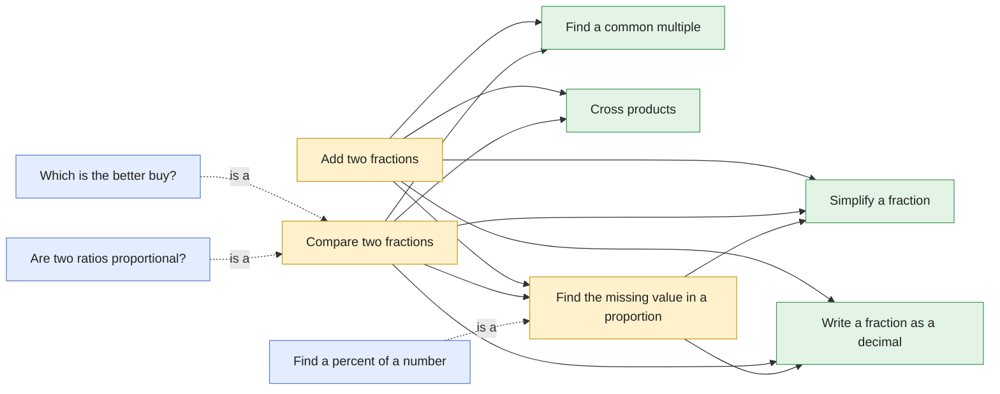

# Question graphs (v2)

How the questions reuse each other. Green = skill, yellow = core, blue = applied. Solid arrows: a method calls that question as a step. Dotted arrows: the applied question *is* the core question in context. (compare-fractions also calls itself: *distance from 1* ends by comparing the two gaps.)

| Question | Kind | Methods | Uses |
|---|---|---|---|
| [Add two fractions](add-fractions.md) | core | 3 | common-multiple, cross-products, missing-value, simplify-fraction, to-decimal |
| [Which is the better buy?](better-buy.md) | applied | 6 | compare-fractions |
| [Find a common multiple](common-multiple.md) | skill | 4 | — |
| [Compare two fractions](compare-fractions.md) | core | 11 | common-multiple, compare-fractions, cross-products, missing-value, simplify-fraction, to-decimal |
| [Cross products](cross-products.md) | skill | 1 | — |
| [Find the missing value in a proportion](missing-value.md) | core | 6 | simplify-fraction, to-decimal |
| [Find a percent of a number](percent-of.md) | applied | 6 | missing-value |
| [Are two ratios proportional?](proportion-check.md) | applied | 11 | compare-fractions |
| [Simplify a fraction](simplify-fraction.md) | skill | 2 | — |
| [Write a fraction as a decimal](to-decimal.md) | skill | 2 | — |
