# Add two fractions

`add-fractions` · core · prompt: *Find {a}/{b} + {c}/{d}.*

Uses: [common-multiple](common-multiple.md), [cross-products](cross-products.md), [missing-value](missing-value.md), [simplify-fraction](simplify-fraction.md), [to-decimal](to-decimal.md)

| Method | Idea | Steps use |
|---|---|---|
| **Common denominator** `common_denominator` | Rewrite both fractions over a common denominator, add the numerators, simplify. | common-multiple, missing-value, simplify-fraction |
| **Bow-tie (cross-multiply)** `bow_tie` | ({a}×{d} + {c}×{b}) / ({b}×{d}), then simplify. | cross-products, simplify-fraction |
| **Convert to decimals** `decimal` | Write each fraction as a decimal and add. | to-decimal |

Reading the graphs: **hexagons** group first steps by operation · scope; **blue** = first step, **purple** = second step (only where methods share a first step); **yellow** = method; **green dashed** = a call to another question (see its own page); edge labels show which skill method produced the step.

## Find 5/6 + 3/4.

```mermaid
flowchart LR
  n0(["Find 5/6 + 3/4."])
  n1(["Answer: 19/12"])
  n2["Common denominator"]
  n3["Find a common multiple of 6 and 4 → 12"]
  n2 --> n3
  n4["Solve 5/6 = x/12 → 10"]
  n3 --> n4
  n5["Solve 3/4 = x/12 → 9"]
  n4 --> n5
  n6["10 + 9 = 19"]
  n5 --> n6
  n7["Simplify 19/12 → 19/12"]
  n6 --> n7
  n7 --> n1
  n8["Bow-tie (cross-multiply)"]
  n9["Find the cross products of 5/6 and 3/4 → 20/18"]
  n8 --> n9
  n10["6 × 4 = 24"]
  n9 --> n10
  n11["20 + 18 = 38"]
  n10 --> n11
  n12["Simplify 38/24 → 19/12"]
  n11 --> n12
  n12 --> n1
  n13["Convert to decimals"]
  n14["Write 5/6 as a decimal → ≈ 0.833"]
  n13 --> n14
  n15["Write 3/4 as a decimal → 0.75"]
  n14 --> n15
  n16["5/6 + 0.75 = 19/12"]
  n15 --> n16
  n16 --> n1
  n17["5 ÷ 6 ≈ 0.833"]
  n18{{"divide · within"}}
  n0 --> n18
  n18 --> n17
  n17 -->|"to-decimal/divide"| n13
  n19["GCF(6, 4) = 2"]
  n20{{"factor · across"}}
  n0 --> n20
  n20 --> n19
  n19 -->|"common-multiple/gcf_formula"| n2
  n21["5 × 4 = 20"]
  n22{{"multiply · across"}}
  n0 --> n22
  n22 --> n21
  n21 -->|"cross-products/diagonals"| n8
  n23["6 × 4 = 24"]
  n22 --> n23
  n23 -->|"common-multiple/product"| n2
  n24["LCM(6, 4) = 12"]
  n22 --> n24
  n24 -->|"common-multiple/recall"| n2
  n25["6 × 2 = 12"]
  n26{{"multiply · within"}}
  n0 --> n26
  n26 --> n25
  n25 -->|"common-multiple/list_multiples"| n2
  classDef cls fill:#eef0f6,stroke:#8a90a6,color:#222
  classDef first fill:#e3edfd,stroke:#5b7fd1,color:#222
  classDef second fill:#efe6fb,stroke:#8b63c9,color:#222
  classDef method fill:#fff1cc,stroke:#c99a1a,color:#222,font-weight:bold
  classDef skill fill:#e3f4e6,stroke:#3f9a55,stroke-dasharray:5 3,color:#222
  classDef step fill:#ffffff,stroke:#999,color:#222
  classDef ans fill:#fde4e1,stroke:#c4554a,color:#222
  class n18,n20,n22,n26 cls
  class n17,n19,n21,n23,n24,n25 first
  class n2,n8,n13 method
  class n3,n4,n5,n7,n9,n12,n14,n15 skill
  class n6,n10,n11,n16 step
  class n0,n1 ans
```

## Find 2/3 + 1/5.

```mermaid
flowchart LR
  n0(["Find 2/3 + 1/5."])
  n1(["Answer: 13/15"])
  n2["Common denominator"]
  n3["Find a common multiple of 3 and 5 → 15"]
  n2 --> n3
  n4["Solve 2/3 = x/15 → 10"]
  n3 --> n4
  n5["Solve 1/5 = x/15 → 3"]
  n4 --> n5
  n6["10 + 3 = 13"]
  n5 --> n6
  n7["Simplify 13/15 → 13/15"]
  n6 --> n7
  n7 --> n1
  n8["Bow-tie (cross-multiply)"]
  n9["Find the cross products of 2/3 and 1/5 → 10/3"]
  n8 --> n9
  n10["3 × 5 = 15"]
  n9 --> n10
  n11["10 + 3 = 13"]
  n10 --> n11
  n12["Simplify 13/15 → 13/15"]
  n11 --> n12
  n12 --> n1
  n13["Convert to decimals"]
  n14["Write 2/3 as a decimal → ≈ 0.667"]
  n13 --> n14
  n15["Write 1/5 as a decimal → 0.2"]
  n14 --> n15
  n16["2/3 + 0.2 = 13/15"]
  n15 --> n16
  n16 --> n1
  n17["2 ÷ 3 ≈ 0.667"]
  n18{{"divide · within"}}
  n0 --> n18
  n18 --> n17
  n17 -->|"to-decimal/divide"| n13
  n19["GCF(3, 5) = 1"]
  n20{{"factor · across"}}
  n0 --> n20
  n20 --> n19
  n19 -->|"common-multiple/gcf_formula"| n2
  n21["2 × 5 = 10"]
  n22{{"multiply · across"}}
  n0 --> n22
  n22 --> n21
  n21 -->|"cross-products/diagonals"| n8
  n23["LCM(3, 5) = 15"]
  n22 --> n23
  n23 -->|"common-multiple/recall"| n2
  n24["3 × 5 = 15"]
  n22 --> n24
  n25{{"multiply · within"}}
  n0 --> n25
  n25 --> n24
  n24 -->|"common-multiple/list_multiples / common-multiple/product"| n2
  classDef cls fill:#eef0f6,stroke:#8a90a6,color:#222
  classDef first fill:#e3edfd,stroke:#5b7fd1,color:#222
  classDef second fill:#efe6fb,stroke:#8b63c9,color:#222
  classDef method fill:#fff1cc,stroke:#c99a1a,color:#222,font-weight:bold
  classDef skill fill:#e3f4e6,stroke:#3f9a55,stroke-dasharray:5 3,color:#222
  classDef step fill:#ffffff,stroke:#999,color:#222
  classDef ans fill:#fde4e1,stroke:#c4554a,color:#222
  class n18,n20,n22,n25 cls
  class n17,n19,n21,n23,n24 first
  class n2,n8,n13 method
  class n3,n4,n5,n7,n9,n12,n14,n15 skill
  class n6,n10,n11,n16 step
  class n0,n1 ans
```

