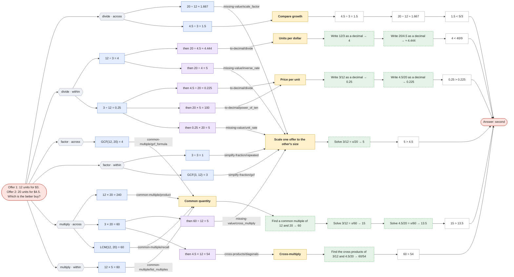
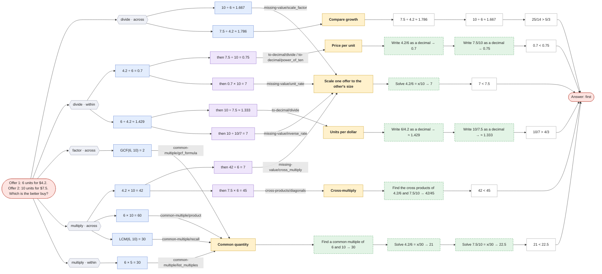

# Which is the better buy?

`better-buy` · applied · prompt: *Offer 1: {q1} units for ${p1}. Offer 2: {q2} units for ${p2}. Which is the better buy?*

Reduces to [compare-fractions](compare-fractions.md) with `{"a": "p1", "b": "q1", "c": "p2", "d": "q2"}`. Compare the prices per unit p1/q1 and p2/q2; the smaller one is the better buy, so 'first' (bigger) maps to 'second'.

| Method | Idea | Steps use |
|---|---|---|
| **Price per unit** `price_per_unit` (= compare-fractions · decimal) | Find the cost of 1 unit in each offer; lower is better. | — |
| **Units per dollar** `units_per_dollar` (= compare-fractions · unit_rate) | Find how much $1 buys; more is better. | — |
| **Common quantity** `common_quantity` (= compare-fractions · common_denominator) | Price both offers at the same quantity. | — |
| **Scale one offer to the other's size** `scale_up` (= compare-fractions · match_denominator) | What would offer 1 cost for {q2} units? | — |
| **Cross-multiply** `cross_multiply` (= compare-fractions · cross_multiply) | {a}/{b} > {c}/{d} exactly when {a}×{d} > {c}×{b}. | — |
| **Compare growth** `compare_growth` (= compare-fractions · scale_factor) | Price grows by {p2} ÷ {p1}, quantity by {q2} ÷ {q1}; quantity growing faster means offer 2 is better. | — |

Reading the graphs: **hexagons** group first steps by operation · scope; **blue** = first step, **purple** = second step (only where methods share a first step); **yellow** = method; **green dashed** = a call to another question (see its own page); edge labels show which skill method produced the step.

## Offer 1: 12 units for $3. Offer 2: 20 units for $4.5. Which is the better buy?

## Offer 1: 6 units for $4.2. Offer 2: 10 units for $7.5. Which is the better buy?

