# Which is the better buy?

`better-buy` · applied · prompt: *Offer 1: {q1} units for ${p1}. Offer 2: {q2} units for ${p2}. Which is the better buy?*

This is [compare-fractions](compare-fractions.md) in context, with `{"a": "p1", "b": "q1", "c": "p2", "d": "q2"}`. Compare the prices per unit p1/q1 and p2/q2; the smaller one is the better buy, so 'first' (bigger) maps to 'second'.

| Method | Idea | Best when | Calls |
|---|---|---|---|
| **Price per unit** `price_per_unit` (= compare-fractions · decimal) | Find the cost of 1 unit in each offer; lower is better. | A calculator is allowed. | [to-decimal](to-decimal.md) |
| **Units per dollar** `units_per_dollar` (= compare-fractions · unit_rate) | Find how much $1 buys; more is better. | The context is a rate (miles per hour, items per dollar). | [to-decimal](to-decimal.md) |
| **Common quantity** `common_quantity` (= compare-fractions · common_denominator) | Price both offers at the same quantity. | The denominators are small or related. | [common-multiple](common-multiple.md), [missing-value](missing-value.md) |
| **Scale one offer to the other's size** `scale_up` (= compare-fractions · match_denominator) | What would offer 1 cost for {q2} units? | {d} is a multiple of {b}. | [missing-value](missing-value.md) |
| **Cross-multiply** `cross_multiply` (= compare-fractions · cross_multiply) | {a}/{b} > {c}/{d} exactly when {a}×{d} > {c}×{b}. | A quick check with small numbers. | [cross-products](cross-products.md) |
| **Compare growth** `compare_growth` (= compare-fractions · scale_factor) | Price grows by {p2} ÷ {p1}, quantity by {q2} ÷ {q1}; quantity growing faster means offer 2 is better. | One fraction looks like a scaled-up version of the other. | — |

Each graph starts at the question and branches at **× Which first step?** into every first step a student might write. Methods that share a first step meet there and split at **× Which next step?**. Each route then follows its method to the answer. The legend at the bottom of each graph explains the shapes.

## Offer 1: 12 units for $3. Offer 2: 20 units for $4.5. Which is the better buy?

Click the graph to open it full size · [mermaid source](../svg/better-buy-1.mmd)

## Offer 1: 6 units for $4.2. Offer 2: 10 units for $7.5. Which is the better buy?

Click the graph to open it full size · [mermaid source](../svg/better-buy-2.mmd)
