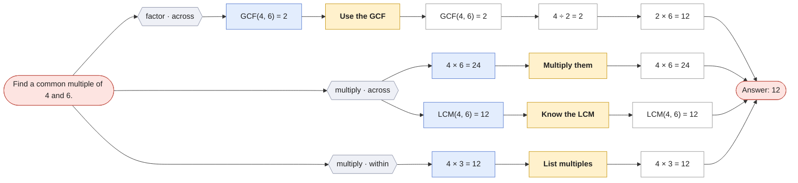
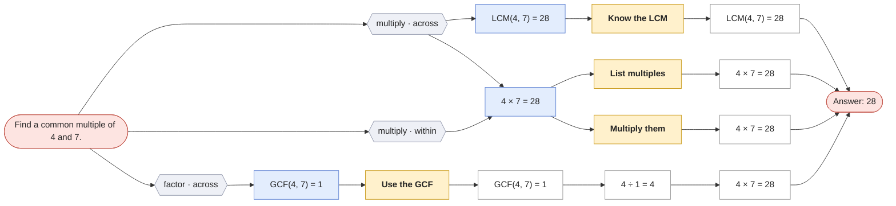

# Find a common multiple

`common-multiple` · skill · prompt: *Find a common multiple of {x} and {y}.*

| Method | Idea | Steps use |
|---|---|---|
| **Know the LCM** `recall` | Recognize the least common multiple directly. | — |
| **List multiples** `list_multiples` | Count up by {x} until you reach a number {y} divides. | — |
| **Multiply them** `product` | {x} × {y} is always a common multiple. | — |
| **Use the GCF** `gcf_formula` | LCM = {x} ÷ GCF × {y}. | — |

Reading the graphs: **hexagons** group first steps by operation · scope; **blue** = first step, **purple** = second step (only where methods share a first step); **yellow** = method; **green dashed** = a call to another question (see its own page); edge labels show which skill method produced the step.

## Find a common multiple of 4 and 6.

## Find a common multiple of 4 and 7.

