# Compare two fractions

`compare-fractions` · core · prompt: *Which is larger: {a}/{b} or {c}/{d}? (Or are they equal?)*

Its methods call: [common-multiple](common-multiple.md), [compare-fractions](compare-fractions.md), [cross-products](cross-products.md), [missing-value](missing-value.md), [simplify-fraction](simplify-fraction.md), [to-decimal](to-decimal.md)

| Method | Idea | Best when | Calls |
|---|---|---|---|
| **Cross-multiply** `cross_multiply` | {a}/{b} > {c}/{d} exactly when {a}×{d} > {c}×{b}. | A quick check with small numbers. | [cross-products](cross-products.md) |
| **Common denominator** `common_denominator` | Rewrite both fractions over the same denominator, then compare numerators. | The denominators are small or related. | [common-multiple](common-multiple.md), [missing-value](missing-value.md) |
| **Rewrite one fraction over the other's denominator** `match_denominator` | Turn {a}/{b} into something over {d}, then compare its top with {c}. | {d} is a multiple of {b}. | [missing-value](missing-value.md) |
| **Common numerator** `common_numerator` | With equal numerators, the smaller denominator gives the bigger fraction. | The numerators are smaller or simpler than the denominators. | [common-multiple](common-multiple.md), [missing-value](missing-value.md) |
| **Convert to decimals** `decimal` | Write each fraction as a decimal and compare. | A calculator is allowed. | [to-decimal](to-decimal.md) |
| **Compare unit rates (flipped fractions)** `unit_rate` | How much bottom per 1 of top? The bigger rate belongs to the smaller fraction. | The context is a rate (miles per hour, items per dollar). | [to-decimal](to-decimal.md) |
| **Compare scale factors** `scale_factor` | How much do the tops grow ({c} ÷ {a}) compared with the bottoms ({d} ÷ {b})? | One fraction looks like a scaled-up version of the other. | — |
| **Ratio table** `ratio_table` | Scale {a}:{b} by 2, 3, 4, … until the top reaches {c}, then compare bottoms. | {c} is a small whole-number multiple of {a}. | — |
| **Graph the points** `graph` | Plot ({a}, {b}) and ({c}, {d}); the steeper line from the origin belongs to the smaller fraction. | Building intuition. | — |
| **Simplify both** `simplify` | Reduce both fractions to lowest terms; equal fractions reduce to the same thing. | Checking equality (proportions). | [simplify-fraction](simplify-fraction.md) |
| **Distance from 1** `distance_from_one` | Find how far each fraction is from 1; the one closer to 1 is bigger. | Both fractions are just below 1 (7/8 vs 9/10). | [compare-fractions](compare-fractions.md) |

Each graph starts at the question and branches at **× Which first step?** into every first step a student might write. Methods that share a first step meet there and split at **× Which next step?**. Each route then follows its method to the answer. The legend at the bottom of each graph explains the shapes.

## Which is larger: 3/4 or 5/7? (Or are they equal?)

Click the graph to open it full size · [mermaid source](../svg/compare-fractions-1.mmd)

Not applicable here: Ratio table (`ratio_table`)

## Which is larger: 3/8 or 2/5? (Or are they equal?)

Click the graph to open it full size · [mermaid source](../svg/compare-fractions-2.mmd)

Not applicable here: Ratio table (`ratio_table`)
