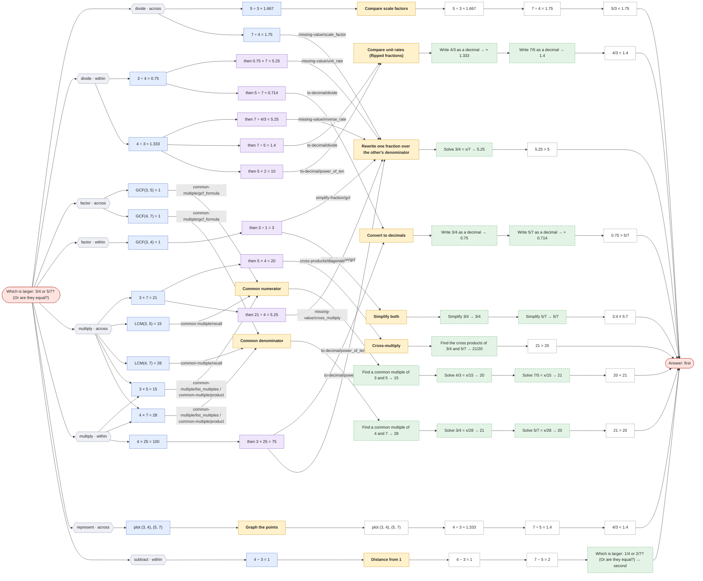

# Compare two fractions

`compare-fractions` · core · prompt: *Which is larger: {a}/{b} or {c}/{d}? (Or are they equal?)*

Uses: [common-multiple](common-multiple.md), [compare-fractions](compare-fractions.md), [cross-products](cross-products.md), [missing-value](missing-value.md), [simplify-fraction](simplify-fraction.md), [to-decimal](to-decimal.md)

| Method | Idea | Steps use |
|---|---|---|
| **Cross-multiply** `cross_multiply` | {a}/{b} > {c}/{d} exactly when {a}×{d} > {c}×{b}. | cross-products |
| **Common denominator** `common_denominator` | Rewrite both fractions over the same denominator, then compare numerators. | common-multiple, missing-value |
| **Rewrite one fraction over the other's denominator** `match_denominator` | Turn {a}/{b} into something over {d}, then compare numerators with {c}. | missing-value |
| **Common numerator** `common_numerator` | With equal numerators, the smaller denominator gives the bigger fraction. | common-multiple, missing-value |
| **Convert to decimals** `decimal` | Write each fraction as a decimal and compare. | to-decimal |
| **Compare unit rates (flipped fractions)** `unit_rate` | How much bottom per 1 of top? The bigger rate belongs to the smaller fraction. | to-decimal |
| **Compare scale factors** `scale_factor` | How much do the tops grow ({c} ÷ {a}) compared with the bottoms ({d} ÷ {b})? | — |
| **Ratio table** `ratio_table` | Scale {a}:{b} by 2, 3, 4, … until the top reaches {c}, then compare bottoms. | — |
| **Graph the points** `graph` | Plot ({a}, {b}) and ({c}, {d}); the steeper line from the origin belongs to the smaller fraction. | — |
| **Simplify both** `simplify` | Reduce both fractions to lowest terms; equal fractions reduce to the same thing. | simplify-fraction |
| **Distance from 1** `distance_from_one` | Find how far each fraction is from 1; the one closer to 1 is bigger. | compare-fractions |

Reading the graphs: **hexagons** group first steps by operation · scope; **blue** = first step, **purple** = second step (only where methods share a first step); **yellow** = method; **green dashed** = a call to another question (see its own page); edge labels show which skill method produced the step.

## Which is larger: 3/4 or 5/7? (Or are they equal?)

Not applicable here: Ratio table (`ratio_table`)

## Which is larger: 3/8 or 2/5? (Or are they equal?)

```mermaid
flowchart LR
  n0(["Which is larger: 3/8 or 2/5? (Or are they equal?)"])
  n1(["Answer: second"])
  n2["Cross-multiply"]
  n3["Find the cross products of 3/8 and 2/5 → 15/16"]
  n2 --> n3
  n4["15 #lt; 16"]
  n3 --> n4
  n4 --> n1
  n5["Common denominator"]
  n6["Find a common multiple of 8 and 5 → 40"]
  n5 --> n6
  n7["Solve 3/8 = x/40 → 15"]
  n6 --> n7
  n8["Solve 2/5 = x/40 → 16"]
  n7 --> n8
  n9["15 #lt; 16"]
  n8 --> n9
  n9 --> n1
  n10["Rewrite one fraction over the other's denominator"]
  n11["Solve 3/8 = x/5 → 1.875"]
  n10 --> n11
  n12["1.875 #lt; 2"]
  n11 --> n12
  n12 --> n1
  n13["Common numerator"]
  n14["Find a common multiple of 3 and 2 → 6"]
  n13 --> n14
  n15["Solve 8/3 = x/6 → 16"]
  n14 --> n15
  n16["Solve 5/2 = x/6 → 15"]
  n15 --> n16
  n17["16 #gt; 15"]
  n16 --> n17
  n17 --> n1
  n18["Convert to decimals"]
  n19["Write 3/8 as a decimal → 0.375"]
  n18 --> n19
  n20["Write 2/5 as a decimal → 0.4"]
  n19 --> n20
  n21["0.375 #lt; 0.4"]
  n20 --> n21
  n21 --> n1
  n22["Compare unit rates (flipped fractions)"]
  n23["Write 8/3 as a decimal → ≈ 2.667"]
  n22 --> n23
  n24["Write 5/2 as a decimal → 2.5"]
  n23 --> n24
  n25["8/3 #gt; 2.5"]
  n24 --> n25
  n25 --> n1
  n26["Compare scale factors"]
  n27["2 ÷ 3 ≈ 0.667"]
  n26 --> n27
  n28["5 ÷ 8 = 0.625"]
  n27 --> n28
  n29["2/3 #gt; 0.625"]
  n28 --> n29
  n29 --> n1
  n30["Graph the points"]
  n31["plot (3, 8), (2, 5)"]
  n30 --> n31
  n32["8 ÷ 3 ≈ 2.667"]
  n31 --> n32
  n33["5 ÷ 2 = 2.5"]
  n32 --> n33
  n34["8/3 #gt; 2.5"]
  n33 --> n34
  n34 --> n1
  n35["Simplify both"]
  n36["Simplify 3/8 → 3/8"]
  n35 --> n36
  n37["Simplify 2/5 → 2/5"]
  n36 --> n37
  n38["3:8 ≠ 2:5"]
  n37 --> n38
  n38 --> n1
  n39["Distance from 1"]
  n40["8 − 3 = 5"]
  n39 --> n40
  n41["5 − 2 = 3"]
  n40 --> n41
  n42["Which is larger: 5/8 or 3/5? (Or are they equal?) → first"]
  n41 --> n42
  n42 --> n1
  n43["2 ÷ 3 ≈ 0.667"]
  n44{{"divide · across"}}
  n0 --> n44
  n44 --> n43
  n43 --> n26
  n45["5 ÷ 8 = 0.625"]
  n44 --> n45
  n45 -->|"missing-value/scale_factor"| n10
  n46["3 ÷ 8 = 0.375"]
  n47{{"divide · within"}}
  n0 --> n47
  n47 --> n46
  n48["then 0.375 × 5 = 1.875"]
  n46 --> n48
  n48 -->|"missing-value/unit_rate"| n10
  n49["then 2 ÷ 5 = 0.4"]
  n46 --> n49
  n49 -->|"to-decimal/divide"| n18
  n50["then 5 × 2 = 10"]
  n46 --> n50
  n50 -->|"to-decimal/power_of_ten"| n18
  n51["8 ÷ 3 ≈ 2.667"]
  n47 --> n51
  n52["then 5 ÷ 8/3 = 1.875"]
  n51 --> n52
  n52 -->|"missing-value/inverse_rate"| n10
  n53["then 5 ÷ 2 = 2.5"]
  n51 --> n53
  n53 -->|"to-decimal/divide"| n22
  n54["then 2 × 5 = 10"]
  n51 --> n54
  n54 -->|"to-decimal/power_of_ten"| n22
  n55["GCF(3, 2) = 1"]
  n56{{"factor · across"}}
  n0 --> n56
  n56 --> n55
  n55 -->|"common-multiple/gcf_formula"| n13
  n57["GCF(8, 5) = 1"]
  n56 --> n57
  n57 -->|"common-multiple/gcf_formula"| n5
  n58["GCF(3, 8) = 1"]
  n59{{"factor · within"}}
  n0 --> n59
  n59 --> n58
  n60["then 3 ÷ 1 = 3"]
  n58 --> n60
  n60 -->|"simplify-fraction/gcf"| n10
  n60 -->|"simplify-fraction/gcf"| n35
  n61["3 × 5 = 15"]
  n62{{"multiply · across"}}
  n0 --> n62
  n62 --> n61
  n63["then 2 × 8 = 16"]
  n61 --> n63
  n63 -->|"cross-products/diagonals"| n2
  n64["then 15 ÷ 8 = 1.875"]
  n61 --> n64
  n64 -->|"missing-value/cross_multiply"| n10
  n65["LCM(3, 2) = 6"]
  n62 --> n65
  n65 -->|"common-multiple/recall"| n13
  n66["LCM(8, 5) = 40"]
  n62 --> n66
  n66 -->|"common-multiple/recall"| n5
  n67["3 × 2 = 6"]
  n62 --> n67
  n68{{"multiply · within"}}
  n0 --> n68
  n68 --> n67
  n67 -->|"common-multiple/list_multiples / common-multiple/product"| n13
  n69["8 × 5 = 40"]
  n62 --> n69
  n68 --> n69
  n69 -->|"common-multiple/list_multiples / common-multiple/product"| n5
  n70["8 × 125 = 1000"]
  n68 --> n70
  n71["then 3 × 125 = 375"]
  n70 --> n71
  n71 -->|"to-decimal/power_of_ten"| n18
  n71 -->|"to-decimal/power_of_ten"| n10
  n72["plot (3, 8), (2, 5)"]
  n73{{"represent · across"}}
  n0 --> n73
  n73 --> n72
  n72 --> n30
  n74["8 − 3 = 5"]
  n75{{"subtract · within"}}
  n0 --> n75
  n75 --> n74
  n74 --> n39
  classDef cls fill:#eef0f6,stroke:#8a90a6,color:#222
  classDef first fill:#e3edfd,stroke:#5b7fd1,color:#222
  classDef second fill:#efe6fb,stroke:#8b63c9,color:#222
  classDef method fill:#fff1cc,stroke:#c99a1a,color:#222,font-weight:bold
  classDef skill fill:#e3f4e6,stroke:#3f9a55,stroke-dasharray:5 3,color:#222
  classDef step fill:#ffffff,stroke:#999,color:#222
  classDef ans fill:#fde4e1,stroke:#c4554a,color:#222
  class n44,n47,n56,n59,n62,n68,n73,n75 cls
  class n43,n45,n46,n51,n55,n57,n58,n61,n65,n66,n67,n69,n70,n72,n74 first
  class n48,n49,n50,n52,n53,n54,n60,n63,n64,n71 second
  class n2,n5,n10,n13,n18,n22,n26,n30,n35,n39 method
  class n3,n6,n7,n8,n11,n14,n15,n16,n19,n20,n23,n24,n36,n37,n42 skill
  class n4,n9,n12,n17,n21,n25,n27,n28,n29,n31,n32,n33,n34,n38,n40,n41 step
  class n0,n1 ans
```

Not applicable here: Ratio table (`ratio_table`)
