# Cross products

`cross-products` · skill · prompt: *Find the cross products of {a}/{b} and {c}/{d}.*

| Method | Idea | Steps use |
|---|---|---|
| **Multiply the diagonals** `diagonals` | Multiply each numerator by the other fraction's denominator. | — |

Reading the graphs: **hexagons** group first steps by operation · scope; **blue** = first step, **purple** = second step (only where methods share a first step); **yellow** = method; **green dashed** = a call to another question (see its own page); edge labels show which skill method produced the step.

## Find the cross products of 3/4 and 5/7.

```mermaid
flowchart LR
  n0(["Find the cross products of 3/4 and 5/7."])
  n1(["Answer: 21/20"])
  n2["Multiply the diagonals"]
  n3["3 × 7 = 21"]
  n2 --> n3
  n4["5 × 4 = 20"]
  n3 --> n4
  n4 --> n1
  n5["3 × 7 = 21"]
  n6{{"multiply · across"}}
  n0 --> n6
  n6 --> n5
  n5 --> n2
  classDef cls fill:#eef0f6,stroke:#8a90a6,color:#222
  classDef first fill:#e3edfd,stroke:#5b7fd1,color:#222
  classDef second fill:#efe6fb,stroke:#8b63c9,color:#222
  classDef method fill:#fff1cc,stroke:#c99a1a,color:#222,font-weight:bold
  classDef skill fill:#e3f4e6,stroke:#3f9a55,stroke-dasharray:5 3,color:#222
  classDef step fill:#ffffff,stroke:#999,color:#222
  classDef ans fill:#fde4e1,stroke:#c4554a,color:#222
  class n6 cls
  class n5 first
  class n2 method
  class n3,n4 step
  class n0,n1 ans
```

## Find the cross products of 6/8 and 72/96.

```mermaid
flowchart LR
  n0(["Find the cross products of 6/8 and 72/96."])
  n1(["Answer: 576/576"])
  n2["Multiply the diagonals"]
  n3["6 × 96 = 576"]
  n2 --> n3
  n4["72 × 8 = 576"]
  n3 --> n4
  n4 --> n1
  n5["6 × 96 = 576"]
  n6{{"multiply · across"}}
  n0 --> n6
  n6 --> n5
  n5 --> n2
  classDef cls fill:#eef0f6,stroke:#8a90a6,color:#222
  classDef first fill:#e3edfd,stroke:#5b7fd1,color:#222
  classDef second fill:#efe6fb,stroke:#8b63c9,color:#222
  classDef method fill:#fff1cc,stroke:#c99a1a,color:#222,font-weight:bold
  classDef skill fill:#e3f4e6,stroke:#3f9a55,stroke-dasharray:5 3,color:#222
  classDef step fill:#ffffff,stroke:#999,color:#222
  classDef ans fill:#fde4e1,stroke:#c4554a,color:#222
  class n6 cls
  class n5 first
  class n2 method
  class n3,n4 step
  class n0,n1 ans
```

