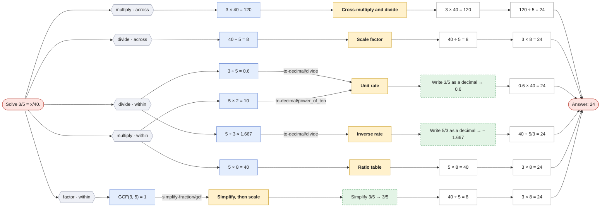
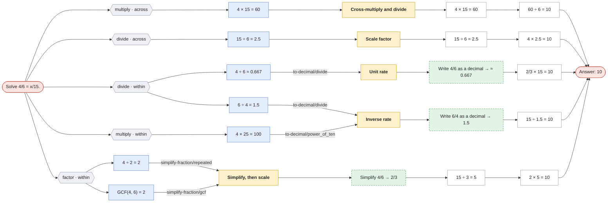

# Find the missing value in a proportion

`missing-value` · core · prompt: *Solve {a}/{b} = x/{d}.*

Uses: [simplify-fraction](simplify-fraction.md), [to-decimal](to-decimal.md)

| Method | Idea | Steps use |
|---|---|---|
| **Cross-multiply and divide** `cross_multiply` | {a} × {d} = {b} × x, so x = {a} × {d} ÷ {b}. | — |
| **Scale factor** `scale_factor` | Find what turns {b} into {d}, then do the same to {a}. | — |
| **Unit rate** `unit_rate` | Find the value per 1, then scale up to {d}. | to-decimal |
| **Inverse rate** `inverse_rate` | Find how many of the second quantity per 1 of the first, then divide. | to-decimal |
| **Ratio table** `ratio_table` | Build {a}:{b} up by ×2, ×3, … until the second term reaches {d}. | — |
| **Simplify, then scale** `simplify_then_scale` | Reduce {a}/{b} first so a whole-number scale factor appears. | simplify-fraction |

Reading the graphs: **hexagons** group first steps by operation · scope; **blue** = first step, **purple** = second step (only where methods share a first step); **yellow** = method; **green dashed** = a call to another question (see its own page); edge labels show which skill method produced the step.

## Solve 3/5 = x/40.

## Solve 4/6 = x/15.

Not applicable here: Ratio table (`ratio_table`)
