# Are two ratios proportional?

`proportion-check` · applied · prompt: *Are {a}:{b} and {c}:{d} proportional?*

This is [compare-fractions](compare-fractions.md) in context, with `{"a": "a", "b": "b", "c": "c", "d": "d"}`. 

| Method | Idea | Best when | Calls |
|---|---|---|---|
| **Cross-multiply** `cross_multiply` (= compare-fractions · cross_multiply) | {a}/{b} > {c}/{d} exactly when {a}×{d} > {c}×{b}. | A quick check with small numbers. | [cross-products](cross-products.md) |
| **Common denominator** `common_denominator` (= compare-fractions · common_denominator) | Rewrite both fractions over the same denominator, then compare numerators. | The denominators are small or related. | [common-multiple](common-multiple.md), [missing-value](missing-value.md) |
| **Rewrite one fraction over the other's denominator** `match_denominator` (= compare-fractions · match_denominator) | Turn {a}/{b} into something over {d}, then compare its top with {c}. | {d} is a multiple of {b}. | [missing-value](missing-value.md) |
| **Common numerator** `common_numerator` (= compare-fractions · common_numerator) | With equal numerators, the smaller denominator gives the bigger fraction. | The numerators are smaller or simpler than the denominators. | [common-multiple](common-multiple.md), [missing-value](missing-value.md) |
| **Convert to decimals** `decimal` (= compare-fractions · decimal) | Write each fraction as a decimal and compare. | A calculator is allowed. | [to-decimal](to-decimal.md) |
| **Compare unit rates (flipped fractions)** `unit_rate` (= compare-fractions · unit_rate) | How much bottom per 1 of top? The bigger rate belongs to the smaller fraction. | The context is a rate (miles per hour, items per dollar). | [to-decimal](to-decimal.md) |
| **Compare scale factors** `scale_factor` (= compare-fractions · scale_factor) | How much do the tops grow ({c} ÷ {a}) compared with the bottoms ({d} ÷ {b})? | One fraction looks like a scaled-up version of the other. | — |
| **Ratio table** `ratio_table` (= compare-fractions · ratio_table) | Scale {a}:{b} by 2, 3, 4, … until the top reaches {c}, then compare bottoms. | {c} is a small whole-number multiple of {a}. | — |
| **Graph the points** `graph` (= compare-fractions · graph) | Plot ({a}, {b}) and ({c}, {d}); the steeper line from the origin belongs to the smaller fraction. | Building intuition. | — |
| **Simplify both** `simplify` (= compare-fractions · simplify) | Reduce both fractions to lowest terms; equal fractions reduce to the same thing. | Checking equality (proportions). | [simplify-fraction](simplify-fraction.md) |
| **Distance from 1** `distance_from_one` (= compare-fractions · distance_from_one) | Find how far each fraction is from 1; the one closer to 1 is bigger. | Both fractions are just below 1 (7/8 vs 9/10). | [compare-fractions](compare-fractions.md) |

Each graph starts at the question and branches at **× Which first step?** into every first step a student might write. Methods that share a first step meet there and split at **× Which next step?**. Each route then follows its method to the answer. The legend at the bottom of each graph explains the shapes.

## Are 6:8 and 72:96 proportional?

Click the graph to open it full size · [mermaid source](../svg/proportion-check-1.mmd)

## Are 4:6 and 10:14 proportional?

Click the graph to open it full size · [mermaid source](../svg/proportion-check-2.mmd)

Not applicable here: Ratio table (`ratio_table`)
