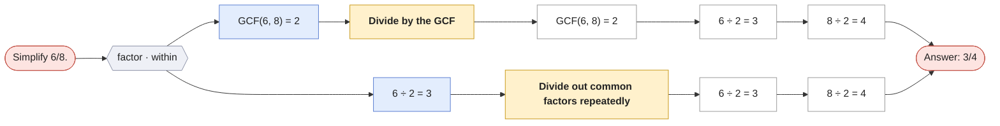

# Simplify a fraction

`simplify-fraction` · skill · prompt: *Simplify {x}/{y}.*

| Method | Idea | Steps use |
|---|---|---|
| **Divide by the GCF** `gcf` | Find the greatest common factor once and divide both terms by it. | — |
| **Divide out common factors repeatedly** `repeated` | Keep dividing both terms by any shared factor (2, 3, 5, …) until none is left. | — |

Reading the graphs: **hexagons** group first steps by operation · scope; **blue** = first step, **purple** = second step (only where methods share a first step); **yellow** = method; **green dashed** = a call to another question (see its own page); edge labels show which skill method produced the step.

## Simplify 6/8.

## Simplify 72/96.

```mermaid
flowchart LR
  n0(["Simplify 72/96."])
  n1(["Answer: 3/4"])
  n2["Divide by the GCF"]
  n3["GCF(72, 96) = 24"]
  n2 --> n3
  n4["72 ÷ 24 = 3"]
  n3 --> n4
  n5["96 ÷ 24 = 4"]
  n4 --> n5
  n5 --> n1
  n6["Divide out common factors repeatedly"]
  n7["72 ÷ 2 = 36"]
  n6 --> n7
  n8["96 ÷ 2 = 48"]
  n7 --> n8
  n9["36 ÷ 2 = 18"]
  n8 --> n9
  n10["48 ÷ 2 = 24"]
  n9 --> n10
  n11["18 ÷ 2 = 9"]
  n10 --> n11
  n12["24 ÷ 2 = 12"]
  n11 --> n12
  n13["9 ÷ 3 = 3"]
  n12 --> n13
  n14["12 ÷ 3 = 4"]
  n13 --> n14
  n14 --> n1
  n15["72 ÷ 2 = 36"]
  n16{{"factor · within"}}
  n0 --> n16
  n16 --> n15
  n15 --> n6
  n17["GCF(72, 96) = 24"]
  n16 --> n17
  n17 --> n2
  classDef cls fill:#eef0f6,stroke:#8a90a6,color:#222
  classDef first fill:#e3edfd,stroke:#5b7fd1,color:#222
  classDef second fill:#efe6fb,stroke:#8b63c9,color:#222
  classDef method fill:#fff1cc,stroke:#c99a1a,color:#222,font-weight:bold
  classDef skill fill:#e3f4e6,stroke:#3f9a55,stroke-dasharray:5 3,color:#222
  classDef step fill:#ffffff,stroke:#999,color:#222
  classDef ans fill:#fde4e1,stroke:#c4554a,color:#222
  class n16 cls
  class n15,n17 first
  class n2,n6 method
  class n3,n4,n5,n7,n8,n9,n10,n11,n12,n13,n14 step
  class n0,n1 ans
```

