# Simplify a fraction

`simplify-fraction` · skill · prompt: *Simplify {x}/{y}.*

| Method | Idea | Best when | Calls |
|---|---|---|---|
| **Divide by the GCF** `gcf` | Find the greatest common factor once and divide both terms by it. | You can spot the GCF. | — |
| **Divide out common factors repeatedly** `repeated` | Keep dividing both terms by any shared factor (2, 3, 5, …) until none is left. | The numbers are large and the GCF isn't obvious. | — |

Each graph starts at the question and branches at **× Which first step?** into every first step a student might write. Methods that share a first step meet there and split at **× Which next step?**. Each route then follows its method to the answer. The legend at the bottom of each graph explains the shapes.

## Simplify 6/8.

Click the graph to open it full size · [mermaid source](../svg/simplify-fraction-1.mmd)

## Simplify 72/96.

Click the graph to open it full size · [mermaid source](../svg/simplify-fraction-2.mmd)
