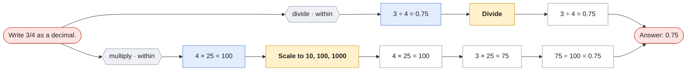

# Write a fraction as a decimal

`to-decimal` · skill · prompt: *Write {x}/{y} as a decimal.*

| Method | Idea | Steps use |
|---|---|---|
| **Divide** `divide` | Divide the numerator by the denominator (long division or a calculator). | — |
| **Scale to 10, 100, 1000** `power_of_ten` | Multiply top and bottom so the denominator becomes 10, 100, or 1000, then read off the decimal. | — |

Reading the graphs: **hexagons** group first steps by operation · scope; **blue** = first step, **purple** = second step (only where methods share a first step); **yellow** = method; **green dashed** = a call to another question (see its own page); edge labels show which skill method produced the step.

## Write 3/4 as a decimal.

## Write 5/8 as a decimal.

```mermaid
flowchart LR
  n0(["Write 5/8 as a decimal."])
  n1(["Answer: 0.625"])
  n2["Divide"]
  n3["5 ÷ 8 = 0.625"]
  n2 --> n3
  n3 --> n1
  n4["Scale to 10, 100, 1000"]
  n5["8 × 125 = 1000"]
  n4 --> n5
  n6["5 × 125 = 625"]
  n5 --> n6
  n7["625 ÷ 1000 = 0.625"]
  n6 --> n7
  n7 --> n1
  n8["5 ÷ 8 = 0.625"]
  n9{{"divide · within"}}
  n0 --> n9
  n9 --> n8
  n8 --> n2
  n10["8 × 125 = 1000"]
  n11{{"multiply · within"}}
  n0 --> n11
  n11 --> n10
  n10 --> n4
  classDef cls fill:#eef0f6,stroke:#8a90a6,color:#222
  classDef first fill:#e3edfd,stroke:#5b7fd1,color:#222
  classDef second fill:#efe6fb,stroke:#8b63c9,color:#222
  classDef method fill:#fff1cc,stroke:#c99a1a,color:#222,font-weight:bold
  classDef skill fill:#e3f4e6,stroke:#3f9a55,stroke-dasharray:5 3,color:#222
  classDef step fill:#ffffff,stroke:#999,color:#222
  classDef ans fill:#fde4e1,stroke:#c4554a,color:#222
  class n9,n11 cls
  class n8,n10 first
  class n2,n4 method
  class n3,n5,n6,n7 step
  class n0,n1 ans
```

