# Word problems

A word problem needs **extraction** before any method applies. Extraction is a set of decisions, done in any order: which question the story is, which numbers go together and which way round, whether a number is extra or a total, which numbers aren't needed. Each decision has one correct option and its **traps**: the mistakes students actually make. A trap is the correct reading with that one decision swapped, so the build computes the wrong answer it leads to, and the first steps that give it away (steps no correct reading starts with). That lets an app diagnose an extraction mistake from a student's answer, and often from their first step.

## Extraction concepts

| Concept | What the student decides | Cues | Typical mistake |
|---|---|---|---|
| **Recognize the question type** `question_type` | Decide which question the story is: missing value, compare, better buy, proportion check, percent of, add fractions. | at the same rate / speed; how many … for …; which is the better buy / deal; who is better / sweeter / faster; same taste / shade; % of, % off, tip, tax; in all, altogether (with fractions) | Solving a different question than the one asked (sale price instead of savings). |
| **Pull out each quantity** `quantity` | Write each number with its unit and what it counts: 4 spoons (of sugar), 6 glasses (of lemonade). | — | Keeping the number but losing what it counts, so it gets used in the wrong place. |
| **Spot numbers written as words** `implicit_number` | Turn words into numbers. | a dozen = 12; a pair = 2; half = 1/2; twice = 2 ×; a quarter = 1/4; a / an / each = 1 | Reading '2 dozen' as 2. |
| **Make units match** `unit_conversion` | Convert so both sides of a ratio use the same units. | minutes ↔ hours; cents ↔ dollars; inches ↔ feet | Mixing hours on one side with minutes on the other. |
| **Find the pair that forms the ratio** `rate_pair` | Identify which two quantities belong together. | per; for every; each; to make; out of; for; stands for; in (150 miles in 3 hours) | Pairing the wrong two numbers. |
| **Keep the same order on both sides** `correspondence` | If the known ratio is sugar : lemonade, the unknown ratio must be sugar : lemonade too. | — | Flipping one side: 4/6 = 18/x instead of 4/6 = x/18. |
| **Ignore numbers that don't matter** `distractor` | Recognize numbers the question doesn't need. | — | Using a distractor in place of a real quantity. |
| **Name the unknown** `unknown` | Say what's asked for and in what unit, before computing. | — | Computing a related number that isn't the one asked for. |
| **'More' vs 'in all'** `delta_vs_total` | Decide whether a number is an increase or a new total, and whether the answer should be. | more; additional; another; in all; altogether; total; already; left | Answering the total when the extra amount was asked for, or the reverse. |
| **Scale, don't add** `multiplicative` | Proportional quantities grow by the same factor, not by the same amount. | — | '18 more glasses, so 18 more spoons.' |
| **Which way wins** `direction` | In a comparison, decide whether the bigger or smaller ratio is better, and which ratio (sugar per glass, or glasses per spoon) the story is about. | cheaper; sweeter; better rate; faster; stronger | Picking the bigger number when the smaller one wins, or comparing the flipped ratio. |
| **Finish the story** `follow_up` | A step after the core computation: subtract what's already used, find the price after a discount. | — | Stopping after the core computation. |
| **Answer in the story's terms** `answer_in_context` | Name the person or offer, give units, write 19/12 as 1 7/12. | — | Answering 'first' or a bare number. |

| Word problem | Is a | Decisions |
|---|---|---|
| [Cereal boxes](#cereal-boxes) | [Which is the better buy?](better-buy.md) | Recognize the question type, Ignore numbers that don't matter, Find the pair that forms the ratio, Which way wins |
| [Free throws](#free-throws) | [Compare two fractions](compare-fractions.md) | Recognize the question type, Find the pair that forms the ratio, Which way wins |
| [Jacket on sale](#jacket-sale) | [Find a percent of a number](percent-of.md) | Recognize the question type, Name the unknown |
| [Lemonade: how many in all](#lemonade-in-all) | [Find the missing value in a proportion](missing-value.md) | Recognize the question type, Find the pair that forms the ratio, 'More' vs 'in all', Finish the story, Scale, don't add |
| [Lemonade: more sugar](#lemonade-more-sugar) | [Find the missing value in a proportion](missing-value.md) | Recognize the question type, Find the pair that forms the ratio, Keep the same order on both sides, 'More' vs 'in all', Scale, don't add |
| [Map scale](#map-scale) | [Find the missing value in a proportion](missing-value.md) | Recognize the question type, Find the pair that forms the ratio, Name the unknown, Keep the same order on both sides |
| [Same shade of paint?](#paint-shade) | [Are two ratios proportional?](proportion-check.md) | Recognize the question type, Scale, don't add |
| [Pancakes by the dozen](#pancakes-dozen) | [Find the missing value in a proportion](missing-value.md) | Recognize the question type, Find the pair that forms the ratio, Spot numbers written as words, Keep the same order on both sides |
| [Sharing pizza](#pizza-shared) | [Add two fractions](add-fractions.md) | Recognize the question type, Answer in the story's terms |
| [Whose lemonade is sweeter?](#sweeter-lemonade) | [Compare two fractions](compare-fractions.md) | Recognize the question type, Which way wins, Find the pair that forms the ratio, Scale, don't add |
| [Train in minutes](#train-minutes) | [Find the missing value in a proportion](missing-value.md) | Recognize the question type, Find the pair that forms the ratio, Make units match, Keep the same order on both sides |
| [Walking to school](#walk-to-school) | [Find a percent of a number](percent-of.md) | Recognize the question type, Find the pair that forms the ratio, Ignore numbers that don't matter |

## Cereal boxes

> A 12-ounce box of cereal costs $3.00 and a 20-ounce box costs $4.50. The store is 2 miles from home. Which box is the better buy?

**Asked:** which box is the better buy (box). **Is a:** [Which is the better buy?](better-buy.md). **Answer:** the 20-ounce box ($0.225 per ounce vs $0.25).

| Phrase | Value | Counts | Needed? |
|---|---|---|---|
| “a 12-ounce box” | 12 ounces | cereal in the small box | yes |
| “costs $3.00” | 3.00 dollars | price of the small box | yes |
| “a 20-ounce box” | 20 ounces | cereal in the big box | yes |
| “costs $4.50” | 4.50 dollars | price of the big box | yes |
| “2 miles from home” | 2 miles | distance to the store | **no** |

| Decision | Concept | Correct | Traps → wrong answer |
|---|---|---|---|
| What kind of question is this? | Recognize the question type | Which costs less for what you get: a better buy | — |
| Which number isn't needed? | Ignore numbers that don't matter | 2 miles from home | — |
| What do you compare? | Find the pair that forms the ratio | Each box's price per ounce | Just the prices → the 12-ounce box |
| Which way wins? | Which way wins | The lower price per ounce | The higher price per ounce → the 12-ounce box |

The graph starts at the story. The **Extract** frame holds the decisions; red dashed arrows leave a decision for each trap and run to the wrong answer it produces. The thick green arrow carries the extracted numbers into the question, drawn exactly as on the question's own page. Any follow-up step comes after, then the answer in the story's terms. The legend is at the bottom.

[](../svg/wp-cereal-boxes.svg)

Click the graph to open it full size · [mermaid source](../svg/wp-cereal-boxes.mmd)

| Trap | Mistake | Leads to | Caught by the answer? | Gives itself away with |
|---|---|---|---|---|
| Find the pair that forms the ratio | Compares prices only and picks the cheaper box. | the 12-ounce box | yes | — |
| Which way wins | Picks the box with the higher price per ounce. | the 12-ounce box | yes | — |

## Free throws

> Maya made 3 of her 4 free throws. Leo made 5 of his 7. Who has the better shooting rate?

**Asked:** who has the better shooting rate (name). **Is a:** [Compare two fractions](compare-fractions.md). **Answer:** Maya (3/4 = 0.75 vs 5/7 ≈ 0.714).

| Phrase | Value | Counts | Needed? |
|---|---|---|---|
| “made 3” | 3 shots | Maya's made shots | yes |
| “of her 4” | 4 shots | Maya's attempts | yes |
| “made 5” | 5 shots | Leo's made shots | yes |
| “of his 7” | 7 shots | Leo's attempts | yes |

| Decision | Concept | Correct | Traps → wrong answer |
|---|---|---|---|
| What kind of question is this? | Recognize the question type | Whose rate is higher: compare two fractions | — |
| What is each player's rate? | Find the pair that forms the ratio | Shots made out of shots taken | Just the shots made → Leo |
| Which way wins? | Which way wins | The bigger fraction made | The bigger fraction missed → Leo |

The graph starts at the story. The **Extract** frame holds the decisions; red dashed arrows leave a decision for each trap and run to the wrong answer it produces. The thick green arrow carries the extracted numbers into the question, drawn exactly as on the question's own page. Any follow-up step comes after, then the answer in the story's terms. The legend is at the bottom.

[](../svg/wp-free-throws.svg)

Click the graph to open it full size · [mermaid source](../svg/wp-free-throws.mmd)

| Trap | Mistake | Leads to | Caught by the answer? | Gives itself away with |
|---|---|---|---|---|
| Find the pair that forms the ratio | Compares shots made only (5 > 3). | Leo | yes | — |
| Which way wins | Compares misses per shot and picks the bigger. | Leo | yes | `1 × 7 = 7`, `LCM(1, 2) = 2`, `1 ÷ 4 = 0.25`, `4 ÷ 1 = 4` |

## Jacket on sale

> A jacket normally costs $80. This week it is 15% off. How much does the jacket cost this week?

**Asked:** how much does it cost this week (dollars). **Is a:** [Find a percent of a number](percent-of.md). **Answer:** $68.

| Phrase | Value | Counts | Needed? |
|---|---|---|---|
| “costs $80” | 80 dollars | original price | yes |
| “15% off” | 15 percent | discount | yes |

| Decision | Concept | Correct | Traps → wrong answer |
|---|---|---|---|
| What kind of question is this? | Recognize the question type | 15% of the price comes off: a percent of a number | $15 comes off → 65 |
| What does the question ask for? | Name the unknown | The new price | The savings → 12 |

The graph starts at the story. The **Extract** frame holds the decisions; red dashed arrows leave a decision for each trap and run to the wrong answer it produces. The thick green arrow carries the extracted numbers into the question, drawn exactly as on the question's own page. Any follow-up step comes after, then the answer in the story's terms. The legend is at the bottom.

[](../svg/wp-jacket-sale.svg)

Click the graph to open it full size · [mermaid source](../svg/wp-jacket-sale.mmd)

| Trap | Mistake | Leads to | Caught by the answer? | Gives itself away with |
|---|---|---|---|---|
| Recognize the question type | Takes off $15 instead of 15%. | 65 | yes | — |
| Name the unknown | Answers the savings instead of the new price. | 12 | yes | — |

## Lemonade: how many in all

> Joe used 4 spoons of sugar to make the first 6 glasses of lemonade. He wants 18 glasses in all. How many more spoons of sugar does he need?

**Asked:** how many more spoons of sugar (spoons). **Is a:** [Find the missing value in a proportion](missing-value.md). **Answer:** 8 more spoons of sugar.

| Phrase | Value | Counts | Needed? |
|---|---|---|---|
| “4 spoons of sugar” | 4 spoons | sugar already used | yes |
| “the first 6 glasses” | 6 glasses | lemonade made | yes |
| “18 glasses in all” | 18 glasses | lemonade wanted in total | yes |

| Decision | Concept | Correct | Traps → wrong answer |
|---|---|---|---|
| What kind of question is this? | Recognize the question type | Same recipe, more glasses: a missing value | — |
| Which two quantities go together? | Find the pair that forms the ratio | 4 spoons of sugar with 6 glasses | — |
| Is 18 the extra glasses or the total? | 'More' vs 'in all' | 18 is the total | 18 is the extra glasses → 12 |
| Is the sugar for all 18 glasses the answer? | Finish the story | No: subtract the 4 spoons already used | Yes → 12 |
| How does the sugar change when the glasses go up? | Scale, don't add | It scales by the same factor | It goes up by the same number of extra glasses → 12 |

The graph starts at the story. The **Extract** frame holds the decisions; red dashed arrows leave a decision for each trap and run to the wrong answer it produces. The thick green arrow carries the extracted numbers into the question, drawn exactly as on the question's own page. Any follow-up step comes after, then the answer in the story's terms. The legend is at the bottom.

[](../svg/wp-lemonade-in-all.svg)

Click the graph to open it full size · [mermaid source](../svg/wp-lemonade-in-all.mmd)

| Trap | Mistake | Leads to | Caught by the answer? | Gives itself away with |
|---|---|---|---|---|
| 'More' vs 'in all' | Reads 18 as 18 more glasses. | 12 | yes | — |
| Finish the story | Stops at the sugar for all 18 glasses. | 12 | yes | — |
| Scale, don't add | Adds instead of scaling: 12 more glasses, so 12 more spoons. | 12 | yes | — |

## Lemonade: more sugar

> Joe is having a party. He has 6 cups of water and 4 spoons of sugar, which make 6 glasses of lemonade. He needs 18 more glasses of lemonade. How many more spoons of sugar does he need?

**Asked:** how many more spoons of sugar (spoons). **Is a:** [Find the missing value in a proportion](missing-value.md). **Answer:** 12 more spoons of sugar.

| Phrase | Value | Counts | Needed? |
|---|---|---|---|
| “6 cups of water” | 6 cups | water | **no** |
| “4 spoons of sugar” | 4 spoons | sugar | yes |
| “6 glasses of lemonade” | 6 glasses | lemonade | yes |
| “18 more glasses” | 18 glasses | extra lemonade | yes |

| Decision | Concept | Correct | Traps → wrong answer |
|---|---|---|---|
| What kind of question is this? | Recognize the question type | Same recipe, more glasses: a missing value | — |
| Which two quantities go together? | Find the pair that forms the ratio | 4 spoons of sugar with 6 glasses | 4 spoons of sugar with 6 cups of water → 12 |
| Which way round does the ratio go? | Keep the same order on both sides | Sugar over glasses on both sides | Glasses over sugar on one side → 27 |
| Is 18 the extra glasses or the total? | 'More' vs 'in all' | 18 is the extra glasses | 18 more makes 24 in all, so use 24 → 16; 18 is the total, so subtract the sugar used → 8 |
| How does the sugar change when the glasses go up? | Scale, don't add | It scales by the same factor | It goes up by the same 18 → 18 |

The graph starts at the story. The **Extract** frame holds the decisions; red dashed arrows leave a decision for each trap and run to the wrong answer it produces. The thick green arrow carries the extracted numbers into the question, drawn exactly as on the question's own page. Any follow-up step comes after, then the answer in the story's terms. The legend is at the bottom.

[](../svg/wp-lemonade-more-sugar.svg)

Click the graph to open it full size · [mermaid source](../svg/wp-lemonade-more-sugar.mmd)

| Trap | Mistake | Leads to | Caught by the answer? | Gives itself away with |
|---|---|---|---|---|
| Find the pair that forms the ratio | Pairs sugar with the water, which isn't needed. | 12 | **no**: same answer, so ask how they got it | — |
| Keep the same order on both sides | Flips one side: glasses over sugar = x over glasses. | 27 | yes | `6 × 18 = 108`, `18 ÷ 4 = 4.5` |
| 'More' vs 'in all' | Finds the sugar for all 24 glasses instead of the 18 extra. | 16 | yes | `4 × 24 = 96`, `24 ÷ 6 = 4`, `6 × 4 = 24` |
| 'More' vs 'in all' | Reads 18 as the new total and subtracts the 4 spoons already used. | 8 | yes | — |
| Scale, don't add | Adds instead of scaling: 18 more glasses, so 18 more spoons. | 18 | yes | — |

## Map scale

> On a map, 1 inch stands for 25 miles. Two towns are 3.5 inches apart on the map. How far apart are they really?

**Asked:** how far apart really (miles). **Is a:** [Find the missing value in a proportion](missing-value.md). **Answer:** 87.5 miles.

| Phrase | Value | Counts | Needed? |
|---|---|---|---|
| “1 inch” | 1 inch | map distance | yes |
| “25 miles” | 25 miles | real distance | yes |
| “3.5 inches apart” | 3.5 inches | map distance between the towns | yes |

| Decision | Concept | Correct | Traps → wrong answer |
|---|---|---|---|
| What kind of question is this? | Recognize the question type | Same scale, new distance: a missing value | — |
| Which two quantities go together? | Find the pair that forms the ratio | 25 real miles for each 1 map inch | The scale and the map distance → 50/7 |
| What gets scaled up? | Name the unknown | The 3.5 inches between the towns | — |
| Which way round does the ratio go? | Keep the same order on both sides | Miles over inches on both sides | Inches over miles on one side → 0.14 |

The graph starts at the story. The **Extract** frame holds the decisions; red dashed arrows leave a decision for each trap and run to the wrong answer it produces. The thick green arrow carries the extracted numbers into the question, drawn exactly as on the question's own page. Any follow-up step comes after, then the answer in the story's terms. The legend is at the bottom.

[](../svg/wp-map-scale.svg)

Click the graph to open it full size · [mermaid source](../svg/wp-map-scale.mmd)

| Trap | Mistake | Leads to | Caught by the answer? | Gives itself away with |
|---|---|---|---|---|
| Find the pair that forms the ratio | Divides the scale by the map distance. | 50/7 | yes | — |
| Keep the same order on both sides | Flips one side: inches over miles. | 0.14 | yes | `1 × 3.5 = 3.5`, `3.5 ÷ 25 = 0.14` |

## Same shade of paint?

> Paint A mixes 6 cans of blue with 8 cans of white. Paint B mixes 72 cans of blue with 96 cans of white. Will the two paints be the same shade?

**Asked:** will they be the same shade (yes or no). **Is a:** [Are two ratios proportional?](proportion-check.md). **Answer:** Yes: both are 3 blue to 4 white.

| Phrase | Value | Counts | Needed? |
|---|---|---|---|
| “6 cans of blue” | 6 cans | blue in A | yes |
| “8 cans of white” | 8 cans | white in A | yes |
| “72 cans of blue” | 72 cans | blue in B | yes |
| “96 cans of white” | 96 cans | white in B | yes |

| Decision | Concept | Correct | Traps → wrong answer |
|---|---|---|---|
| What kind of question is this? | Recognize the question type | Same shade means the same ratio: a proportion check | — |
| How do the mixes compare? | Scale, don't add | By ratio | By difference: white minus blue → no |

The graph starts at the story. The **Extract** frame holds the decisions; red dashed arrows leave a decision for each trap and run to the wrong answer it produces. The thick green arrow carries the extracted numbers into the question, drawn exactly as on the question's own page. Any follow-up step comes after, then the answer in the story's terms. The legend is at the bottom.

[](../svg/wp-paint-shade.svg)

Click the graph to open it full size · [mermaid source](../svg/wp-paint-shade.mmd)

| Trap | Mistake | Leads to | Caught by the answer? | Gives itself away with |
|---|---|---|---|---|
| Scale, don't add | Compares the differences (2 more white vs 24 more white). | no | yes | — |

## Pancakes by the dozen

> A pancake recipe uses 2 cups of flour and 3 eggs to make 12 pancakes. How many cups of flour are needed for 2 dozen pancakes?

**Asked:** how many cups of flour (cups). **Is a:** [Find the missing value in a proportion](missing-value.md). **Answer:** 4 cups of flour.

| Phrase | Value | Counts | Needed? |
|---|---|---|---|
| “2 cups of flour” | 2 cups | flour | yes |
| “3 eggs” | 3 eggs | eggs | **no** |
| “12 pancakes” | 12 pancakes | pancakes | yes |
| “2 dozen pancakes” | 2 dozen | pancakes wanted | yes |

| Decision | Concept | Correct | Traps → wrong answer |
|---|---|---|---|
| What kind of question is this? | Recognize the question type | Same recipe, more pancakes: a missing value | — |
| Which two quantities go together? | Find the pair that forms the ratio | 2 cups of flour with 12 pancakes | 3 eggs with 12 pancakes → 6 |
| How many pancakes is 2 dozen? | Spot numbers written as words | 24 | 2 → 1/3 |
| Which way round does the ratio go? | Keep the same order on both sides | Flour over pancakes on both sides | Pancakes over flour on one side → 144 |

The graph starts at the story. The **Extract** frame holds the decisions; red dashed arrows leave a decision for each trap and run to the wrong answer it produces. The thick green arrow carries the extracted numbers into the question, drawn exactly as on the question's own page. Any follow-up step comes after, then the answer in the story's terms. The legend is at the bottom.

[](../svg/wp-pancakes-dozen.svg)

Click the graph to open it full size · [mermaid source](../svg/wp-pancakes-dozen.mmd)

| Trap | Mistake | Leads to | Caught by the answer? | Gives itself away with |
|---|---|---|---|---|
| Find the pair that forms the ratio | Scales the eggs instead of the flour. | 6 | yes | `3 × 24 = 72`, `3 ÷ 12 = 0.25`, `12 ÷ 3 = 4`, `GCF(3, 12) = 3` |
| Spot numbers written as words | Reads '2 dozen' as 2 pancakes. | 1/3 | yes | `2 × 2 = 4` |
| Keep the same order on both sides | Flips one side: pancakes over flour. | 144 | yes | `12 × 24 = 288`, `24 ÷ 2 = 12` |

## Sharing pizza

> Sam ate 5/6 of a pizza and Kim ate 3/4 of a pizza. How much pizza did they eat in all?

**Asked:** how much pizza in all (pizzas). **Is a:** [Add two fractions](add-fractions.md). **Answer:** 1 7/12 pizzas.

| Phrase | Value | Counts | Needed? |
|---|---|---|---|
| “5/6 of a pizza” | 5 sixths | Sam's share (top) | yes |
| “5/6 of a pizza” | 6  | Sam's share (bottom) | yes |
| “3/4 of a pizza” | 3 quarters | Kim's share (top) | yes |
| “3/4 of a pizza” | 4  | Kim's share (bottom) | yes |

| Decision | Concept | Correct | Traps → wrong answer |
|---|---|---|---|
| What kind of question is this? | Recognize the question type | 'In all': add the two fractions | Add the tops and add the bottoms → 0.8 |
| How do you say 19/12 of a pizza? | Answer in the story's terms | 1 7/12 pizzas | — |

The graph starts at the story. The **Extract** frame holds the decisions; red dashed arrows leave a decision for each trap and run to the wrong answer it produces. The thick green arrow carries the extracted numbers into the question, drawn exactly as on the question's own page. Any follow-up step comes after, then the answer in the story's terms. The legend is at the bottom.

[](../svg/wp-pizza-shared.svg)

Click the graph to open it full size · [mermaid source](../svg/wp-pizza-shared.mmd)

| Trap | Mistake | Leads to | Caught by the answer? | Gives itself away with |
|---|---|---|---|---|
| Recognize the question type | Adds tops and bottoms: (5 + 3)/(6 + 4). | 0.8 | yes | — |

## Whose lemonade is sweeter?

> Joe mixes 4 spoons of sugar into 6 glasses of lemonade. Ann mixes 10 spoons of sugar into 14 glasses. Whose lemonade is sweeter?

**Asked:** whose lemonade is sweeter (name). **Is a:** [Compare two fractions](compare-fractions.md). **Answer:** Ann's (10/14 ≈ 0.714 spoons per glass vs 4/6 ≈ 0.667).

| Phrase | Value | Counts | Needed? |
|---|---|---|---|
| “4 spoons of sugar” | 4 spoons | Joe's sugar | yes |
| “6 glasses” | 6 glasses | Joe's lemonade | yes |
| “10 spoons of sugar” | 10 spoons | Ann's sugar | yes |
| “14 glasses” | 14 glasses | Ann's lemonade | yes |

| Decision | Concept | Correct | Traps → wrong answer |
|---|---|---|---|
| What kind of question is this? | Recognize the question type | Whose mix is stronger: compare two fractions | — |
| What measures sweetness? | Which way wins | Sugar per glass: more is sweeter | Glasses per spoon: more is sweeter → Joe |
| What do you compare? | Find the pair that forms the ratio | Each mix's sugar per glass | Just the spoons of sugar → Ann |
| How do the mixes differ? | Scale, don't add | By ratio | By difference: glasses minus spoons → Joe |

The graph starts at the story. The **Extract** frame holds the decisions; red dashed arrows leave a decision for each trap and run to the wrong answer it produces. The thick green arrow carries the extracted numbers into the question, drawn exactly as on the question's own page. Any follow-up step comes after, then the answer in the story's terms. The legend is at the bottom.

[](../svg/wp-sweeter-lemonade.svg)

Click the graph to open it full size · [mermaid source](../svg/wp-sweeter-lemonade.mmd)

| Trap | Mistake | Leads to | Caught by the answer? | Gives itself away with |
|---|---|---|---|---|
| Which way wins | Compares glasses per spoon and calls the bigger one sweeter. | Joe | yes | `(6, 4), (14, 10)` |
| Find the pair that forms the ratio | Compares spoons of sugar only (10 > 4). | Ann | **no**: same answer, so ask how they got it | — |
| Scale, don't add | Compares glasses minus spoons (2 vs 4) and calls the smaller gap sweeter. | Joe | yes | — |

## Train in minutes

> A train travels 150 miles in 3 hours. At the same speed, how far does it travel in 90 minutes?

**Asked:** how far (miles). **Is a:** [Find the missing value in a proportion](missing-value.md). **Answer:** 75 miles.

| Phrase | Value | Counts | Needed? |
|---|---|---|---|
| “150 miles” | 150 miles | distance | yes |
| “3 hours” | 3 hours | time | yes |
| “90 minutes” | 90 minutes | new time | yes |

| Decision | Concept | Correct | Traps → wrong answer |
|---|---|---|---|
| What kind of question is this? | Recognize the question type | Same speed, new time: a missing value | — |
| Which two quantities go together? | Find the pair that forms the ratio | 150 miles in 3 hours | — |
| Are the two times in the same units? | Make units match | No: convert 90 minutes to hours | Use 90 as it is → 4500 |
| Which way round does the ratio go? | Keep the same order on both sides | Miles over hours on both sides | Hours over miles on one side → 0.03 |

The graph starts at the story. The **Extract** frame holds the decisions; red dashed arrows leave a decision for each trap and run to the wrong answer it produces. The thick green arrow carries the extracted numbers into the question, drawn exactly as on the question's own page. Any follow-up step comes after, then the answer in the story's terms. The legend is at the bottom.

[](../svg/wp-train-minutes.svg)

Click the graph to open it full size · [mermaid source](../svg/wp-train-minutes.mmd)

| Trap | Mistake | Leads to | Caught by the answer? | Gives itself away with |
|---|---|---|---|---|
| Make units match | Uses 90 without converting minutes to hours. | 4500 | yes | `150 × 90 = 13500`, `90 ÷ 3 = 30`, `3 × 30 = 90` |
| Keep the same order on both sides | Flips one side: hours over miles. | 0.03 | yes | `3 × 1.5 = 4.5`, `1.5 ÷ 150 = 0.01` |

## Walking to school

> There are 60 students in a class. 35% of them walk to school, and 10 ride bikes. How many students walk to school?

**Asked:** how many students walk (students). **Is a:** [Find a percent of a number](percent-of.md). **Answer:** 21 students.

| Phrase | Value | Counts | Needed? |
|---|---|---|---|
| “60 students” | 60 students | the class | yes |
| “35% of them walk” | 35 percent | walkers | yes |
| “10 ride bikes” | 10 students | bike riders | **no** |

| Decision | Concept | Correct | Traps → wrong answer |
|---|---|---|---|
| What kind of question is this? | Recognize the question type | 35% of a group: a percent of a number | — |
| 35% of what? | Find the pair that forms the ratio | Of all 60 students | Of the 10 bike riders → 3.5 |
| What about the 10 bike riders? | Ignore numbers that don't matter | Not needed | Take them out first → 17.5 |

The graph starts at the story. The **Extract** frame holds the decisions; red dashed arrows leave a decision for each trap and run to the wrong answer it produces. The thick green arrow carries the extracted numbers into the question, drawn exactly as on the question's own page. Any follow-up step comes after, then the answer in the story's terms. The legend is at the bottom.

[](../svg/wp-walk-to-school.svg)

Click the graph to open it full size · [mermaid source](../svg/wp-walk-to-school.mmd)

| Trap | Mistake | Leads to | Caught by the answer? | Gives itself away with |
|---|---|---|---|---|
| Find the pair that forms the ratio | Takes 35% of the 10 bike riders. | 3.5 | yes | `10 ÷ 100 = 0.1`, `35 × 10 = 350`, `10 ÷ 10 = 1` |
| Ignore numbers that don't matter | Takes the 10 bike riders out of the class first. | 17.5 | yes | `50 ÷ 100 = 0.5`, `35 × 50 = 1750`, `50 ÷ 10 = 5` |
