# Word problems

A word problem needs **extraction** before any method applies: pull out the quantities, drop the distractors, pair the right numbers in the right order, and recognize which question the story is. Each problem below maps to one of the questions above; its **traps** are common wrong extractions, written as alternative mappings so the wrong answer each one produces is computed, not guessed. That lets an app diagnose an extraction mistake from a student's answer, and often from their first step.

## Extraction concepts

| Concept | What the student does | Cues | Typical mistake |
|---|---|---|---|
| **Recognize the question type** `question_type` | Decide which question the story is: missing value, compare, better buy, proportion check, percent of, add fractions. | at the same rate / speed; how many … for …; which is the better buy / deal; who is better / sweeter / faster; same taste / shade; % of, % off, tip, tax; in all, altogether (with fractions) | Solving a different question than the one asked (sale price instead of savings). |
| **Pull out each quantity** `quantity` | Write each number with its unit and what it counts: 4 spoons (of sugar), 6 glasses (of lemonade). | — | Keeping the number but losing what it counts, so it gets used in the wrong place. |
| **Spot numbers written as words** `implicit_number` | Turn words into numbers. | a dozen = 12; a pair = 2; half = 1/2; twice = 2 ×; a quarter = 1/4; a / an / each = 1 | Reading '2 dozen' as 2. |
| **Make units match** `unit_conversion` | Convert so both sides of a ratio use the same units. | minutes ↔ hours; cents ↔ dollars; inches ↔ feet | Mixing hours on one side with minutes on the other. |
| **Find the pair that forms the ratio** `rate_pair` | Identify which two quantities belong together. | per; for every; each; to make; out of; for; stands for; in (150 miles in 3 hours) | Pairing the wrong two numbers. |
| **Keep the same order on both sides** `correspondence` | If the known ratio is sugar : lemonade, the unknown ratio must be sugar : lemonade too. | — | Flipping one side: 4/6 = 18/x instead of 4/6 = x/18. |
| **Ignore numbers that don't matter** `distractor` | Recognize numbers the question doesn't need. | — | Using a distractor in place of a real quantity. |
| **Name the unknown** `unknown` | Say what's asked for and in what unit, before computing. | — | Computing a related number that isn't the one asked for. |
| **'More' vs 'in all'** `delta_vs_total` | Decide whether a number is an increase or a new total, and whether the answer should be. | more; additional; another; in all; altogether; total; already; left | Answering the total when the extra amount was asked for, or the reverse. |
| **Scale, don't add** `multiplicative` | Proportional quantities grow by the same factor, not by the same amount. | — | '18 more glasses, so 18 more spoons.' |
| **Which way wins** `direction` | In a comparison, decide whether the bigger or smaller ratio is better, and which ratio (sugar per glass, or glasses per spoon) the story is about. | cheaper; sweeter; better rate; faster; stronger | Picking the bigger number when the smaller one wins, or comparing the flipped ratio. |
| **Finish the story** `follow_up` | A step after the core computation: subtract what's already used, find the price after a discount. | — | Stopping after the core computation. |
| **Answer in the story's terms** `answer_in_context` | Name the person or offer, give units, write 19/12 as 1 7/12. | — | Answering 'first' or a bare number. |

| Word problem | Maps to | Concepts |
|---|---|---|
| [Cereal boxes](#cereal-boxes) | [better-buy](better-buy.md) | Recognize the question type, Find the pair that forms the ratio, Which way wins, Ignore numbers that don't matter, Answer in the story's terms |
| [Free throws](#free-throws) | [compare-fractions](compare-fractions.md) | Find the pair that forms the ratio, Which way wins, Answer in the story's terms |
| [Jacket on sale](#jacket-sale) | [percent-of](percent-of.md) | Recognize the question type, Name the unknown, Finish the story |
| [Lemonade: how many in all](#lemonade-in-all) | [missing-value](missing-value.md) | 'More' vs 'in all', Finish the story, Find the pair that forms the ratio, Scale, don't add |
| [Lemonade: more sugar](#lemonade-more-sugar) | [missing-value](missing-value.md) | Recognize the question type, Pull out each quantity, Find the pair that forms the ratio, Keep the same order on both sides, Ignore numbers that don't matter, 'More' vs 'in all', Scale, don't add, Name the unknown |
| [Map scale](#map-scale) | [missing-value](missing-value.md) | Find the pair that forms the ratio, Keep the same order on both sides, Spot numbers written as words |
| [Same shade of paint?](#paint-shade) | [proportion-check](proportion-check.md) | Recognize the question type, Find the pair that forms the ratio, Scale, don't add, Answer in the story's terms |
| [Pancakes by the dozen](#pancakes-dozen) | [missing-value](missing-value.md) | Spot numbers written as words, Ignore numbers that don't matter, Find the pair that forms the ratio, Keep the same order on both sides |
| [Sharing pizza](#pizza-shared) | [add-fractions](add-fractions.md) | Recognize the question type, Pull out each quantity, Answer in the story's terms |
| [Whose lemonade is sweeter?](#sweeter-lemonade) | [compare-fractions](compare-fractions.md) | Recognize the question type, Find the pair that forms the ratio, Which way wins, Scale, don't add, Answer in the story's terms |
| [Train in minutes](#train-minutes) | [missing-value](missing-value.md) | Make units match, Find the pair that forms the ratio, Recognize the question type |
| [Walking to school](#walk-to-school) | [percent-of](percent-of.md) | Recognize the question type, Ignore numbers that don't matter |

## Cereal boxes

> A 12-ounce box of cereal costs $3.00 and a 20-ounce box costs $4.50. The store is 2 miles from home. Which box is the better buy?

| Phrase | Value | Counts | Role |
|---|---|---|---|
| “a 12-ounce box” | 12 | cereal in the small box | used |
| “costs $3.00” | 3.00 | price of the small box | used |
| “a 20-ounce box” | 20 | cereal in the big box | used |
| “costs $4.50” | 4.50 | price of the big box | used |
| “2 miles from home” | 2 | distance to the store | distractor |

**Asked:** which box is the better buy (box). **Link:** “box … costs”: Each box pairs ounces with dollars; compare dollars per ounce, and the smaller wins.

**Maps to** [better-buy](better-buy.md): q1 = 12, p1 = 3, q2 = 20, p2 = 4.5. **Answer:** the 20-ounce box ($0.225 per ounce vs $0.25).

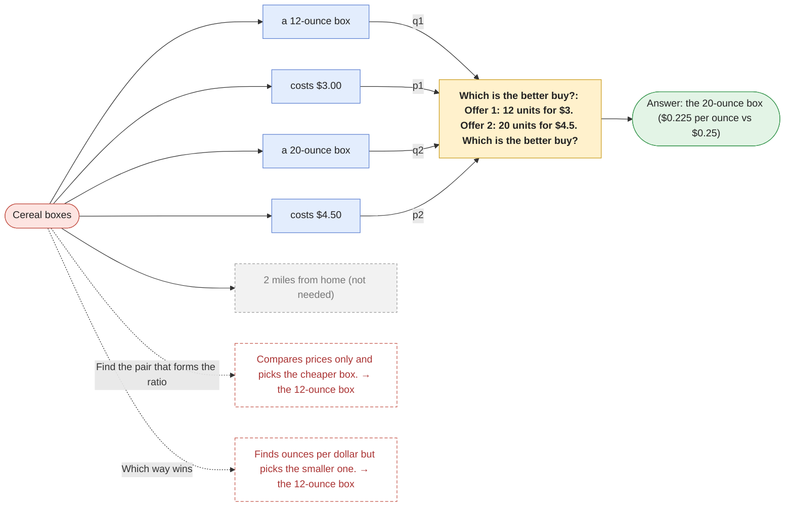

| Trap | Mistake | Gives | Caught by the answer? |
|---|---|---|---|
| Find the pair that forms the ratio | Compares prices only and picks the cheaper box. | the 12-ounce box | yes |
| Which way wins | Finds ounces per dollar but picks the smaller one. | the 12-ounce box | yes |

## Free throws

> Maya made 3 of her 4 free throws. Leo made 5 of his 7. Who has the better shooting rate?

| Phrase | Value | Counts | Role |
|---|---|---|---|
| “made 3” | 3 | Maya's made shots | used |
| “of her 4” | 4 | Maya's attempts | used |
| “made 5” | 5 | Leo's made shots | used |
| “of his 7” | 7 | Leo's attempts | used |

**Asked:** who has the better shooting rate (name). **Link:** “made … of”: Made out of attempted; the bigger fraction wins.

**Maps to** [compare-fractions](compare-fractions.md): a = 3, b = 4, c = 5, d = 7. **Answer:** Maya (3/4 = 0.75 vs 5/7 ≈ 0.714).

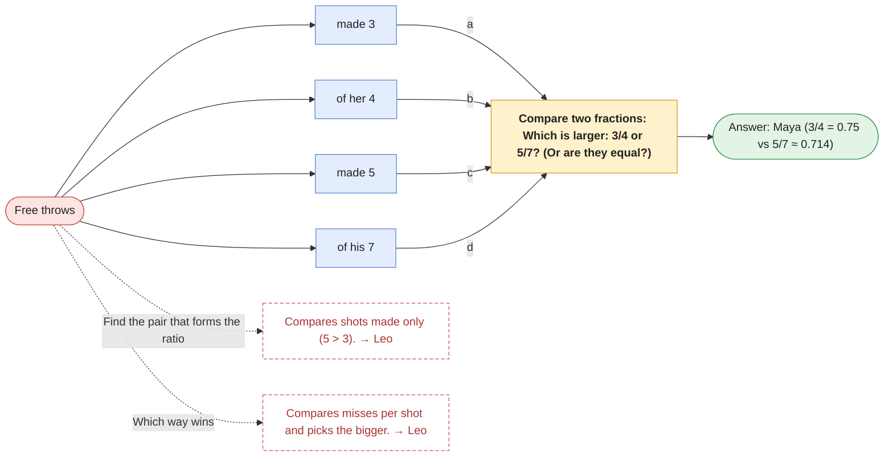

| Trap | Mistake | Gives | Caught by the answer? |
|---|---|---|---|
| Find the pair that forms the ratio | Compares shots made only (5 > 3). | Leo | yes |
| Which way wins | Compares misses per shot and picks the bigger. | Leo | yes |

First steps that give a trap away (each method's main route under the wrong reading; no correct route starts this way). Traps that just compare raw counts are caught by the answer instead.

| Student's first step | Suggests |
|---|---|
| `1 × 2 = 2` | Compares misses per shot and picks the bigger. |
| `1 × 7 = 7` | Compares misses per shot and picks the bigger. |
| `1 ÷ 4 = 0.25` | Compares misses per shot and picks the bigger. |
| `2 ÷ 1 = 2` | Compares misses per shot and picks the bigger. |
| `4 ÷ 1 = 4` | Compares misses per shot and picks the bigger. |
| `4 − 1 = 3` | Compares misses per shot and picks the bigger. |
| `GCF(1, 4) = 1` | Compares misses per shot and picks the bigger. |
| `LCM(1, 2) = 2` | Compares misses per shot and picks the bigger. |
| `plot (1, 4), (2, 7)` | Compares misses per shot and picks the bigger. |

## Jacket on sale

> A jacket normally costs $80. This week it is 15% off. How much does the jacket cost this week?

| Phrase | Value | Counts | Role |
|---|---|---|---|
| “costs $80” | 80 | original price | used |
| “15% off” | 15 | discount | used |

**Asked:** how much does it cost this week (dollars). **Link:** “% off”: 15% of the original price is taken off.

**Maps to** [percent-of](percent-of.md): p = 15, n = 80, then subtract the savings from the original price. **Answer:** $68.

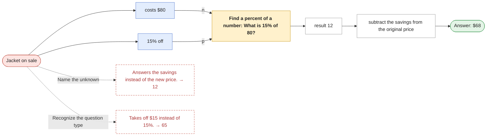

| Trap | Mistake | Gives | Caught by the answer? |
|---|---|---|---|
| Name the unknown | Answers the savings instead of the new price. | 12 | yes |
| Recognize the question type | Takes off $15 instead of 15%. | 65 | yes |

## Lemonade: how many in all

> Joe used 4 spoons of sugar to make the first 6 glasses of lemonade. He wants 18 glasses in all. How many more spoons of sugar does he need?

| Phrase | Value | Counts | Role |
|---|---|---|---|
| “4 spoons of sugar” | 4 | sugar already used | used |
| “the first 6 glasses” | 6 | lemonade made | used |
| “18 glasses in all” | 18 | lemonade wanted in total | used |

**Asked:** how many more spoons (spoons). **Link:** “to make”: 4 spoons per 6 glasses; 18 is a total, so the answer is total sugar minus sugar already used.

**Maps to** [missing-value](missing-value.md): a = 4, b = 6, d = 18, then subtract the sugar already used. **Answer:** 8 more spoons of sugar.

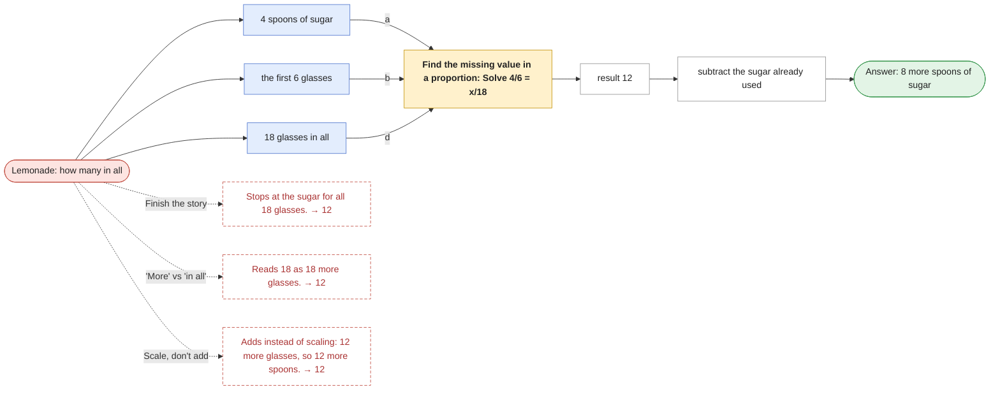

| Trap | Mistake | Gives | Caught by the answer? |
|---|---|---|---|
| Finish the story | Stops at the sugar for all 18 glasses. | 12 | yes |
| 'More' vs 'in all' | Reads 18 as 18 more glasses. | 12 | yes |
| Scale, don't add | Adds instead of scaling: 12 more glasses, so 12 more spoons. | 12 | yes |

## Lemonade: more sugar

> Joe is having a party. He has 6 cups of water and 4 spoons of sugar, which make 6 glasses of lemonade. He needs 18 more glasses of lemonade. How many more spoons of sugar does he need?

| Phrase | Value | Counts | Role |
|---|---|---|---|
| “6 cups of water” | 6 | water | distractor |
| “4 spoons of sugar” | 4 | sugar | used |
| “6 glasses of lemonade” | 6 | lemonade | used |
| “18 more glasses” | 18 | extra lemonade | used |

**Asked:** how many more spoons of sugar (spoons). **Link:** “which make”: 4 spoons of sugar go with 6 glasses; the water is a distractor for a question about sugar.

**Maps to** [missing-value](missing-value.md): a = 4, b = 6, d = 18. **Answer:** 12 more spoons of sugar.

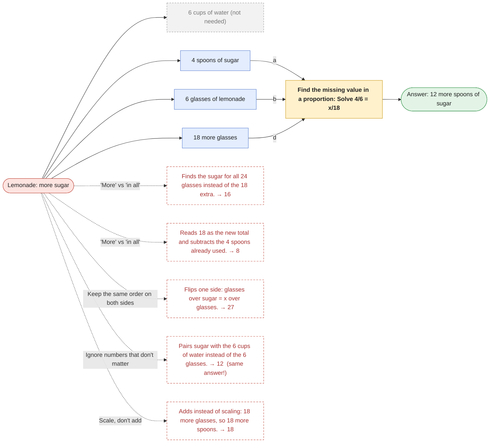

| Trap | Mistake | Gives | Caught by the answer? |
|---|---|---|---|
| 'More' vs 'in all' | Finds the sugar for all 24 glasses instead of the 18 extra. | 16 | yes |
| 'More' vs 'in all' | Reads 18 as the new total and subtracts the 4 spoons already used. | 8 | yes |
| Keep the same order on both sides | Flips one side: glasses over sugar = x over glasses. | 27 | yes |
| Ignore numbers that don't matter | Pairs sugar with the 6 cups of water instead of the 6 glasses. | 12 | **no**: same answer, so ask how they got it |
| Scale, don't add | Adds instead of scaling: 18 more glasses, so 18 more spoons. | 18 | yes |

First steps that give a trap away (each method's main route under the wrong reading; no correct route starts this way). Traps that just compare raw counts are caught by the answer instead.

| Student's first step | Suggests |
|---|---|
| `18 ÷ 4 = 4.5` | Flips one side: glasses over sugar = x over glasses. |
| `24 ÷ 6 = 4` | Finds the sugar for all 24 glasses instead of the 18 extra. |
| `4 × 24 = 96` | Finds the sugar for all 24 glasses instead of the 18 extra. |
| `6 × 18 = 108` | Flips one side: glasses over sugar = x over glasses. |
| `6 × 4 = 24` | Finds the sugar for all 24 glasses instead of the 18 extra. |

## Map scale

> On a map, 1 inch stands for 25 miles. Two towns are 3.5 inches apart on the map. How far apart are they really?

| Phrase | Value | Counts | Role |
|---|---|---|---|
| “1 inch” | 1 | map distance | used |
| “25 miles” | 25 | real distance | used |
| “3.5 inches apart” | 3.5 | map distance between the towns | used |

**Asked:** how far apart really (miles). **Link:** “stands for”: 25 real miles per 1 map inch.

**Maps to** [missing-value](missing-value.md): a = 25, b = 1, d = 3.5. **Answer:** 87.5 miles.

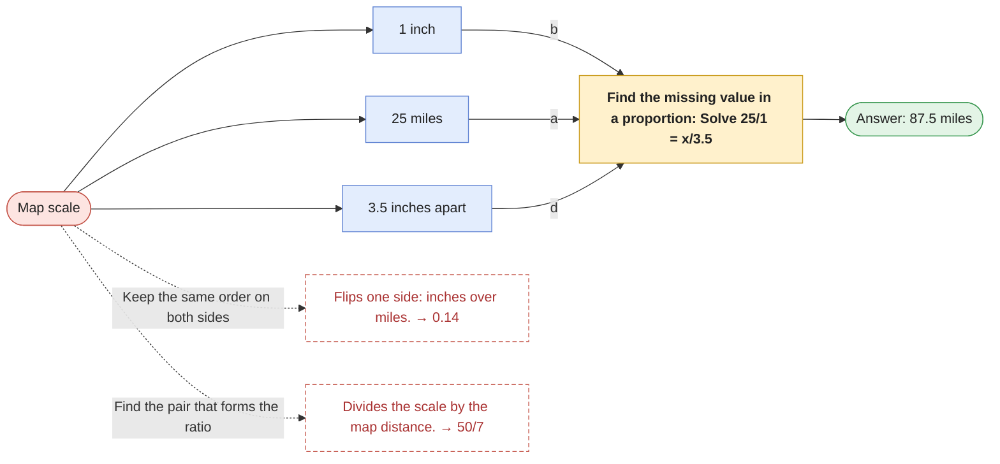

| Trap | Mistake | Gives | Caught by the answer? |
|---|---|---|---|
| Keep the same order on both sides | Flips one side: inches over miles. | 0.14 | yes |
| Find the pair that forms the ratio | Divides the scale by the map distance. | 50/7 | yes |

First steps that give a trap away (each method's main route under the wrong reading; no correct route starts this way). Traps that just compare raw counts are caught by the answer instead.

| Student's first step | Suggests |
|---|---|
| `1 × 3.5 = 3.5` | Flips one side: inches over miles. |
| `3.5 ÷ 25 = 0.14` | Flips one side: inches over miles. |

## Same shade of paint?

> Paint A mixes 6 cans of blue with 8 cans of white. Paint B mixes 72 cans of blue with 96 cans of white. Will the two paints be the same shade?

| Phrase | Value | Counts | Role |
|---|---|---|---|
| “6 cans of blue” | 6 | blue in A | used |
| “8 cans of white” | 8 | white in A | used |
| “72 cans of blue” | 72 | blue in B | used |
| “96 cans of white” | 96 | white in B | used |

**Asked:** same shade? (yes/no). **Link:** “mixes … with”: Same shade means the same blue : white ratio.

**Maps to** [proportion-check](proportion-check.md): a = 6, b = 8, c = 72, d = 96. **Answer:** Yes: both are 3 blue to 4 white.

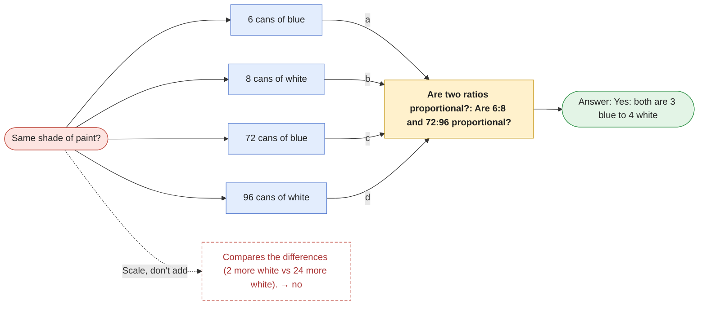

| Trap | Mistake | Gives | Caught by the answer? |
|---|---|---|---|
| Scale, don't add | Compares the differences (2 more white vs 24 more white). | no | yes |

## Pancakes by the dozen

> A pancake recipe uses 2 cups of flour and 3 eggs to make 12 pancakes. How many cups of flour are needed for 2 dozen pancakes?

| Phrase | Value | Counts | Role |
|---|---|---|---|
| “2 cups of flour” | 2 | flour | used |
| “3 eggs” | 3 | eggs | distractor |
| “12 pancakes” | 12 | pancakes | used |
| “2 dozen pancakes” | 2 dozen → **24** | pancakes wanted | used |

**Asked:** how many cups of flour (cups). **Link:** “to make”: 2 cups of flour per 12 pancakes.

**Maps to** [missing-value](missing-value.md): a = 2, b = 12, d = 24. **Answer:** 4 cups of flour.

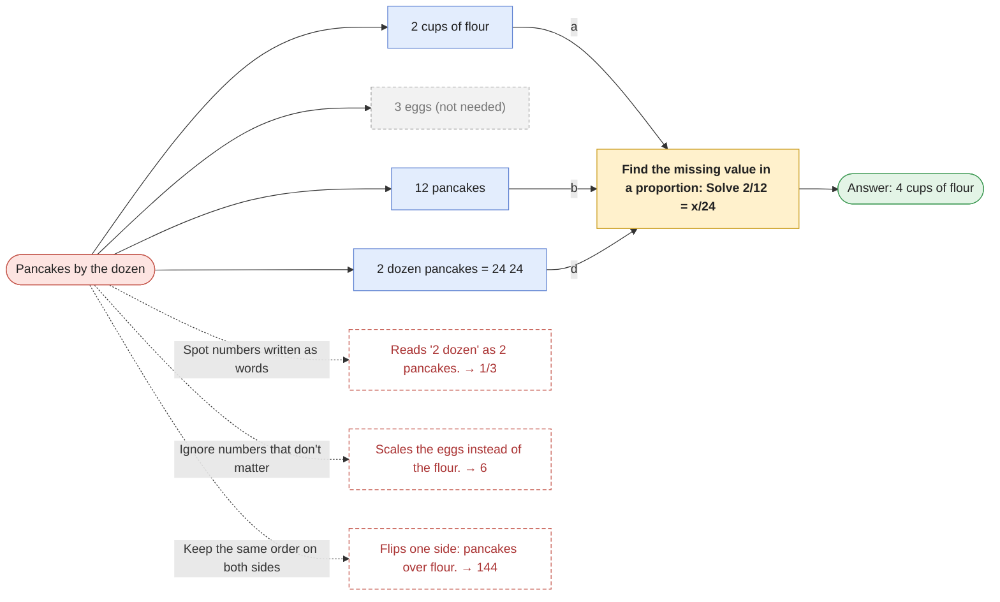

| Trap | Mistake | Gives | Caught by the answer? |
|---|---|---|---|
| Spot numbers written as words | Reads '2 dozen' as 2 pancakes. | 1/3 | yes |
| Ignore numbers that don't matter | Scales the eggs instead of the flour. | 6 | yes |
| Keep the same order on both sides | Flips one side: pancakes over flour. | 144 | yes |

First steps that give a trap away (each method's main route under the wrong reading; no correct route starts this way). Traps that just compare raw counts are caught by the answer instead.

| Student's first step | Suggests |
|---|---|
| `12 × 24 = 288` | Flips one side: pancakes over flour. |
| `12 ÷ 3 = 4` | Scales the eggs instead of the flour. |
| `2 × 2 = 4` | Reads '2 dozen' as 2 pancakes. |
| `24 ÷ 2 = 12` | Flips one side: pancakes over flour. |
| `3 × 24 = 72` | Scales the eggs instead of the flour. |
| `3 ÷ 12 = 0.25` | Scales the eggs instead of the flour. |
| `GCF(3, 12) = 3` | Scales the eggs instead of the flour. |

## Sharing pizza

> Sam ate 5/6 of a pizza and Kim ate 3/4 of a pizza. How much pizza did they eat in all?

| Phrase | Value | Counts | Role |
|---|---|---|---|
| “5/6 of a pizza” | 5/6 | Sam's share | used |
| “3/4 of a pizza” | 3/4 | Kim's share | used |

**Asked:** how much in all (pizzas). **Link:** “in all”: Add the two fractions.

**Maps to** [add-fractions](add-fractions.md): a = 5, b = 6, c = 3, d = 4. **Answer:** 1 7/12 pizzas.

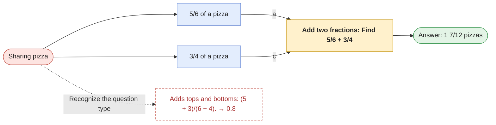

| Trap | Mistake | Gives | Caught by the answer? |
|---|---|---|---|
| Recognize the question type | Adds tops and bottoms: (5 + 3)/(6 + 4). | 0.8 | yes |

## Whose lemonade is sweeter?

> Joe mixes 4 spoons of sugar into 6 glasses of lemonade. Ann mixes 10 spoons of sugar into 14 glasses. Whose lemonade is sweeter?

| Phrase | Value | Counts | Role |
|---|---|---|---|
| “4 spoons of sugar” | 4 | Joe's sugar | used |
| “6 glasses” | 6 | Joe's lemonade | used |
| “10 spoons of sugar” | 10 | Ann's sugar | used |
| “14 glasses” | 14 | Ann's lemonade | used |

**Asked:** whose is sweeter (name). **Link:** “mixes … into”: Sweetness is sugar per glass; the bigger fraction is sweeter.

**Maps to** [compare-fractions](compare-fractions.md): a = 4, b = 6, c = 10, d = 14. **Answer:** Ann's (10/14 ≈ 0.714 spoons per glass vs 4/6 ≈ 0.667).

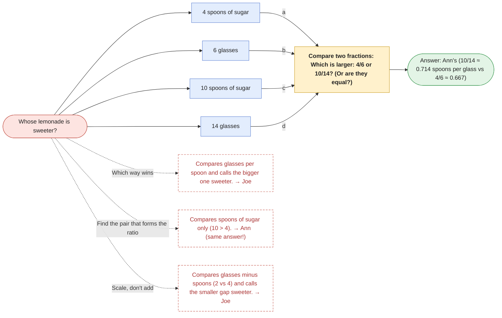

| Trap | Mistake | Gives | Caught by the answer? |
|---|---|---|---|
| Which way wins | Compares glasses per spoon and calls the bigger one sweeter. | Joe | yes |
| Find the pair that forms the ratio | Compares spoons of sugar only (10 > 4). | Ann | **no**: same answer, so ask how they got it |
| Scale, don't add | Compares glasses minus spoons (2 vs 4) and calls the smaller gap sweeter. | Joe | yes |

First steps that give a trap away (each method's main route under the wrong reading; no correct route starts this way). Traps that just compare raw counts are caught by the answer instead.

| Student's first step | Suggests |
|---|---|
| `6 × 10 = 60` | Compares glasses per spoon and calls the bigger one sweeter. |
| `plot (6, 4), (14, 10)` | Compares glasses per spoon and calls the bigger one sweeter. |

## Train in minutes

> A train travels 150 miles in 3 hours. At the same speed, how far does it travel in 90 minutes?

| Phrase | Value | Counts | Role |
|---|---|---|---|
| “150 miles” | 150 | distance | used |
| “3 hours” | 3 | time | used |
| “90 minutes” | 90 minutes → **1.5** | new time | used |

**Asked:** how far (miles). **Link:** “in … at the same speed”: 150 miles per 3 hours; the time must be in hours on both sides.

**Maps to** [missing-value](missing-value.md): a = 150, b = 3, d = 1.5. **Answer:** 75 miles.

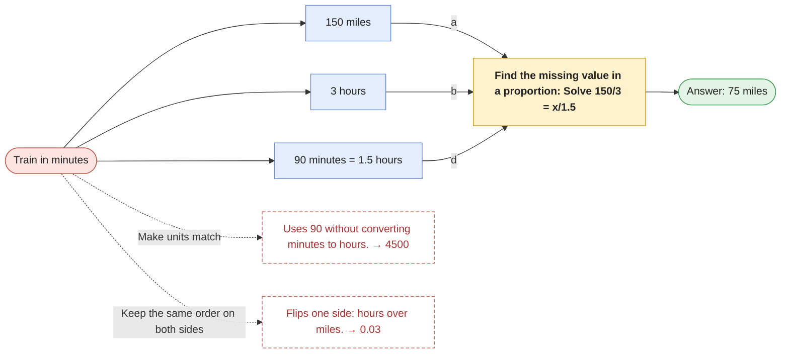

| Trap | Mistake | Gives | Caught by the answer? |
|---|---|---|---|
| Make units match | Uses 90 without converting minutes to hours. | 4500 | yes |
| Keep the same order on both sides | Flips one side: hours over miles. | 0.03 | yes |

First steps that give a trap away (each method's main route under the wrong reading; no correct route starts this way). Traps that just compare raw counts are caught by the answer instead.

| Student's first step | Suggests |
|---|---|
| `1.5 ÷ 150 = 0.01` | Flips one side: hours over miles. |
| `150 × 90 = 13500` | Uses 90 without converting minutes to hours. |
| `3 × 1.5 = 4.5` | Flips one side: hours over miles. |
| `3 × 30 = 90` | Uses 90 without converting minutes to hours. |
| `90 ÷ 3 = 30` | Uses 90 without converting minutes to hours. |

## Walking to school

> There are 60 students in a class. 35% of them walk to school, and 10 ride bikes. How many students walk to school?

| Phrase | Value | Counts | Role |
|---|---|---|---|
| “60 students” | 60 | the class | used |
| “35% of them walk” | 35 | walkers | used |
| “10 ride bikes” | 10 | bike riders | distractor |

**Asked:** how many students walk (students). **Link:** “% of them”: 'them' is the 60 students.

**Maps to** [percent-of](percent-of.md): p = 35, n = 60. **Answer:** 21 students.

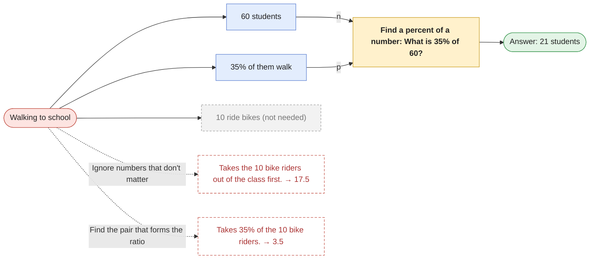

| Trap | Mistake | Gives | Caught by the answer? |
|---|---|---|---|
| Ignore numbers that don't matter | Takes the 10 bike riders out of the class first. | 17.5 | yes |
| Find the pair that forms the ratio | Takes 35% of the 10 bike riders. | 3.5 | yes |

First steps that give a trap away (each method's main route under the wrong reading; no correct route starts this way). Traps that just compare raw counts are caught by the answer instead.

| Student's first step | Suggests |
|---|---|
| `10 ÷ 10 = 1` | Takes 35% of the 10 bike riders. |
| `10 ÷ 100 = 0.1` | Takes 35% of the 10 bike riders. |
| `35 × 10 = 350` | Takes 35% of the 10 bike riders. |
| `35 × 50 = 1750` | Takes the 10 bike riders out of the class first. |
| `50 ÷ 10 = 5` | Takes the 10 bike riders out of the class first. |
| `50 ÷ 100 = 0.5` | Takes the 10 bike riders out of the class first. |
